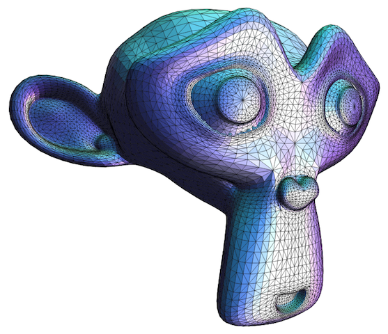

# Workshop report: Building Linked Data heatmaps with Clojurescript & thi.ng

Last week, during the second 3-day data visualization
[workshop](http://workshop.thi.ng) with [Clojure](http://clojure.org),
[Clojurescript](https://github.com/clojure/clojurescript) and the
[_thi.ng_](http://thi.ng) libraries, we built a small web application using data
from the UK’s [Office for National Statistics](http://statistics.data.gov.uk/)
(ONS) and the [London Data
Store](http://data.london.gov.uk/dataset/average-house-prices-borough).

Still from a previous London 3D data viz project done with & for [The Open
Data Institute](http://theodi.org/) in 2013, here showing knife crime incidents
by borough.

The workshop was intended to introduce participants to important Clojure/script
concepts (e.g. laziness, reducers, transducers, concurrency primitives), data
structures (sets, maps, protocols, custom types), libraries (core.async,
reagent, thi.ng) and workflows (figwheel), as well as teach Linked Data &
Semantic Web concepts, technologies, standards and learn how these can be used
to combine data from disparate sources, in order to simplify their analysis and
later visualization. After much theory, sketching and many small, isolated
exercises, we finally tied everything together by building an interactive
heatmap and price charts about London property sales, prices & trends (data from
2013/14) in both Clojure and Clojurescript. The web UI also includes a query
editor to experiment with new queries (and visualize their structure) directly
in the browser…

Heatmap of average London property price per borough (2013/14) shows clear bias
of high-price areas. Important note: We only used a sample of ~23k transactions
to save time during the workshop. The full dataset published at data.gov.uk
contains 200k+ transactions.

Alternative heatmap based on number of sales per borough in 2013/14. There were
~2x as many sales in the south-east (orange) than in other areas (dark blue).

Charts of individual property sales per borough in 2013/14, sorted by date. Note
the clearly visible upward trend for most boroughs. Charts are generated for all
33 boroughs, with the remainder omitted here for space reasons.

Screenshot of the query editor and auto-generated visualization of the shown
query’s structure (courtesy [thi.ng/fabric](http://thi.ng/fabric) and
[Graphviz](http://graphviz.org) on the server, editor uses
[CodeMirror](http://codemirror.net))

[Clone the project from Github](https://github.com/thi-ng/ws-ldn-2/) and run
locally (instructions further below).

The remainder of this article sheds some more light on implementation details,
the role of the [_thi.ng_](http://thi.ng/) libraries in realising this project
and lots of links to further reading…

Marcin Ignac (one of the participants and fellow computational designer) also
just [shared some of his own workshop
experiences](http://marcinignac.com/blog/what-i-like-about-clojure/) (and some
great “homework” examples) over on his blog.

## Graphs, RDF, SPARQL and the Linked Data model

Some background: I’ve been fascinated by graphs as general data structure for a
long time and think it’s safe to say they’re becoming an ever increasingly
popular choice, especially for greenfield projects. Graphs are more natural and
friendlier to deal with than tables or document stores when dealing with complex
data relationships and many [large public datasets](http://wiki.dbpedia.org/)
have been expressed as graphs way before [neo4j](http://neo4j.com) appeared and
had any commercial success and way before Facebook’s
[GraphQL](http://graphql.org/), which recently/finally introduced the whole idea
as big news to the big wide world of JS devs.

With all the current excitement around these two platforms (for example), I’m
always somewhat taken aback by the fact that so many developers have either
never heard of RDF (the W3C’s [Resource Description
Format](http://www.w3.org/TR/rdf11-primer/)) or (worse) never want to work with
it again. I can somewhat share the top-level thinking behind the latter
sentiment, since historically (RDF is in existence since 1999), the format had
been closely associated with XML (originally the de-facto encoding) and its
large/verbose Java tooling. However, _RDF is an abstract data model_ encoding
knowledge statements with clearly defined semantics. It’s not tied to XML or any
other particular representation. All what really matters is a standard way to
encode data / knowledge as triples of _subject, predicate, object,_ and use,
where possible, URIs to provide uniqueness and dereferencing capabilities to
lookup unknown terms. The result of this extremely simple setup is that
knowledge can be encoded and stored completely distributed, largely becomes
self-describing, and equally important, becomes open for aggregation, regardless
of where a piece of data has been retrieved from. **This** is what the term
_Linked Data_ (LD) stands for.

> Placing our data in a graph system not supporting these principles, will still
> give us potentially more flexible query capabilities locally, but will not
> automatically solve the old questions of how to easily combine knowledge from
> multiple sources or how to provide our own data in a semantically,
> interoperable format to others.

The Freebase Parallax UI, a research project by [David
Huynh](http://davidhuynh.net/) from 2008, still is one of my favourite examples,
nicely showing this current limitation and contrasting it with the potential a
Linked Data approach can offer (even though he’s only using one large dataset in
the example [[Freebase](http://freebase.com)]). Now, 7 years later we still
can’t get answers like this from the market leaders in search and this lack of
interoperability in many (most?) public datasets is also holding back entire
disciplines (UX, UI, data vis) at large:

Over the past 10 years the LD community has adopted a number of
[alternative](http://www.w3.org/TR/turtle/), more
[lightweight](https://en.wikipedia.org/wiki/N-Triples) formats, standardized
embedding of metadata in HTML ([RDFa](http://www.w3.org/TR/xhtml-rdfa-primer/)),
defined licensing options etc. RDF is also increasingly used and embraced by the
[biggest commercial players](https://developers.google.com/structured-data/) and
governments worldwide. Institutions like the [Open Knowledge
Foundation](http://okfn.org) and [The ODI](http://theodi.org) are actively
furthering this course by tirelessly working with holders of datasets large &
small.

The [Linked Open Data cloud](http://lod-cloud.net/) as of 2014, an overview of
interlinked open data sets describing over 8 billion resources

In addition to the sheer amount of Linked Data available, there’re are as well
[hundreds of well-defined, freely available data
vocabularies](http://lov.okfn.org/dataset/lov) (ontologies) to define terms and
express semantics of all complexities in a **standard, interoperable and
machine-readable way** — something anyone seriously interested in working with
data analysis / visualization should be embracing, or at least be welcoming… For
many use cases, a handful of core vocabularies is sufficient to at least express
the most common relationships in an interoperable manner. Data integration
almost always is a continuous effort, but small, incremental changes can go a
long way. It’s also important to recognize that these vocabularies themselves
are expressed in RDF, so there’s no distinction between data and language. This
should feel familiar to any Lisper/Clojurian ;)

## Back to the workshop exercise…

The LD portal of the UK Statistics Office provides access to structured
geographic data, which can be directly queried via their
[SPARQL](http://www.w3.org/TR/sparql11-overview/)
[endpoint](http://statistics.data.gov.uk/flint-sparql). SPARQL is the RDF
world’s SQL, a vendor independent standard, query language, protocol and service
description for semantic data. Its query language part is heavily inspired by
Prolog, Datalog and other pattern matching/unification approaches, which makes
dealing with graph based data very easy: Simply state the patterns/relationships
you wish to find, add some constraints (filters, unions, negations etc.) and
modifiers (aggregation, sorting etc.) to manipulate the result set. There’re
loads of more unique options, e.g. federated queries of multiple sources at
once. See the [primer](http://www.w3.org/TR/sparql11-overview/) for details.

## Dataset 1: London geodata

We used this query to extract a subgraph of all London boroughs and their
lat/lon boundary polygons:

## Dataset 2: London property sales

The second dataset we used comes from the London Data store and constitutes
~[650MB of all property
sales](http://data.london.gov.uk/dataset/average-house-prices-borough) between
1995–2014. This data comes in “glorious” CSV flavor, with several files using
different column layouts and so, of course, requiring special, manual treatment.
Oh the joy!

I prepared a little Clojure [utility
namespace](https://github.com/thi-ng/ws-ldn-2/blob/master/src/clj/ws_ldn_2/csvconvert.clj)
and demonstrated how we can convert the CSV to a RDF graph model by using terms
from the general purpose [schema.org](http://schema.org) vocabulary (and
supplement a few ad-hoc ones of our own). From a user perspective of this code,
this boils down to just this:

## thi.ng/fabric

With both the geo data already in graph form and the house sale transactions
converted, we were ready to place them into one common container and acquainted
ourselves with the [thi.ng/fabric](http://thi.ng/fabric) library.

[thi.ng/fabric](http://thi.ng/fabric) is a still young, modular framework for
Clojure/Clojurescript, providing a general purpose compute graph model as the
foundation to build more context specific applications on (from spreadsheets,
navigation, inferencing to knowledge graphs). In the compute graph, nodes store
values and can send & receive signals to/from any connected neighbor. At first,
this sounds similar to the well-known [Actor
model](https://en.wikipedia.org/wiki/Actor_model), however in the
[Signal/Collect approach](http://signalcollect.com) this library is loosely
based on, each graph edge is represented as a function, which can transform or
inhibit outgoing signals and hence perform computation on the original node
values (similar to the mapping phase of Map-Reduce). Furthermore, the collection
of received signals also happens via user defined functions, enabling further
transformations only possible when combining multiple signals (reduction). A
choice of customizable schedulers (incl. parallel & async options) allows for
different approaches to control the overall computation. Many graph algorithms
can be [expressed (more)
succinctly](https://github.com/thi-ng/fabric#general-compute-graph-examples)
using this setup, but for the workshop we focused on the two library modules
allowing this architecture to be used as a fairly well featured and ready-to-go
Linked Data development server. To my best knowledge, it’s also currently the
only pure Clojure solution there is thus far.

## thi.ng.fabric.facts & thi.ng.fabric.ld

These two library modules together realise:

-   a complete [RDF-style triple
    store](https://github.com/thi-ng/fabric/blob/master/fabric-facts/src/core.org)
    (however, supporting **any** Clojure datatypes)
-   [SPARQL-like query
    engine](https://github.com/thi-ng/fabric/blob/master/fabric-facts/src/dsl.org)
    (based on query trees w/intelligent sharing of sub-query terms & clauses)
-   [query visualization](https://github.com/thi-ng/fabric/blob/master/fabric-facts/src/viz.org)
-   rule-based inferencing of new facts (or fact removal)
-   [NTriples parser](https://github.com/thi-ng/fabric/blob/master/fabric-facts/src/nt.org) to import existing RDF datasets
-   [HTTP interface & query endpoint](https://github.com/thi-ng/fabric/tree/master/fabric-ld)
    with support for stored queries (autoupdating) and multiple result formats
    ([EDN](https://github.com/edn-format/edn), JSON,
    [JSON-LD](http://json-ld.org/),
    [SPARQL CSV results](http://www.w3.org/TR/sparql11-results-csv-tsv/), more coming)

What do I mean with “SPARQL-like” query engine? Well, since I’ve been using
Clojure for most of my data centric work in recent years, I wanted to have the
ability to apply these kind of queries to any data without having to restrict
myself to the requirements of pure-RDF tools. Furthermore, since the boundary
between code and data can be easily blurred in Clojure, it made sense to define
everything in an as Clojuresque as possible way, e.g. by using Clojure data
structures (maps, symbols, s-expressions) to define the queries and gain
programmatic manipulation/construction as a result. In some way this is similar
to [Allegrograph’s SPARQL
S-expressions](http://franz.com/agraph/support/documentation/current/sparql-sexpr.html),
though these were not a motive and is quite natural to do in any Lisp. The other
reason for “SPARQL-like” is that _fabric_ still being a young project, not all
aspects (e.g. federated queries, construct queries, named graphs) are yet
implemented, but it’s a work-in-progress.

As an example, the query to compute the complete aggregate heatmap data and
lat/lon polygons for all boroughs, can be expressed with this Clojure EDN map.
Note: The :aggregate expressions are **not** function calls, but will be
compiled into functions during query execution:

## Ready, set, go…

Use the commands below to clone & launch the workshop project locally on your
machine. You’ll need [Leiningen](http://leiningen.org) and Java 1.7+ installed.
The project is also configured to ask for up to 1.28GB of RAM for the server
part. [Figwheel](https://github.com/bhauman/lein-figwheel) will temporarily also
require quite a bit of memory, so will your browser.

The thi.ng/fabric [readme for the LD
module](https://github.com/thi-ng/fabric/tree/develop/fabric-ld) contains
several examples how to interact with the server via HTTP.

**Important:** **Do not view the web app via localhost:3449** (figwheel’s port),
since none of the queries will work (originally due to CORS, but I also switched
to relative query paths). Use [http://localhost:8000/](http://localhost:8000/)
only, figwheel will still apply in any code changes via its WebSocket
connection.

The code in the repo is fully commented and also acts as an illustrated use case
and combined example of various libraries in the _thi.ng_ collection (among
others). A quick breakdown of the various parts follows:

## Clojure server

This project uses a custom _fabric.ld_ server setup and loads the two datasets
discussed above during startup (see
[ws-ldn-2.core](https://github.com/thi-ng/ws-ldn-2/blob/master/src/clj/ws_ldn_2/core.clj)
namespace). Zach Tellman’s [Aleph](http://aleph.io) is used as the default
underlying HTTP server for the _fabric.ld_ module, since it provides a nice
mechanism for deferred response handling, which can be important when handling
long, complex queries. We also injected a server route to handle the [structural
visualization](https://github.com/thi-ng/fabric/blob/master/fabric-facts/src/viz.org)
of a user’s query sent from the browser-based query editor. This handler shells
out to [Graphviz](http://graphviz.org), which needs to be installed and on the
system path. To install on OSX: `brew install graphviz`

## Clojurescript frontend

Our main focus of development was on the CLJS frontend parts of the app, which
(like 99% of all Clojurescript web apps) is based on React.js. Of the available
wrappers, I’ve always found [Reagent](http://reagent-project.github.io) the most
lightweight and least painful, so proposed to use this here too. Together with a
completely [datadriven 100LOC
router](https://github.com/thi-ng/ws-ldn-2/blob/master/src/cljs/ws_ldn_2/router.cljs),
which I’ve been using for many of my own projects and a sprinkling of Bootstrap,
we had a basic SPA skeleton app running in no time.

Integrating 3rd party JS libraries into CLJS projects used to be somewhat
painful until not so long ago. However, since the advent of the [cljsjs
project](http://cljsjs.github.io/), which is re-packaging JS libs for CLJS, this
is thankfully a thing of the past and in some ways almost easier to handle than
with npm. As an integration example, we imported
[CodeMirror](http://codemirror.net) and used Reagent’s **create-class**
mechanism to build a “reactified” [editor instance with Clojure syntax
highlighting](https://github.com/thi-ng/ws-ldn-2/blob/master/src/cljs/ws_ldn_2/components/editor.cljs),
learned about the **reaction macro** mechanism to minimize component render
updates and experimented with submitting queries to the server and visualizing
their structure.

## Always be visualizing…

In a somewhat longer next step, we then introduced the
[thi.ng/geom](http://thi.ng/geom) SVG and visualization modules, which also form
the backbone of our [heatmap
visualization](https://github.com/thi-ng/geom/blob/master/geom-viz/src/core.org#heatmap).
After learning about the general approach, output format independence and
looking through [various
examples](https://github.com/thi-ng/geom/blob/master/geom-viz/src/index.org)
(incl. the [SVG 3D renderer with software facet
shaders](https://github.com/thi-ng/geom/blob/master/geom-svg/src/examples.org#stl-mesh-import-blenders-suzanne)),
we transformed and projected
([mercator](https://en.wikipedia.org/wiki/Mercator_projection)) our query
results into valid SVG polygons and then started working on the actual heatmap
of London property sales.

Dynamically generated 3D meshes rendered in SVG with different (composable)
software shaders

Blender’s Suzanne imported as STL and rendered in SVG with Phong sofware shader

In order to translate a value range to colors, some form of gradient lookup
table (or function, or both) is required. The
[thi.ng/color](http://thi.ng/color) library provides a namespace to [define
complex color gradients using just 12
numbers](https://github.com/thi-ng/color/blob/master/src/gradients.org) (4x RGB
cosine wave params). The original idea for these gradients comes from the
master, [IQ
himself](http://www.iquilezles.org/www/articles/palettes/palettes.htm), and the
library provides a few useful presets for our purposes (The library also
provides some of [Cynthia Brewer](http://mkweb.bcgsc.ca/brewer/)’s categorical
pallettes which are often better suited for visualization purposes).

Example gradient presets

Adding some of these presets to a dropdown menu, then allows the user to see
London in “different colors” (not all of them good or useful):

Heatmap based on average sale price per borough

Heatmap based on number of sales per borough, same color preset as above. Dark
green lowest, cyan highest numbers.

## Using core.async & SVG chart pre-rendering

Generating the 33 SVG charts (one per borough) with some of them consisting of
1200+ data points is taxing for the browser, so I decided to pre-generate the
SVG only once during initial page load and query processing. Caching these SVG
elements is easy in Clojurescript (and Reagent), since the geom library
generates them as pure Clojure data structures (nested vectors) in [hiccup
format](https://github.com/weavejester/hiccup). In the React component, which
later creates the full DOM for each chart, we then simply need to insert the
cached vectors representing the SVG DOM fragments and have nothing else to do.

At application start we execute two queries: 1) Retrieve the set of polygons and
aggregate values for each borough, 2) Obtain individual property sale
transaction details, about 23,000… Both of these queries utilize fabric’s
registered query feature, which means these queries are stored as part of the
compute graph and their results are always immediately available (without
incurring new work for each connected client) and will update (on the server
side) automatically, should the underlying set of facts change. Since the second
query returns approx. 1.4MB of EDN data which needs to be parsed, processed and
transformed into SVG charts, the entire application startup process is handled
asynchronously using the fabulous
[clojure.core.async](https://github.com/clojure/core.async) library. Replacing
the original callbacks with async channel operations to coordinate the different
processing steps, allowed us to keep a linear structure in our functions and
avoid blocking the DOM during pre-processing of the charts.

[thi.ng/geom](http://thi.ng/geom)’s visualization engine is completely
declarative and essentially transforms a specification map definining all axes,
datasets, layout methods and styling configs into a nested DOM-like data
structure. Because both the initial visualization spec and the result is pure
data, it’s easily possible for either to be defined or manipulated
programmatically/interactively. E.g. Changing axis behavior or layout method is
very easy to do: just update a key in the input spec map or add an event
listener in the result tree, post-generation. Together with the other CLJS
workflow ingredients (e.g. figwheel live code updates), this allows for a quick
iterative design exploration…

Here we explore the impact of different axis scales and rendering methods:

Using a linear scale y-axis is a bad choice for this data due to extreme price
fluctuations in some boroughs (e.g. outliers like Kensington’s 27.9 million or
Lambeth’s 7 million property sales cause havok)

The same data for the same boroughs mapped using a logarithmic scale

And once more using line chart with gradient

## Previous workshop

For completeness sake, this workshop was intended for an intermediate Clojure
audience and we went through a lot of topics over the 3 days. The week before I
ran a similar workshop more aimed at beginners and we produced a visualization
of 47,000 airports using CSV data from
[ourairports.com](http://ourairports.com/data/):

47k airports (magenta = IATA, cyan = non-IATA)

[The Github repository for that workshop](https://github.com/thi-ng/ws-ldn-1)
has more information.

## Future workshops

In order to support the open source development of the _thi.ng_ tool chain and
to provide more learning resources, I’m intending to run more workshops like
this (also more regularly), over the foreseeable future. **These will not only
be focused on Clojure** — I absolutely believe in combined skillsets! If you’re
interested, please do check [workshop.thi.ng](http://workshop.thi.ng) for more
details of upcoming workshops and/or sign up to the no-spam [announcement
newsletter](http://tinyletter.com/thi-ng).

The next workshop will be about one of my other passions:

[Embedded devices, ARM C programming and DIY polyphonic synthesizer](http://workshop.thi.ng/#WS-LDN-3)

London, 5–6 December 2015

The ARM Cortex-M processor family is used in many embedded devices, from IoT,
wearables, phones and more demanding use cases and is rapidly gaining traction.
This workshop will give you an overview and hands-on experience how to program
the STM32F4 (a Cortex-M4 CPU) and work with various peripherals (GPIO, gyro, USB
I/O, audio). Over the 2 days we will be building a fully customizable, CD
quality, polyphonic MIDI synth and cover some generative music approaches to
round off.

## Finally… Clojure community FTW!

This workshop would not have been so easily possible without the amazing &
innovative work done by others in the Clojure community. If you want to learn
more, the following Clojure/script libraries were used (and essential) for this
project & workshop:

-   [core.async](https://github.com/clojure/core.async)
-   [data.csv](https://github.com/clojure/data.csv)
-   [hiccup](https://github.com/weavejester/hiccup)
-   [lein-cljsbuild](https://github.com/emezeske/lein-cljsbuild/)
-   [lein-figwheel](https://github.com/bhauman/lein-figwheel)
-   [reagent](https://github.com/reagent-project/reagent)
-   [thi.ng/color](http://thi.ng/color)
-   [thi.ng/fabric](http://thi.ng/fabric)
-   [thi.ng/geom](http://thi.ng/geom)
-   [thi.ng/math](http://thi.ng/math)
-   [thi.ng/strf](http://thi.ng/strf)
-   [thi.ng/validate](http://thi.ng/validate)
