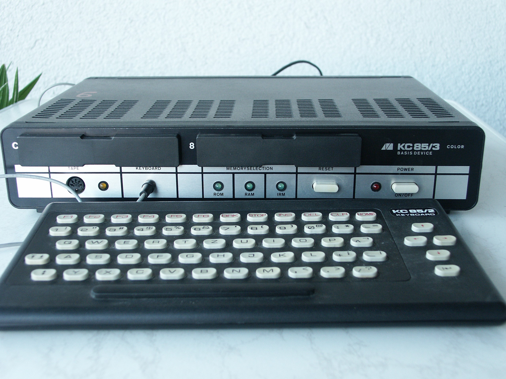
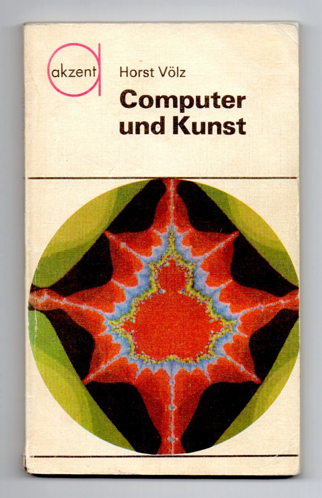
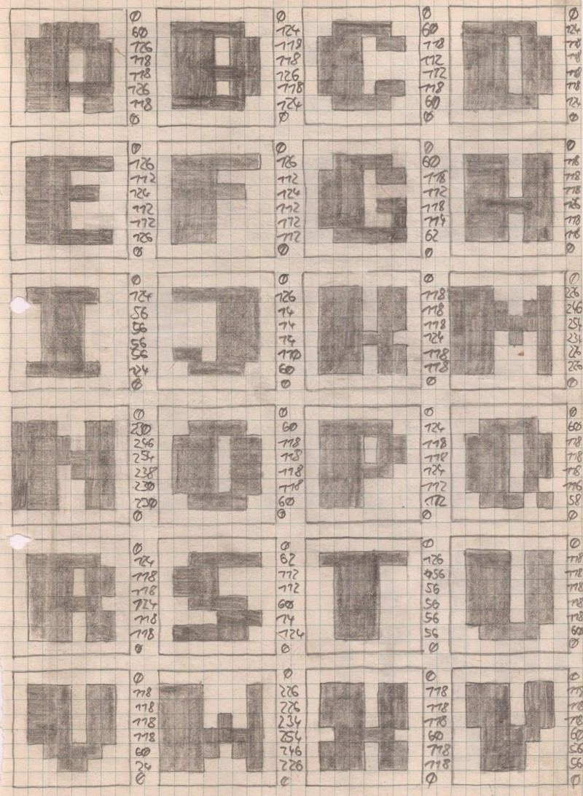
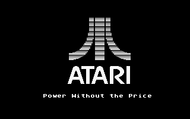
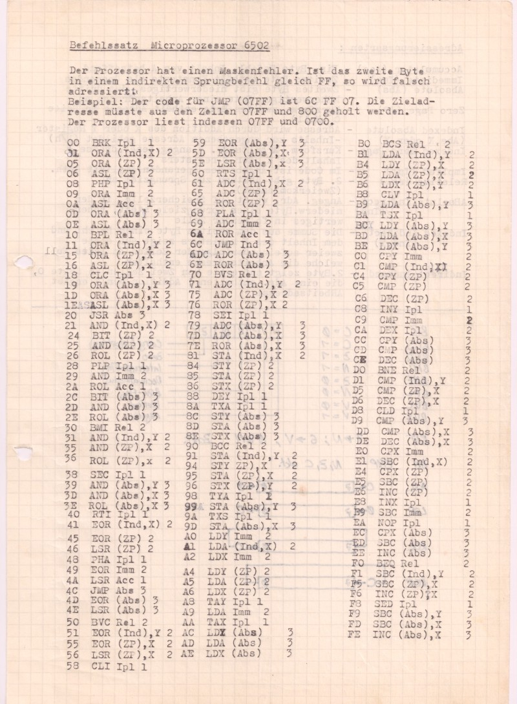
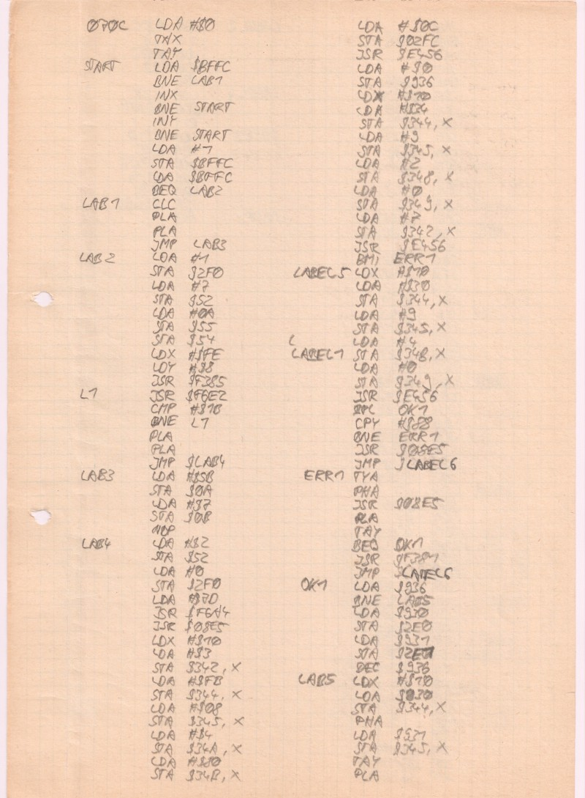
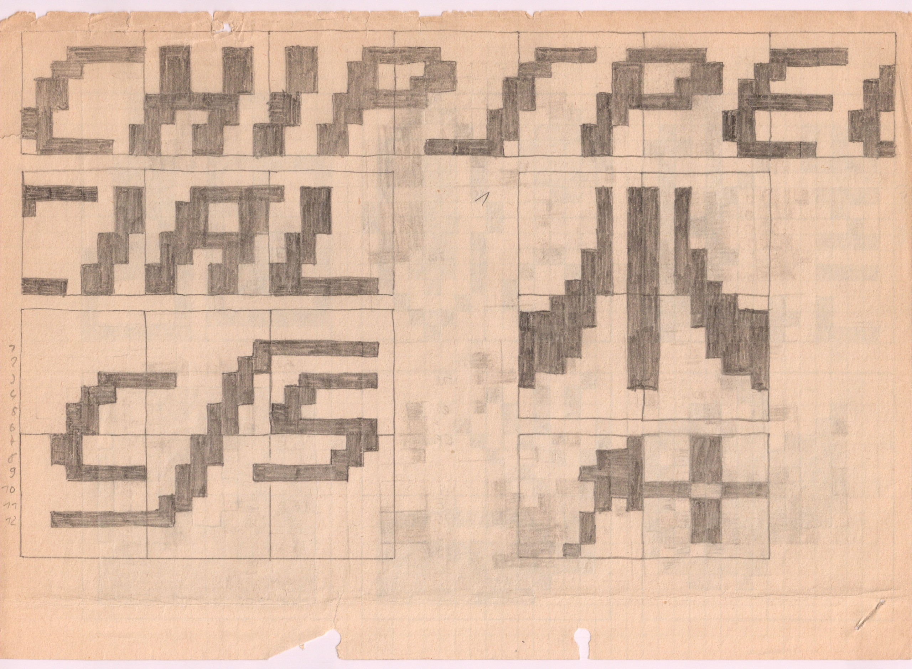
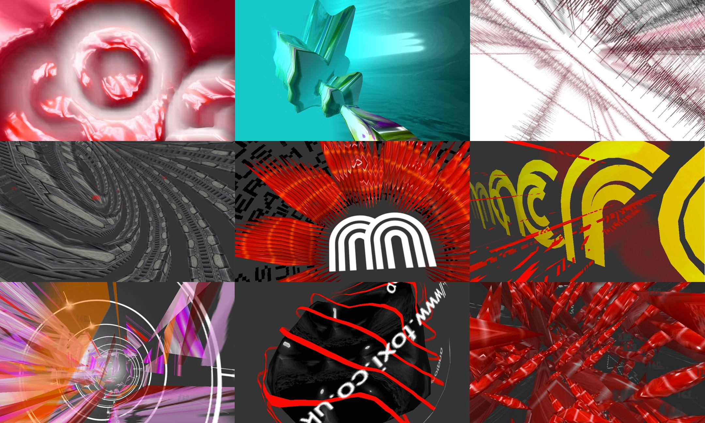

# The Jacob’s Ladder of coding

Anecdotes and questions about climbing up and down the ladder of abstraction:
Atari, ARM, demoscene, education, creative coding, community, seeking lightness,
enlightenment & strange languages

27 years ago I had my first encounter with a computer. Signed up by our parents
to an afternoon course after school, five other 13 year olds and I had the
honour to be the first children in our East-german town to touch these, to us
mystical, machines & learn to program them. The hardware available to us was the
glorious [Robotron KC85/3](https://en.wikipedia.org/wiki/KC_85), the company’s
top-of-the-range model of modular (and unaffordable) home computers, and some
Russian [Junost B&W TVs](https://www.google.co.uk/search?tbm=isch&q=junost+tv)
as monitors. As it turned out, not much else but programming could be done by us
with these boxes and knowing close to nothing about computers nor any games you
could play with them, we happily accepted our fate and embarked on our mission
to spend every Tuesday afternoon throughout the entire school years of 1988/89
to learn as much about computing as we could and built our own game as an excuse
for a learning context. It was the best “school” of my life (in fact it was the
most decisive year of my childhood), with our little band of nerds unwittingly
touching almost every aspect of creative computing / production, self-guided
learning & result-oriented experimentation, team thinking, sharing etc. Last but
not least, in terms of extreme resource constraints, it was a **very** far cry
from today’s perspective about what constitutes a child-friendly computing
education… and I still think in some ways it was a better one, providing more
solid foundations in a truly holistic approach to eventually _learn a craft_.
And, after all, limitation is the mother of all invention!



Image source: [Wikipedia](https://en.wikipedia.org/wiki/KC_85)

Only many years later and well after college, did I come to fully appreciate how
amazing our tutors actually were, two Maths students from the local university.
These guys threw us in the deep end from day one, showed us the ropes and
supplied us with endless amounts of inspiration, reading lists about anything
from possible/weird creative applications of these machines, abstract Russian
art, hardware references, boolean logic, hex numbers & bit-twiddling, game
concepts & theory, music, audio and DSP basics (for chip tunes); they gave us an
electronics crash course, taught geometry, graphics algorithms, typography
(pixel fonts) and of course taught us programming, programming, programming… on
the lowest level possible, in Hexcode & Assembly. Soon I became a regular in our
local library. In all of that, the part I loved most was the lack of boundaries
in our explorations, both back then as still today. The quest for combined
cross-domain knowledge became highly addictive and our teenage brains were like
dry sponges, soaking it all up. At the same time, the initial lack of peers or
community outside our tiny group, led us to (re)discover many basic concepts &
techniques ourselves. To this day I’m still sometimes on the fence if that is or
isn’t _always_ a bad thing… At numerous times I found that conscious isolation
can sometimes indeed lead to more direct insights, techniques and solutions to
existing problems, which otherwise are not taken into account, if all of our
activity is only based on and influenced by the prior research of others. Focus
always has a cost and research takes time. That is especially true in today’s
open source culture and the endless hourly influx of hip new projects via social
media.



One of my all-time favourite and life changing books, written by [Horst
Völz](https://de.wikipedia.org/wiki/Horst_V%C3%B6lz), published by Akzent in
1988 (GDR). This tiny book not only provided a comprehensive overview and code
examples of how computers could (and already were) used in creative disciplines:
generative graphic systems, fractals, poetry, music, AI etc. — but also combined
all these topics with a lot of CS & information theory (Turing, Shannon, Markov
chains, Expert systems…), ethics and historical context (e.g. generative
techniques used during Renaissance times). It is the book which made me want to
study this field later on.

Storming each week from school to the lab, our afternoons there quickly turned
into a gateway to another world, one in which we felt our powers increasing week
by week (very much unlike in the traditional setting of our normal school).
Maths & physics suddenly became fun and relevant to our lives, since they
enabled us to get results on screen and through the speaker. How do you draw a
line or circle on screen without trigonometry or even rational numbers? Well,
there is a guy called
[Bresenham](https://en.wikipedia.org/wiki/Jack_Elton_Bresenham)... Learning
about audio, frequencies & music theory in order to make simple chip tunes
noises for our game, made me want to learn to play the piano, later build a 4bit
sampler (with my brother’s help) and yet a few years later brought me into music
production, setup a little studio, play live gigs and release a handful of 12"
vinyl. Designing pixel fonts & graphics on paper too proved to be the perfect
way to learn about binary & hex numbers, bit masking/shifting… skills still
often essential today, especially when working with embedded devices.



The numbers on the right represent the 8bit pattern of each row (here in
decimal). Converting them to hex was useful since it meant ~30% less typing (the
max. 8bit number in decimal is 255, in hex FF).

With only an hour or two of computer time a week, our learning and progress was
largely down to intensive trial & error, daily homework and learning to code and
debug with only pencil and paper, whilst trying to be the machine yourself:
Playing every step through in our heads (and on paper) over and over until we
were confident, the code did as we’d expect, yet, often still failing because of
wrong intuitions. Learning this analytical thinking is essential to successful
debugging, even today, specifically in languages / environments where no GUI
debugger is available. In the late 90s, John Maeda did similar exercises at MIT
Media Lab, with students role-playing different parts of a CPU or a whole
computer executing a simple process. Later at college, my own CS prof too would
often quote Alan Perlis:

> “To understand a program you must become both the machine and the
> program.” — Alan Perlis

Initially we’d only be using the machine largely to just verify our ideas
prepared at home (spending the majority of the time typing in/correcting numbers
from paper). Through this monastic style of working, we also learned the
importance of having the right tools and balance of skills within the group and
were responsible to create them ourselves in order to achieve our vision. This
important lesson stayed with me throughout (maybe even became) my career so far…
Most projects I worked on, especially in the past 15 years, almost exclusively
relied on custom-made tooling, which was as much part of the final outcome as
the main deliverable to clients. Often times it even _was_ the main deliverable.
On the other hand, I’ve also had to learn the hard way that being a largely
self-sufficient generalist often is undesired in the modern workplace, which
frequently still encourages narrow expertise above all else…



After a few months of convincing my parents to invest all of their saved up and
invaluable West-german money to purchase a piece of “Power Without the Price” (a
much beloved Atari 800XL) a year before the Wall came down in Berlin, I finally
gained daily access to a computer, but was still in a similar situation as
before: No more hard west money left to buy a tape nor disk drive from the
[Intershop](https://en.wikipedia.org/wiki/Intershop), I wasn’t able to save any
work (apart from creating paper copies) and so the Atari was largely kept
switched on until November 10, 1989, the day after the Berlin Wall was opened
and I could buy an
[XC-12](http://www.atarimania.com/documents/Atari_XC12_Program_Recorder_Owners_Manual_1986_Atari.pdf)
tape recorder. I too had to choose whether to go the usual route of working with
the built-in [BASIC](https://atariarchives.org/basic/) language or stick with
what I’d learned/taught myself so far,
[Assembly](https://atariarchives.org/roots/)… In hindsight, am glad I chose the
latter, since it proved to be far more useful and transportable knowledge, even
today!



6502 opcode table for the 8bit Atari. There were no XEROX copiers in East
Germany, so everything had to be typed up… Btw. Bugs don’t just exist in
software, this chip had an addressing error, still it was shipped 100,000’s of
times and people had to work around it (or exploit it :)…



One of few surviving pages of Assembly code, which needed to be manually
translated in to Hex numbers via the opcode table above and then typed in… Only
later did I have the convenience of working with an actual Assembler.

Documentation about western hardware was hard to come by in the East at that
time. Via one of my dad’s colleagues I managed to borrow a
[6502](http://6502.org/) opcode table and some basic Atari OS & hardware
references, enough to continue with my journey of writing and hand-compiling
Assembly to [Hexcode](https://en.wikipedia.org/wiki/Hexadecimal) on paper. I
never questioned the manic insanity of this process until later — I just didn’t
know any better at the time. As an aside, recently reading in George Dyson’s
“[Darwin among the
machines](https://www.amazon.com/Darwin-among-Machines-Evolution-Intelligence/dp/0465031625)”
about similar stories of the [IAS](https://www.ias.edu/) pioneers in Princeton
some 35-40 years prior, made me realise that progress in computing is often
(still) slow indeed.



Some early logo sketches for CSS (Chip Special Software), my first demoscene
hande/alias.

By joining the local “Chaos Club Chemnitz” (a not much bigger group than our
KC85 team two years prior) and [ABBUC](https://www.abbuc.de/) (which is
celebrating its 30th anniversary this year!), I quickly got sucked into the
[demoscene](https://en.wikipedia.org/wiki/Demoscene) flourishing all over Europe
and found more creative outlets and confidence bending the machine to my will.
By 1993/94 the Atari 8bit demo scene had grown considerably and for two years I
co-organized and produced the Halle Project, a “megademo” (a 2 disk collection
of a dozen smaller productions) for one of the scene’s biggest meetings with a
few hundred participants, organized by Top Magazine.

https://www.youtube.com/watch?v=LLan9YDecBI

The Halle Project 1993. I created the loader, contributed the first two parts
and the music for Peter Dell’s (Jacomo) amazing Visdom demo (starts at 6:12).
The sample in the first intro part was recorded with my self-built 4bit sampler,
filled up the entire available RAM and was taken from one of [Torsten
Fenslau](https://www.discogs.com/artist/61591-Torsten-Fenslau)’s epic intros to
the classic [HR3 clubnight](http://www.yourepeat.com/watch/?v=IkAI6raCkkg) radio
show. 7 month later, Torsten died in a car crash :(

https://www.youtube.com/watch?v=U5ClV5v3i5c

The Halle Project 1994 edition, my first foray into vector 3D graphics layered
over a hand-pixeled background image and a chip tune version of Gerry Rafferty’s
Bakerstreet. A pure culture clash!

At this party, being aged 17, I also got my first coding job, a commission to
write a [Lemmings](https://en.wikipedia.org/wiki/Lemmings_%28video_game%29)
clone for the 8bit Atari, released the year later to critical acclaim as The
Brundles… With 100 levels (which also required a GUI level editor to be built),
no access to the original game (only text descriptions of the overall game
logic) and needing to support a number of different hardware extensions (RAM)
and input devices (e.g. ST/Amiga mice) for better gameplay, this project was a
huge task with over 10 months of daily work (before & after school), combining
and requiring every trick I’d learned thus far. It simply would not have been
possible, had I previously chosen the more convenient route and only used BASIC
at the time… In fact, the source code alone exceeded the 64K RAM limit of the
Atari (for BASIC the limit would have been only 48KB, with much lower code
density) and development was only possible by upgrading my machine with an
internal RAM extension to a combined 320KB.

Lesson learned: Language skills, natural and coded ones, are gateways, opening
paths not just for more expression, but also to paths in life.

https://www.youtube.com/watch?v=q46nTcTfv3k

The Brundles loading sequence and gameplay of the first few levels. My friend
Rolf A. Specht (Analog Research) did most of the graphics for the game and Kemal
Ezcan (KE-Soft), the game’s publisher, created the music.

As is the case today, so it was back then: People tend to organize around
specific technological interests, languages and platforms and then stick with
them for a long time, for better or worse. Over the years I’ve been part of many
such tool-based communities (chronologically: Asm, C, TurboPascal, Director, JS,
Flash, Java, Processing, Clojure) and have somewhat turned into a nomad, not
being able to ever find a true home in most of them. This might sound
judgemental and negative, but really isn’t meant to and these travels through
the land of languages and toolkits has given me much food for thought. Having
slowly climbed up the ladder of abstraction and spent many years both with low &
high level languages, has shown me how much each side of the spectrum can inform
and learn from the other (and they really should do more so!). It’s an
experience I can highly recommend to anyone attempting to better understand
these machines some of us are working with for many hours a day and which impact
so much of all our lives. So am extremely grateful to all the kind souls &
learning encountered on the way!



Screenshots of [Macronaut](http://toxi.co.uk/macronaut), one of the demos I made
with Director / Shockwave 3D in 2002. It featured and acted as a testbed for
tightly synced audio responsive visuals, voxel isosurfaces, flocking, mesh
deformations, 3D typography. Sadly, no video version exists and due to Shockwave
being a proprietary platform, also no emulator. Also see entry on
[pouet.net](https://www.pouet.net/prod.php?which=7926).

In the pre-internet world of the early ’90s, we had mainly two camps: 8bit vs.
16bit and Atari vs. Commodore (and some Sinclair). People in each other camp
were considered taboo :) Each platform was basically a completely separate
scene… but apart from the chosen hardware providing each scene’s main identity,
we swore no further allegiances to specific software or languages used and the
community was IMHO much more inclusive (and without a need for CoC’s). In our
bi-weekly club meetings we’d talk about & experiment with anything interesting
to do, not just with the Atari: be it strange languages, books, new games,
tools, events, disk mags or hardware hacks. Anything went. Most members were
all-rounders.

In the vastly larger open source creative computing demographic of today, the by
far biggest groups are tight-knit communities around individual frameworks and
languages. There is much these platforms have achieved in terms of output,
increasing overall code literacy and turning thousands of people from mere
computer users into authors. This is a feat not be underestimated and a Good
Thing™! Yet my issue with this siloed general state of affairs is that, apart
from a few notable exceptions (especially the more recent arrivals), there’s
unfortunately a) not much cross-fertilizing with fundamentally different and/or
new ideas in computing going on and b) over time only incremental progress is
happening, business as usual, rather than a will to continuously challenge core
assumptions among these largest communities about _how we_ talk to machines and
how we can do so better. I find it truly sad that many of these popular
frameworks rely only on the same old imperative programming language family,
philosophy and process, which has been pre-dominant and largely unchanged for
the past 30+ years, and their communities also happily avoid or actively reject
alternative solutions, which might require fundamental changes to their tools,
but which actually could be more suitable and/or powerful to their aims and
reach. Some of these platforms have become and act as institutions in their own
right and as such also tend to espouse an inward looking approach & philosophy
to further cement their status (as owners or pillars?) in their field. This
often includes a no-skills-neccessary, we-cater-all-problems promise to their
new users, with each community re-inventing the same _old_ wheels in their own
image along the way. It’s
[Not-Invented-Here](https://en.wikipedia.org/wiki/Not_invented_here) on a
community level: A reliance on insular support ecosystems, libraries & tooling
is typical, reducing overall code re-use (at least between communities sharing
the same underlying language) and increasing fragmentation. More often than not
these platforms [**equate simplicity with
ease**](https://www.infoq.com/presentations/Simple-Made-Easy) (go watch Rich
Hickey taking this argument eloquently apart!). The popular prioritization of no
pre-requisite knowledge, super shallow learning curves and quick results
eventually becomes the main obstacle to later achieve systemic changes, not just
in these tools themselves, but also for (creative) coding as discipline at
large. Bloatware emerges. Please do forgive if that all sounds harsh, but I
simply do believe we can do better!

Every time I talk with others about this topic, I can’t help but think about
[Snow Crash](https://en.wikipedia.org/wiki/Snow_Crash)’s idea of “Language is a
virus”. I sometimes do wonder what makes us modern humans, especially those
working with computing technology, so fundamentalist and brand-loyal to these
often flawed platforms we happen to use? Is it really that we believe there’s no
better way? Are we really _always_ only pressed for time? Are we mostly content
with Good Enough? Are we just doing what everyone else seems to be doing? Is it
status anxiety, a feeling we have to use X to make a living? Are we afraid of
unlearning? Is it that learning tech/coding is (still) too hard, too much of an
effort, which can only be justified a few times per lifetime? For people who
have been in the game long enough and maybe made a name for themselves in their
community, is it pride, sentimentality or fear of becoming a complete beginner
again? Is it maybe a sign that the way we teach computing and focus on concrete
tools too early in order to obtain quick, unrealistically complex results,
rather than fundamental (“boring”) knowledge, which is somewhat flawed? Is it
our addiction to largely focus on things we can document/celebrate every minor
learning step as an achievement in public? This is no stab at educators — much
of this systemic behavior is driven by the sheer explosion of (too often
similar) choices, demands made by students and policy makers. But I do think we
should ask ourselves these questions more often.

Of course, I realise there too are a number of important commercial and social
benefits and effects this tool-based self-identification of programming
communities has produced and I gladly had a tiny share of those. On the other
hand, as someone standing more on the fringes, I think it’s a strange & worrying
development that use of some of these (by now) established tools increasingly is
becoming an almost mandatory requirement, a kind of brand or quality label and
job qualification, as well as a delineation for (sub-)disciplines (as if there’s
always just this _one_ right tool for the job), especially in the creative
applications spectrum/market. By doing this we’re forgetting something. If we
allow it to happen that entire coding disciplines again are to be defined by
only the currently popular tools, we seem to forget that most of these tools
first appeared exactly to provide more choice, more means and ranges of
expression and to break the former monopolies of the previous generation (e.g.
Director/Flash) — only now to take over that role as new defacto standards. This
is not so much the direct fault of these tools themselves, but we have to
acknowledge that as more and more people are only becoming exposed to the fine
art of coding through these frameworks, we’re losing track that there’re many,
many more choices out there, and many of them underexposed by the light beams of
existing communities. We must not forget that “New needs friends”, [as so nicely
stated by Anton Ego](https://www.youtube.com/watch?v=-JPOoFkrh94) in Pixar’s
Ratatouille. The same goes for “Different”! So in some ways it _does_ come down
to the stewards of those existing communities to more actively encourage and
allow re-thinking of core assumptions to take place. We all know that community
building takes a lot more time and effort than churning out the Next Great Idea
in code form. But communities are programmed themselves and I strongly believe,
that even though we cannot fully overcome the Tower of Babel effect, we can
shift our communities’ primary means of identity from being tool-specific /
technology-based to become more focused on broad-concepts / targets, we’ll all
be learning more (from each other).

As I look back (triggered by recent research) on my own life with computers, I
began to realise why, after climbing the language ladder of abstractions, I’ve
been rejecting frameworks more and more over the past years. As explained
earlier, my trajectory has always followed more of a “bottom-up” approach and I
often still struggle with its polar opposite (“top-down”), both in coding as in
design. Creative projects require creative tools. For example, my
[toxiclibs](https://github.com/postspectacular/toxiclibs) project was partly started out of concrete
needs for work projects, but to work around
[Processing](https://processing.org)’s lack of abstract data models for its core
themes (e.g. creation of visuals). However, it never was purely a Processing
specific project (even though 99% of people have only ever been using it in that
context). Over the 6 years that I worked almost daily on this project, my only
ever design philosophies were No-lock-in & Open-endedness: 1) to not force
myself/users becoming dependent on a single framework (it’s already enough to be
constrained to a given language, Java in this case), 2) to define as many useful
things as possible and define them to be as extensible as _feasible_ and 3) to
document some of these options via 100+ small examples and the larger work
projects I myself and others used these libraries for. Another key principle was
to use it all as teaching tool. There’re many things I’ve learned since, but
this same guiding philosophy still too forms the basis for toxiclibs’ successor,
the collection of [thi.ng](https://thi.ng/)’s for (initially) Clojure &
Clojurescript and is (hopefully) expressed even more clearly. Providing many,
only loosely coupled constructs with many points for customization, but without
overly dictating how they can be used or combined, is key to enable flexibility
in design tools and for me is the primary mark of a bottom-up tool. It’s also
the trademark of a language.

https://vimeo.com/6644720

Toxiclibs community showreel from 2009.

https://vimeo.com/15379147

Toxiclibs community showreel 2010.

In terms of programming languages, that bottom end usually means
[Assembly](https://en.wikipedia.org/wiki/Assembly_language). It is said that
coding in Assembly for prolonged periods can cause the infamous “[God
complex](https://en.wikipedia.org/wiki/God_complex)”, often associated with
general Nerdom and bragging rights in coding circles. Maybe it’s because
Assembly is the only available language without any extra layer of conceptual
translation between human thought and silicon and hence it is widely considered
Black-belt Hard Stuff™. On the other hand, Assembly is often seen as very hard,
because **writing in this language not just assumes, but literally requires, a
much deeper and more detailed understanding of the nature of the machine** and
this is what new programmers are often lacking (see previous section). The usual
argument for justifying this conscious gap in knowledge often runs along the
lines of “You don’t need to know how an injection engine works in order to drive
a car”, which is very true of course. However, programming is a very different
discipline to driving and even though I largely agree with the reasoning for
most common use cases on modern desktop environments with hundreds of complex
API layers, I believe that actively avoiding this knowledge gap outright, by
design, in the world of embedded devices and IoT, is something we should
seriously question and counteract.

https://www.youtube.com/watch?v=lbUnz1a9GPk

[Denno Coil](https://en.wikipedia.org/wiki/Denn%C5%8D_Coil) was an anime series
about a group of hacker children in an augmented reality city. One of the
characters, Yuko Amasawa used special knowledge to alter the government control
AR infrastructure by drawing complex fiducial markers (used for computer vision)
in chalk — the equivalent of coding in Assembly (and also good portrayal of the
God complex).

> “I still believe in abstraction, but now I know that one ends with
> abstraction, not starts with it. I learned that one has to adapt abstractions
> to reality and not the other way around.” — [Alexander
> Stepanov](https://en.wikiquote.org/wiki/Alexander_Stepanov)

**Everything in computing has a cost, either in space, time or energy**. Yes,
higher level (more abstract) languages like Javascript or Python allow for
shorter dev cycles, but these savings come with other costs in terms of lack of
understanding, loss of direct hardware control, more tooling needed, slower
runtime, magnitudes more resources (support code, memory, clock speed, virtual
machines, interpreters etc.) and therefore overall higher energy demands too.
The extra layers between the code we write and its final result can also become
an hindrance when debugging. Furthermore, it’s a fallacy to assume that one’s
Javascript knowledge from working with web browsers is directly transferrable to
microprocessors, which often require a very different model of programming for
anything more than just reading a sensor or flashing an LED. Whereas these days
we can mostly ignore these incurred costs on desktops and in the cloud, for
embedded devices we still should to be paying more attention, not only because
their CPUs are still largely timed in MHz rather than GHz, but also because of
physics — more efficient code, less resources needed (smaller, lower powered
chips), longer battery life, less waste. This stuff matters, or rather _it
should matter more_, especially if we’re supposedly going to spill them by the
billions into the environment over the coming years. Also from the hardware
manufacturers’ side, these considerations are being taken seriously with many
available options to dynamically control power consumption. So why not in
software then too?

Embedded devices often really don’t need a full blown Operating System like
Linux and usually have a more simple hardware architecture than their bigger
siblings (although this is changing too). This all actually makes them the
perfect contemporary learning environment to understand how a CPU (or whole
System-On-a-Chip) and communication with peripherals operates. We can play a
game of catching up. Sometimes doing so without crutches, in Assembly, can be
incredibly enlightening and refreshingly _simple_ (again, in the [Rich Hickey
interpretation of the
word](https://www.infoq.com/presentations/Simple-Made-Easy), **go watch it!!!**),
often even surprisingly so. To anyone who’s developed a sense of code aesthetic
and has a love of lightness and minimalism in how we work with computers,
out-of-fashion languages like Assembly (but also the many flavors of Lisp,
Forth) or new contenders like [Rust](https://www.rust-lang.org/),
[Pony](https://www.ponylang.org/) provide an appealing choice — if not for their
speed and elegance, but at the very least for learning purposes and a different
glimpse of what programming was like, is (in some fields) and could be (in
ours). Some languages have introduced ideas which only became truly viable
decades later, when hardware and sufficient numbers of humans had finally caught
up. However, recently it seems our software world, not hardware, has more and
more catching up to do. Learning these concepts can lead one into a rabbit hole,
but the knowledge gained certainly isn’t a one-way street and will make you a
better programmer, even if your final choice for a project is a more mainstream
language.

> “The true delight is in the finding out rather than in the knowing.”> — Isaac
> Asimov

The code below is a complete Assembly “Hello world” equivalent, a blinking LED,
for a 32bit ARM Cortex M4 CPU. Its ~20 lines of source code (excl. comments,
configuration and variables) equal the same number of operations the CPU is
executing (usually 1 per line) and produce a final binary version of just 76
bytes (not KB!). Even in C, considered the primary low-level systems programming
language, a programme producing the same effect requires between ~1,100–10,000
bytes (this comparison uses Arduino, depends on target platform 8bit vs. 32bit),
that’s 15–140 times more (e.g. the [Arduino Blinky
example](https://www.arduino.cc/en/Tutorial/Blink) compiles down to 10,092 bytes
for a similar CPU [Cortex-M3])!

```assembly
// blinky.S

    .syntax unified
    .cpu cortex-m4
    .thumb

    // configuration values for STM32F4x
    // see: https://www.st.com/web/en/resource/technical/document/reference_manual/DM00031020.pdf

#define AHB1PERIPH_BASE 0x40020000
#define RCC_BASE        AHB1PERIPH_BASE + 0x3800
#define RCC_AHB1_ENR    RCC_BASE + 0x30
#define GPIOD_BASE      AHB1PERIPH_BASE + 0x0c00
#define GPIOD_MODER     GPIOD_BASE
#define GPIOD_ODR       GPIOD_BASE + 0x14
#define GPIOD_BIT       8
#define LED_PIN         15
#define LED_MODER       1 << (2 * LED_PIN)
#define LED_BIT         1 << LED_PIN
#define DELAY           0x80000

    .section  .text
    .weak     _start
    .type     _start, %function
_start:
    ldr     r0, =RCC_AHB1_ENR   // get contents of AHB1 bus clock enable register
    ldr     r1, [r0]
    orr     r1, GPIOD_BIT       // set bit to enable clock for GPIO port D
    str     r1, [r0]
    ldr     r0, =GPIOD_MODER    // configure LED pin as outout
    ldr     r1, =LED_MODER
    str     r1, [r0]
    ldr     r0, =GPIOD_ODR      // load address of GPIOD output data register
.blink:
    movw    r1, LED_BIT
    str     r1, [r0]            // setting LED bit in GPIOD_ODR
    bl      .delay              // jump to delay function below
    eors    r1, r1              // clear r1 register
    str     r1, [r0]            // turn LED off
    bl      .delay              // wait again
    b       .blink              // infinite loop
.delay:
    ldr     r2, =DELAY          // load DELAY value
1:  subs    r2, r2, #1          // count down to 0 = wait
    bne     1b
    bx      lr                  // return to caller

    // partial, but mandatory ARM Cortex M interrupt table
    // here we only specify the reset handler, which also is our main program
    .section .isr_vector_table, "a", %progbits
    .type    isr_vectors, %object
isr_vectors:
    .word   _estack             // stack start address (defined in linker script)
    .word   _start              // address of the reset handler
    .size   isr_vectors, . - isr_vectors
```

A version complete with linker & flash scripts is [available
here](https://gist.github.com/postspectacular/045a694803d896dd0065).

Strong platform dependency has always been another key criticism of Assembly:
Code written for one CPU usually doesn’t work on another. Even though this
remains a fundamental, unresolvable issue, I too believe that in the current
market situation it is somewhat of a lesser concern than it used to be
(especially if we’re also honest about the realistic lifespan and scope of much
of our software): For example, [ARM](https://www.arm.com/) and its IP-only
business model has somewhat ensured that there’re now dozens of manufacturers
with hundreds of different versions alone of the [Cortex
M](https://en.wikipedia.org/wiki/ARM_Cortex-M) chip family. And although they do
slightly vary in terms of instruction set features, they’re are not entirely
incompatible and all upwards compatible by design.

For me Assembly isn’t (just) about maximum speed and code density. My recent
interest in going back to my programming cradle has also not much to do with
sentimentality. Having said this, I think there’s a level of cross-domain
ingenuity present among embedded system coders, which I sometimes miss in our
main platforms. It’s also nice to see that the demoscene is embracing some of
these platforms:

https://www.youtube.com/watch?v=ymGCeG9_6c0

Jupiter & Beyond by SVatG (2013) running on a $15 STM32F4 dev board **without
GPU/VGA support**. In addition to the visuals and audio, the demo too generates
its own VGA signal, which is passed to a real display via a series of resistors.
Productions like this are great to actually understand how powerful even such
small computers are/can be.

Instead, I want to revisit this world “closer to the metal” with the by now very
different mindset obtained from working on the other side of the abstraction
spectrum. Especially my last 4 years spent with [Clojure](https://clojure.org/)
(one of the notable, open-your-mind exceptions I talked about earlier) have
provided me with an incredible (and incredibly useful) amount of new insights
and research ideas. I’ve already noticed how this has positively impacted my
coding style in C and also triggered me to revisit other forgotten languages
from my past, e.g.
[Forth](https://en.wikipedia.org/wiki/Forth_%28programming_language%29) — one of
the seemingly most shunned & unknown languages today (though judging by Github
activity over the past year, slowly gaining again more activity than I remember
previously).

Languages like Clojure, a modern dialect of
[Lisp](https://en.wikipedia.org/wiki/Lisp_%28programming_language%29), are not
just different because of their “strange” looking syntax, or in the case of
Forth, the almost complete lack of syntax. To me it’s their very different view
of what computing can be like, what makes these languages so fascinating. And
here I’m talking about the full experience of programming a machine. As much as
I’m interested in final outcomes, I’m equally invested in bettering the way we
work with machines. Even single concepts like [persistent data
structures](https://en.wikipedia.org/wiki/Persistent_data_structure) or the
presence of a
[REPL](https://en.wikipedia.org/wiki/Read%E2%80%93eval%E2%80%93print_loop) (an
interactive programming environment) are core to the way we think, plan and
express our ideas with these languages and can be transformative to our entire
workflow. The ability to break the write/(compile)/run cycle or [hot-swap code
in a running system](https://github.com/bhauman/lein-figwheel) without
destroying application state already has [transformed the often-times
frustrating experience of modern
webdesign](https://github.com/clojure/clojurescript). It also enables live
coding, a field which is rapidly gaining popularity, not just for musical
applications (though being a timebased medium, that’s where most of the research
and [education](https://sonic-pi.net) is happening).

The following are the perfect examples why we can’t (and shouldn’t) rely on just
general purpose mainstream languages for everything we do with our computers.

https://www.youtube.com/watch?v=bq-260NUw5o

Andrew Sorenson is one of my livecoding heros. He has been working on his
[Impromptu](http://impromptu.moso.com.au/) and
[Extempore](https://extemporelang.github.io/) languages for many years.

https://www.youtube.com/watch?v=K4zAcRcXo68

Sam Aaron is the founder of the [Overtone](https://overtone.github.io/) and
[Sonic-PI](https://sonic-pi.net) projects,
[Supercollider](https://supercollider.github.io/) based livecoding languages &
environments, with the latter primarily aimed at music education using Raspberry
PI (but also available for OSX/Windows).

https://soundcloud.com/toxi/sonic-pi-retune14

My own Sonic-PI livecoding demo/session recorded at the Retune 2014 conference
in Berlin.

Over the past year I’ve started researching and working on a new music
programming environment again myself. It’s a theme I seem to keep on revisiting
every few years, only this time using low-cost embedded devices and with the aim
to combine it with livecoding, gestural / environmental inputs and applying &
testdriving concepts from other languages in this controlled environment.

https://www.youtube.com/watch?v=LQ988B5vlyo

Forever by Universal Everything at Victoria & Albert Museum, 2008/9. In addition
to coding all visuals for this installation, I too designed a rule-based,
generative music composition system using 200+ single shot samples by [Simon
Pyke](http://www.freefarm.co.uk/), all recorded in the same key. With a custom
made annotation tool, we defined rules, constraints and musical scales for all
instrument groups, which then were used to evolve the composition in realtime,
non-stop over the 3 months of the installation.

If many people already take issues with Lisp’s extensive use of parenthesis,
then [Forth](https://en.wikipedia.org/wiki/Forth_%28programming_language%29) and
the [family of concatenative languages](https://concatenative.org/) will seem
even more alien, dare I say radical. However even a brief cursory examination
should show some unique benefits: Forth has an unique focus on programmer
freedom, simplicity and being lightweight. It constitutes a stack based,
_hyperstatic_, but interactively programmable environment, dynamically switching
between compiled & interpreted modes (though the interpreter incurs much less
costs than in other languages). Most Forth implementations are also
self-compiling (with most of the core language words defined in Forth itself).
The lack of syntax and being stack-based makes it trivial to implement
domain-specific languages — essentially any application written in Forth is
written in its own DSL.

> “If you know one Forth, you know one Forth.” — [Bernd
> Paysan](https://groups.google.com/d/msg/comp.lang.forth/YVjtNQwSIH0/RLk5qjWy9dUJ)

Forth (by now) seems to be more of a family than a fixed language, the above
quote nicely sums it up. There is a (much debated) standard though, however the
community seems fractured. Due to the freedom the language inspires, it really
shouldn’t be surprising to see a large number of “North” (as in “Not Forth”)
languages. Depending how one looks at it, it’s either the best example of the
NIH Syndrome, or on the other hand, the logical conclusion of its core
philosophy: To avoid any unneeded junk. Nonetheless, it has been used
successfully for 40+ years for both complex and extremely resource constrained
applications, incl. much work done for NASA and in the early years at Apple
(MacFORTH was the first full development system for the Mac in ‘84).

> “…Forth does it differently. There is no syntax, no redundancy, no typing.
> There are no errors that can be detected. …there are no parentheses. No
> indentation. No hooks, no compatibility. …No files. No operating system.”
>
> —[Chuck
> Moore](https://web.archive.org/web/20150730202353/http://www.colorforth.com/1percent.html),
> creator of Forth

In the same article “[1% the Code](https://concatenative.org/)”, he further
continues:

> “I must say that I’m appalled at the code I see. Because all this code suffers
> the same failings, I conclude it’s not a sporadic problem. Apparently all
> these programmers have copied each others style and are content with the
> result: that complex applications require millions of lines of code. And
> that’s not even counting the operating system required. Sadly, that is not an
> undesirable result. Bloated code does not just keep programmers employed, but
> managers and whole companies, internationally. Compact code would be an
> economic disaster. Because of its savings in team size, development time,
> storage requirements and maintainance cost.”
>
> — [Chuck
> Moore](https://web.archive.org/web/20150730202353/http://www.colorforth.com/1percent.html)

A practical example of this: When I started my journey of ARM C programming
using an [STM32F429 dev
board](https://www.st.com/web/catalog/tools/FM116/SC959/SS1532/PF259090), I was
shocked to find the bundled system source files add up to 160,000+ lines of C
(excluding comments!), which don’t provide much more than common ARM definitions
& macros, system initialization, basic peripheral drivers and an hardware
abstraction layer. On the other hand, a [complete Forth
environment](https://mecrisp.sourceforge.net/) with core peripheral drivers and
livecoding capabilities (via Serial port/UART) for the same CPU (and dozens
others) clocks in at only 8,550 lines of Assembly (that’s 5%). Of course that
isn’t a fair or even very meaningful comparison, but the magnitudes in
difference speak volumes here…

The following videos provide more of an Forth overview and demonstrate
livecoding on an Arduino and an
[FPGA](https://en.wikipedia.org/wiki/Field-programmable_gate_array) (the latter
includes a custom Forth CPU itself):

https://www.youtube.com/watch?v=gFE6oK7jkq4

AmForth can be downloaded from here:
[https://amforth.sourceforge.net/](https://amforth.sourceforge.net/). The
AmForth website also contains a
[cookbook](https://amforth.sourceforge.net/TG/Cookbook.html) of various
examples. The book reference shown in the video is [Starting
Forth](https://www.forth.com/starting-forth/) by Leo Brodie, generally a great
intro to programming.

https://www.youtube.com/watch?v=rdLgLCIDSk0

James Bowman and his open source J1 Forth CPU running on a Lattice FPGA. This
project uses the first fully open source FPGA development toolchain, Project
IceStorm. [More info](https://www.excamera.com/sphinx/article-j1a-swapforth.html)

To clarify where I’m going with all this: I’m not at all proposing that we
should be dropping everything and (re-)adopt languages like Forth, but I do
think a) there’re definite commercial, educational & scientific research
segments which would greatly benefit from fresh community investment in these
style languages and b) some of the ideas are highly interesting to me even if
applied to more mainstream environments (incl.
[audio](https://github.com/PaulBatchelor/Sporth) & shader development).

https://www.youtube.com/watch?v=30s3mgrkzQ0

One of the experiments done with my own JS & browser based Forth VM & REPL to
define pixel shaders in Forth and transpile them into GLSL. The original idea
comes from the [Forth Haiku Salon](http://www.forthsalon.appspot.com/), however
the transpiler implementation here is entirely Forth based and produces more
efficient code.

Since this article is getting rather long, I will have to defer a more complete
treatise of my foray into this language to another post. However, in closing,
I’d like to leave you with some work-in-progress results of this (currently
still C based) musical ARM adventure of mine.


All of this will at some point soon be open source and more properly documented.
For now it is largely a proof-of-concept and the result of a few months of
preparations and examples created during
[two](https://web.archive.org/web/20151229102713/https://actcenter.kr/program/build-your-own-synthesizer-getting-started-with-bare-metal-arm-programming-karsten-schmidt/)
[workshops](http://workshop.thi.ng/) about the project, run in the past month,
with more coming early next year. If you’re interested learning how to work
efficiently with ARM based devices (not just for music), create your own USB
devices, do some audio/DSP programming and build your own instrument as we go a
long, please visit [workshop.thi.ng](http://workshop.thi.ng) for more info
and/or [subscribe to the newsletter](https://tinyletter.com/thi-ng).

https://soundcloud.com/forthcharlie/sets/stm32f4

The [full set currently contains 40+ example
tracks](https://soundcloud.com/forthcharlie/sets/stm32f4) documenting various
features of the synth toolkit.

> “Do not walk in the footsteps of the sages. Instead, seek what they
> sought.” — [Source](http://weblog.raganwald.com/2005/03/page-thirteen.html)
