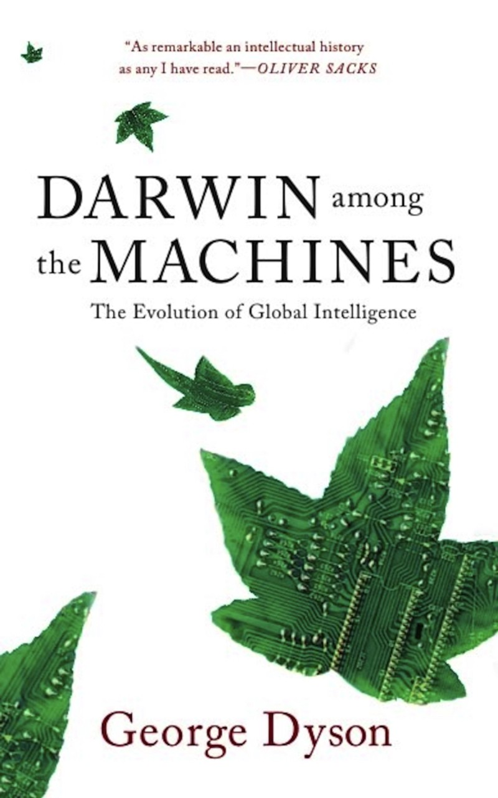

# Evolutionary failures (Part 1)

A journey into Genetic Programming techniques with [Clojure](http://clojure.org)
and [thi.ng](http://thi.ng/)

Over the years, generative techniques like Cellular Automata, [Diffusion-limited
Aggregation](http://toxiclibs.org/2010/02/new-package-simutils/),
Self-organization,
[Reaction-Diffusion](http://toxiclibs.org/2010/02/simutils-grayscott/), Genetic
Algorithms etc. have been playing a key role in my work and I more or less
successfully managed to use them for creating form & music. For an equally
long time [Genetic
Programming](https://en.wikipedia.org/wiki/Genetic_programming) (GP short, a
specialization of Genetic Algorithms) too has been on my to-do list of
techniques to use for a project, yet it never seemed sufficiently suitable until
about a year ago, when I received a chance email from my friends at
[HOLO](http://holo-magazine.com) to create a guest design for the second issue
of their “magazine” (it really should be called a book series!). Each issue of
HOLO is centered around a topic in the crossover field of arts, science and
technology. The topic chosen for the new issue was an “investigation of chance,
predictability, and (true) randomness”, a near perfect fit for employing some
evolutionary techniques to create visuals supporting the editorial throughout
the magazine.

This article is split into two parts, documenting key stages of my process for
this project and trying to extract some more general learnings from attempting
to utilize this form of programming for design creation with Clojure.


AFAIK this still is _the_ Genetic Programming text book. Jam packed with theory
and lots of different implementation approaches. I found my copy in a second
hand bookstore in Boston and its discussion of LISP was one of the reasons I
picked up Clojure a few years later (2011). Hint: It’s perfect for GP.

Before going into the various design routes explored, let’s first briefly
discuss what Genetic programming actually is. Many people familiar with
generative design will have heard of or even played around with GP’s cousin
(superset really), [Genetic
Algorithms](https://en.wikipedia.org/wiki/Genetic_algorithm) (GA). Both
techniques are very similar and strongly based on the Darwinian theory of
evolution, which even Creationists might find interesting to ponder and
experiment with. GP & GA are iterative processes: Starting with a population
of initially random genomes, we decode & apply them to create concrete
[phenotypes](https://en.wikipedia.org/wiki/Phenotype) (individuals with specific
gene expressions), which are then scored for fitness using a domain specific
fitness function. The only real differentiator between GA and GP is that
genotypes in the latter are program operators and phenotypes actual “complete”
programs, needing to be run/executed before their outputs can be used for
fitness scoring. In other words, GP is a form of progressive, goal-guided,
automatic code generation and optimization - all in one. The most successful
members of the current population are then selected for reproduction, often
including probabilistic mutation and mating to achieve cross-over effects and
mixing of genomes. The resulting offspring then forms the majority of the next
population (often along with new completely random individuals to replenish the
overall gene pool and to help avoiding getting stuck at [local
minima](https://en.wikipedia.org/wiki/Maxima_and_minima) in the often hilly
terrain of optimization). The process then repeats over hundreds of generations
with the aim of gradually increasing the overall fitness of the population until
a threshold/target fitness has been reached or no further improvements can be
found…

Since the process does not prescribe any other specifics, it’s suitable &
flexible enough for a wide range of design problems and for many years has
provided a fertile ground for research and experimentation, incl. arts, music,
architecture & engineering, but also the nature of programming itself (see
resources at the end of this article). More recent versions of GP (e.g.
[Cartesian Genetic Programming](http://www.cartesiangp.co.uk/)), combined with
modern hardware (GPUs,
[FPGAs](https://en.wikipedia.org/wiki/Field-programmable_gate_array)) makes
application of this automatic programming technique more feasible than ever
before, since entire populations can now be evaluated in parallel (and in
hardware), potentially cutting down evolution time by magnitudes. That is
important for use cases which rely on finding optimal solutions, on-demand and
in hitherto unknown situations (see second video below).

https://www.youtube.com/watch?v=HWMJdO4klIE

Lee Spector’s GP talk at Clojure Conj 2015 is a great intro to the field and how
to use it in Clojure

https://www.youtube.com/watch?v=tQvFZVlM2Gk

Wes Faler’s talk about using Cartesian Genetic Programming to evolve camera
De-Bayer filters for their moon buggy.

Defining a suitable fitness function and encoding scheme for genes can be the
truly hard parts of GP/GA, though, especially if the design problem is not well
defined, not easily encodable (or not yet known, as was the case for this
project). Therefore, prior study of the field to employ GP in is paramount and
prerequisite for success…


A section in Richard Dawkins’ “Climbing Mount Improbable” (1996) was my first
general introduction to applying the concept programmatically on the computer.

## Morphogen

My first step in the [HOLO](http://holo-magazine.com) design process was the
creation of a sufficiently flexible GP playground for my later experiments and
to evolve path-finding agents to create a (typographic) form as an initial
design idea. Related to this, though a year prior, I created the [Mophogen
DSL](http://thi.ng/morphogen), partially done as a component of [my
commission](http://devartcodefactory.com/) for the Barbican / [Google
DevArt](https://devart.withgoogle.com/) exhibition. Morphogen is a small
domain-specific language, written in Clojure, for defining complex 3D forms
starting from a single seed shape. Each operation acts on a single input shape
and produces any number of result shapes (e.g. the “subdiv” operator splits a
shape along an axis into 2 or more smaller shapes). If arranged in a tree
structure, these operators recursively transform e.g. a box into highly complex
objects. Most interesting to me was, how few operators would be actually needed
to create interesting objects and the current implementation has only 8 built-in
operators: split, reflect, inset corners, extrude, tilt, scale face, scale edge,
delete.


This structure was evolved from a single box using an operator tree ~60 levels
deep and only uses five of the eight available operators ([source
code](https://github.com/thi-ng/morphogen/blob/master/src/examples.org#hex-virus)).
Rendered with [Luxrender](http://luxrender.net).

The main take away points from this project were:

1.  Being completely code based (the DSL is merely creating syntax trees), it’s
    of course easy to define re-usable operator trees/sequences as ever more
    high-level operators.
2.  Because each generated object is tree based, its creation can be understood
    as recursive refinement over time and therefore easily be animated, simply
    by terminating tree processing at increasing depths in the hierarchy. This
    is both educational and fascinating to watch, and one of the nice
    side-effects just emerging automatically from this modeling approach. [An
    example animation is here](https://www.youtube.com/watch?v=vXlOB4NfAE0) (and
    another one below).
3.  The Morphogen setup already partially satisfies the overall structure needed
    for a GP system (minus fitness function & reproduction): The operator
    tree is equivalent to the genotype and its resulting object the phenotype.
    The trees can be easily crossed-over by swapping or transplanting branches
    between two (or more) individuals and/or can be mutated by randomly
    replacing/modifying individual nodes/locations in the tree… Also the reason
    why tree-based GP in general still is one of the most popular approaches.
4.  The Morphogen operators all use the same type & arity (always a single
    shape) and thus are easily interchangeable and simplify the cross-over &
    mutation steps.


Animation created using partial evaluation of the object’s operator tree with
increasing tree depth limit over time.


The operator tree of the above Morphogen object with the initial seed shape
transformation shown at the top.

## Path finding

So mixing ideas from Morphogen,
[LOGO](https://en.wikipedia.org/wiki/Logo_%28programming_language%29) ([Turtle
concept](https://en.wikipedia.org/wiki/Turtle_graphics)) and GP [ant colony
simulations](https://www.youtube.com/watch?v=BKF7pGw8qbY) (food locations), I
set out to define a LOGO-like mini “language” to evolve path-finding agents
whose genome is consisting of only these three different operations:

-   **if-target(dist)** - hard-coded condition with true & false branches,
    checks if agent is currently sufficiently close to the target path and
    hasn’t been in this vicinity previously
-   **mov(dist)** - move X units forward (in current direction)
-   **turn(theta)** - rotate X degrees (counter)clockwise, no movement

Clojure, with its rich set of built-in data types, sequence abstractions and
polymorphic functions (here:
[defmulti](http://clojuredocs.org/clojure.core/defmulti)), is a great
environment to implement an
[interpreter](https://en.wikipedia.org/wiki/Interpreter_%28computing%29) for
such language experiments without much ceremony. The program tree
([AST](https://en.wikipedia.org/wiki/Abstract_syntax_tree)) is represented as
nested [S-expression](https://en.wikipedia.org/wiki/S-expression) using simple
Clojure vectors and symbols. For cross-over and mutation operations I used the
[fast-zip](https://github.com/akhudek/fast-zip) library, a faster, drop-in
replacement for Clojure’s built-in
[clojure.zip](https://crossclj.info/ns/org.clojure/clojure/latest/clojure.zip.html)
namespace. A [zipper](https://en.wikipedia.org/wiki/Zipper_%28data_structure%29)
allows us to traverse a tree structure in a linear manner, whilst also
supporting ascend/descend and sibling navigation at any point. That makes it
very easy to pick a random tree node/branch and edit/replace it in a functional
manner. And since we’re dealing with immutable data, this “editing” is of course
non-destructive and would be quite involved without using zippers. Btw. Tommy
Hall has a [great introduction to zippers (and GP using
S-Expressions)](http://www.thattommyhall.com/2013/08/23/genetic-programming-in-clojure-with-zippers/).

```clj
;; holo2-ast-peephole.edn

;; random example program AST (w/ peephole optimization)
;; fixed target threshold 25, fixed rotation 45 deg
;; unoptimized version: https://gist.github.com/postspectacular/f421037929be75ee7e4e
[[if-target 25
  [[mov 47]
   [turn 45]
   [mov 17]
   [turn 90]]
  [[if-target 25
    [[mov 10]
     [turn 45]
     [if-target 25
      [[turn 45]
       [mov 11]]
      [[mov 34]
       [if-target 25
        [[turn 45]
         [mov 12]
         [turn -45]
         [mov 14]
         [turn 45]]
        [[turn 45]
         [mov 29]]]
       [mov 19]]]
     [turn 90]
     [mov 13]]
    [[turn -90]]]]]
 [mov 50]
 [if-target 25
  [[mov 12]
   [turn 45]
   [mov 14]]
  [[turn 45]
   [mov 26]
   [turn -45]]]
 [if-target 25
  [[mov 15]]
  [[turn 135]
   [mov 19]
   [turn 45]
   [mov 11]
   [turn 45]]]
 [mov 33]]
```

A randomly generated agent program with applied peephole optimization, cutting
down code size up to ~30%.

Each generation consisted of 128 such agent programs, with many growing to 2000
operations each (enforced limit). To keep code size down, I experimented with
applying a simple [Peephole
optimization](https://en.wikipedia.org/wiki/Peephole_optimization) to coalesce
successive ops of the same type (e.g. the sequence “mov(15), mov(12), turn(45),
turn(-45), mov(10)” could be rewritten as a single “mov(37)” - the two turns
cancel out each other and can be removed). Even though this worked and
noticeably cut down on execution time for single generations, it also had a
negative impact on the overall fitness progress. I never spent enough time
trying to figure out why, but speculate it has to do with the overall smaller
surface area to apply mutations and cross-over. “[Junk
DNA](https://en.wikipedia.org/wiki/Noncoding_DNA)” is important indeed. If I
ever get another chance in the future, I would like to implement ADF
([Automatically Defined
Functions](http://www.wseas.us/e-library/conferences/2009/cambridge/AIKED/AIKED56.pdf)),
which seem to provide not just better code re-use and support the emergence of
higher-level operators, but can also be scored for impact on fitness
independently (as unit).

Basic path finding agent setup, random AST generator and interpreter (GP parts
omitted for brevity)

```clj
;; holo-path-ast.clj

(ns hologp.path
  (:require
   [thi.ng.geom.core :as g]
   [thi.ng.geom.core.vector :as v]
   [thi.ng.math.core :as m]))

(def config
  {:mov       [10 20]
   :turn      [45 45]
   :if-target {:non-empty 0.2
               :dist      25}})

(declare eval-ast* rand-ast)

(defrecord Agent [path theta steps targets targets-remaining])

(defn make-agent
  "Returns a new agent with given start position and target points."
  [p targets] (Agent. [p] 0 0 0 targets))

;;;;;;;;;;;;;;;;;;;;;;;; Interpreter

(defn near-target?
  "Returns target if pos is within maxd units."
  [pos target maxd] (if (< (g/dist pos target) maxd) target))

(defn finished?
  "Returns true if agent has reached op limit or has no remaining targets."
  [a limit] (or (>= (:steps a) limit) (empty? (:targets-remaining a))))

(defmulti agent-op
  "Agent AST interpreter multi-function, dispatches on op-type"
  (fn [a ast limit] (first ast)))

;; MOV operator: Moves agent in current direction, increases step
;; counter, potentially consumes/snaps to next target
(defmethod agent-op 'mov
  [agent [_ speed] _]
  (let [pos    (g/+ (peek (:path agent))
                    (g/as-cartesian (v/vec2 speed (m/radians (:theta agent)))))
        target (near-target? pos (first (:targets-remaining agent)) speed)
        pos    (v/vec2 (or target pos))
        agent  (assoc agent
                      :path  (conj (:path agent) pos)
                      :pos   pos
                      :steps (inc (:steps agent)))]
    (if target
      (-> agent
          (update :targets inc)
          (update :targets-remaining subvec 1))
      agent)))

;; TURN operator: Updates direction and increases step counter
(defmethod agent-op 'turn
  [agent [_ theta] _]
  (-> agent
      (update :theta + theta)
      (update :steps inc)))

;; IF-TARGET operator: Checks if agent is near target,
;; then executes either true/false branch
(defmethod agent-op 'if-target
  [agent [_ dist then else] limit]
  (eval-ast*
   (update agent :steps inc)
   (if (near-target? (:pos agent) (first (:targets-remaining agent)) dist)
       then else)
   limit))

(defn eval-ast*
  "AST interpreter. Takes agent, AST and op limit. Executes tree until
  exhausted or agent is finished (has consumed all targets)."
  [agent ast limit]
  (reduce
   (fn [a ast]
     (if (finished? a limit)
       (reduced a)
       (agent-op a ast limit)))
   agent ast))

(defn eval-ast
  "Like eval-ast* but with additional iteration counter, allowing
  repeated applications of the AST."
  [agent ast limit iter]
  (loop [a agent, i iter]
    (if-not (or (zero? i) (finished? a limit))
      (recur (eval-ast* a ast limit) (dec i))
      a)))

;;;;;;;;;;;;;;;;;;;;;;;; AST generator

(defn rand-mov
  "Takes an agent config, returns a random move op."
  [conf] ['mov (int (apply m/random (:mov conf)))])

(defn rand-turn
  "Takes an agent config, returns a random turn op."
  [conf]
  (let [theta (int (apply m/random (:turn conf)))]
    ['turn (if (< (rand) 0.5) (- theta) theta)]))

(defn rand-terminal
  "Takes an agent config, returns a random non-branch op."
  [conf] ((rand-nth [rand-mov rand-mov rand-mov rand-turn]) conf))

(defn rand-branch
  "Takes an agent config, child branch depth, max depth & max length.
  Returns a random if-target op with 2 branches."
  [conf d maxd maxl]
  (let [bconf   (:if-target conf)
        lbranch (if (< (rand) (:non-empty bconf)) [(rand-mov conf)] [])
        rbranch (if (< (rand) (:non-empty bconf)) [(rand-turn conf)] [])]
    ['if-target (:dist bconf)
     (rand-ast conf lbranch d maxd maxl (int (m/random 1 maxl)))
     (rand-ast conf rbranch d maxd maxl (int (m/random 1 maxl)))]))

(defn rand-ast
  "Takes an agent config, AST, tree depth, max tree depth, max child
  branch length and curr branch length. Returns randomly generated AST."
  [conf acc d maxd maxl cmaxl]
  (let [acc (if (< d maxd)
              (if (< (m/random) 0.1)
                (conj acc (rand-branch conf (inc d) maxd maxl))
                (let [term (rand-terminal conf)]
                  (if (and (not= 'mov (first term)) (< (rand) 0.25))
                    (conj acc term term)
                    (conj acc term))))
              (conj acc (rand-terminal conf)))]
    (if (< (count acc) cmaxl)
      (rand-ast conf acc d maxd maxl cmaxl)
      acc)))

(comment
  ;; example invocation
  (eval-ast
   (make-agent (v/vec2) [[30 0] [30 30] [30 60] [60 60]])
   (rand-ast config [] 0 4 16 16)
   1000 1))
```

The following animation shows a single simulation run of the path finding
process, only showing the fittest agents of each generation:

https://www.youtube.com/watch?v=v3vf36IiuTo

946 generations of evolving path finding agents with the fittest program of each
generation highlighted in red.

As part of the evolution, the top 10 paths of each generation were recorded and
a subset of these later visualized together in a single image, thus showing the
slow reduction of complete random walks and the appearance of the ever more
complete target path over time. I used [thi.ng/geom](http://thi.ng/geom)’s [SVG
module](https://github.com/thi-ng/geom/blob/master/geom-svg/src/index.org) to
export the raw paths, then used the
[auto-spline](https://github.com/thi-ng/geom/blob/master/geom-types/src/bezier.org#automatic-curve-generation)
feature to smooth out kinks in the paths and the [Parallel Transport Frames
extruder](https://github.com/thi-ng/geom/blob/master/geom-types/src/ptf.org) to
convert each 2D path into a 3D mesh tube for rendering. In the image below the
generation (in terms of evolution) of a path is mapped to its elevation, with
the 1st generation at the bottom. In order to create a smooth workflow, do as
much as possible directly from the Clojure REPL and to avoid manual repetitive
work for dozens of outputs, I used [thi.ng/luxor](http://thi.ng/luxor) to
generate render [scene
templates](https://github.com/thi-ng/luxor/blob/master/src/scenes.org) for
[Luxrender](http://luxrender.net) with model, camera, light groups & material
setups and then could directly produce hi-def renders straight from the REPL. To
free up my laptop, rendering happened on dynamically spawned 16-core EC2
instances (relatively straightforward to achieve via Michael Cohen’s
[Amazonica](https://github.com/mcohen01/amazonica) library).


Selection of the fittest paths of 20 generations (from a total set of 1438
generations)


Since GP consumes an astonishing amount of random numbers, one late night last
February I had the idea to build [rnd.farm](http://rnd.farm), a little
websocket-based tool & web API to harvest randomness from human user
interactions (mouse/touch & key events and timings) and inherently unpredictable
network lag. Whilst not being able to produce nowhere near enough entropy
required for crypto applications, it was a nice opportunity to involve readers
of the magazine in the process and we collected close to 2 million numbers. Each
user session collects up to 8KB of raw data, but also builds a stream of SHA-256
digests of chunks of 512 raw numbers to achieve further bit scattering. Later
experiments in my process were all based on these collected random number
streams.


[rnd.farm](http://rnd.farm) (defunkt) screenshot, Clojure/Clojurescript project
source:
[github.com/postspectacular/rnd.farm](https://github.com/postspectacular/rnd.farm)

> “It is a misconception, based on the stereotype of a Turing machine as
> executing a prearranged program one step at a time, to assume that Turing
> believed that any single, explicitly programmed serial process would ever
> capture human intelligence in mechanical form.” - George Dyson

Reading George Dyson’s “[Darwin among the
machines](http://www.amazon.com/Darwin-among-Machines-Evolution-Intelligence/dp/0465031625)”
at about the same time, I found it an especially good complement to what I was
doing. Its anecdotal coverage of the history of computing machines and
contrasting parallels and philosophical arguments in biology (e.g. Darwinian
evolution vs. [Endosymbiosis](https://en.wikipedia.org/wiki/Symbiogenesis)),
also led me to learn more about [Nils Aall
Barricelli](https://en.wikipedia.org/wiki/Nils_Aall_Barricelli), one of (if not
_the_) first pioneer(s) of GP and computer-based artificial life simulations.

What followed next in my process was a long exploration, research and partial
reconstruction of Barricelli’s approach, mixed with an additional second layer
of GP to actually breed replication rules & functions. However this all will be
discussed in detail in the upcoming second part of this article…



A book I wished to have read 10 years earlier, a fascinating and eye-opening
treatise of the history of computing since the 17th century and discussion of
its parallels in biology/science/fiction. Highly recommended reading!

## Tissue

[Signed Distance
Functions](https://en.wikipedia.org/wiki/Signed_distance_function) (SDF) are one
of the most exciting topics / techniques in shader programming. [Popularized by
demoscener
Iq](http://iquilezles.org/www/articles/distfunctions/distfunctions.htm) and
others, SDFs can be used to not just represent many different & complex
geometries, but also manipulate our understanding of space itself (by
re-interpreting the produced distance values).

https://youtu.be/4oPpcSZa3NE

Fairlight & Alcatraz’ “Uncovering Static” demo (64KB, 2011) was a pioneering
production using SDFs for mesh (re)construction. Matt Swoboda (Smash of
Fairlight) also has done a few highly informative talks about realtime
applications of this topic, [slides
here](https://directtovideo.files.wordpress.com/2012/03/gdc_2012_released.pdf).

Fundamentally, an SDF is a mathematical function, which returns the signed
distance between a point and the surface of an object. So for a sphere the
function would return the distance between the point and sphere’s origin minus
the radius. If the distance is negative, the point is inside, if positive
outside, and if zero, it’s on the surface itself. Whereas SDFs are mostly used
for realtime GPU rendering in pixel shaders, my main interest in them so far has
been in defining [voxel](https://en.wikipedia.org/wiki/Voxel) geometries and
constructing mesh files from those for later offline processing (e.g. for 3D
printing).


The mesh in the image above has been created with the handful of ready-to-run
Clojure functions below (using various pieces of the
[thi.ng/geom](http://thi.ng/geom) library), then rendered in
[Blender](http://www.blender.org/). Instead of using the regular sphere distance
function, the “sd-nested-sphere” function re-interpretes & warps the space
_within_ the sphere, using the modulo of the distance and some arbitrary step
value, and thus creates the strange repetitions. The fractured patterns on the
surface are sampling artifacts, caused by the voxel grid itself, with the
function only being evaluated once for each cell (voxel) in the 3D grid: if the
absolute distance from the cell center is less than a given small threshold
(wall thickness), the voxel is set, else left empty. The final transformation is
to extract an [isosurface](https://en.wikipedia.org/wiki/Isosurface) mesh from
that voxel space and export it (here in [Stanford PLY
format](https://en.wikipedia.org/wiki/PLY_%28file_format%29)). The following
functions achieve all that (far from realtime though):

```clj
;; sdf-voxel.clj

(ns sdf-voxel
  (:require
   [thi.ng.geom.core :as g]
   [thi.ng.geom.core.vector :as v :refer [vec3]]
   [thi.ng.geom.voxel.svo :as svo]
   [thi.ng.geom.voxel.isosurface :as iso]
   [thi.ng.geom.mesh.io :as mio]
   [clojure.java.io :as io]))

(defn sd-nested-sphere
  "Computes signed squared distance from point p to sphere around o
  with radius r. If p is inside sphere, returns dist modulo step."
  [o r step p]
  (let [d (- (g/dist-squared p o) (* r r))]
    (if (neg? d)
      (rem d step)
      d)))

(defn voxel-box
  "Takes SVO tree, voxel op (set or delete), a voxel filter fn and
  coordinate ranges for x,y,z. Applies op for all voxels for which
  filter returns truthy result. Returns updated tree."
  [tree op flt rx ry rz]
  (->> (for [x rx y ry, z rz] (vec3 x y z))
       (filter flt)
       (svo/apply-voxels op tree)))

(defn voxel-sd-sphere
  "Takes SVO tree, sphere origin & radius, nesting distance &
  thickness, x,y,z min/max pairs and voxel resolution. Populates tree
  with voxels based on sd-nested-sphere evaluation, returns updated tree."
  [tree o r step w x1 x2 y1 y2 z1 z2 res]
  (let [thresh (/ step w)]
    (voxel-box
     tree svo/set-at
     (fn [p] (< (Math/abs (sd-nested-sphere o r step p)) thresh))
     (range x1 x2 res)
     (range y1 y2 res)
     (range z1 z2 res))))

(defn export-iso-mesh
  "Takes output path and SVO, computes tree's iso surface mesh and
  exports it as binary PLY."
  [path tree]
  (with-open [out (io/output-stream path)]
    (mio/write-ply
     (mio/wrapped-output-stream out)
     (iso/surface-mesh tree 10 0.5))))

(defn main
  "SDF demo configuration, computes & exports SDF hemisphere mesh."
  []
  (let [size 16
        s1   (dec size)
        s2   (* size 0.5)
        res  (double 1/8)
        tree (voxel-sd-sphere
              (svo/voxeltree size res)
              (vec3 s2) (- s2 2)
              0.5 3
              1 s1
              1 s1
              1 s2
              res)]
    (export-iso-mesh "sd-sphere.ply" tree)))
```

With the GP setup from earlier extended with more math (and vector math)
operators, the next step was breeding random SDFs, applying them to voxels and
myself playing the fitness function, purely judging results aesthetically and
choosing the “fittest” individuals of each generation manually. I also
introduced two other concepts in order to create more varied results:

1.  Layers - The voxel space is divided along the Z-axis into slices and grouped
    into cells (see next point) which are evolved individually. The final
    isosurface of the whole voxel space still produces only a single mesh
    though, and the interfaces between the different layers (and cells) produce
    interesting effects/geometries.
2.  Macro cells - To break the “boring” cube shape of the voxel grid/space, a
    random polygon mask is applied to each voxel layer. The polygon itself is
    created using (unconstrained) [Delaunay
    triangulation](https://github.com/thi-ng/geom/blob/master/geom-meshops/src/delaunay.org)
    from a random set of points and therefore is always convex. To create more
    interesting (concave) shapes, a number of border triangles (never internal
    ones) are then removed, also randomly (btw. a border triangle in a
    non-closed mesh has one edge with only a single face assigned). For each
    remaining triangle cell, a random SDF is generated and evolved.


A single layer of “tissue”, showing only minor differences in genes (and
resulting SDFs) for each macro cell (triangles). Each layer has its own base
genome, which cells inherit and only mutate.


Two layers, each with different sets of macro cells and their randomly evolved
SDFs.


3 tissue layers.


5 layers


7 layers

For the last two images two other special layers were introduced: One using a
hardcoded SDF to the edges of randomized & subdivided
[icosahedron](https://en.wikipedia.org/wiki/Icosahedron) mesh constellations.
The other is a “meta layer” intersecting all other layers and uses an SDF to a
random spline path.

To dial down the possibly too “organic” aesthetic for the HOLO project, another
variation on this theme was to use randomly bred Cellular Automata instead of
SDFs to fill the voxel space and also skip computing the isosurface, creating an
altogether more crystalline aesthetic…

As indicated by the title of this article, repetitive failure is the core
principle of any evolutionary process, and so too in our (somewhat evolutionary)
design process, all these experiments discussed so far didn’t pass the ultimate
fitness function of this project. My sincere thanks go out to the HOLO team
though, who proved to be super supportive during all stages!!! Thank you, thank
you, guys!

In the next part of the article (coinciding with the release of the magazine) we
will focus on the research & steps leading to the creation of the chosen design
route for HOLO and also explore how Genetic Programming can be an interesting
approach, if combined with other evolutionary techniques, like Cellular
Automata. Even in other (non-visual) disciplines.

https://soundcloud.com/forthcharlie/stm32f401-synth-cellular-automata

A simple demo of using an extended system of 1D Wolfram Cellular Automata to
play notes/chords on a predefined musical scale. This example is running on a
STM32F4 dev board. Additional CAs could be used to create key & rhythm changes
or accompanying melody lines.

To get a sneak peek of the upcoming HOLO issue and learn more about the
magazine, visit:

-   [http://holo-magazine.com/2/](http://holo-magazine.com/2/)
-   [http://www.creativeapplications.net/holo/holo-2-the-grand-tour/](http://www.creativeapplications.net/holo/holo-2-the-grand-tour/)


[**thi.ng**](http://thi.ng) **is a collection of libraries for creative
computing (for Clojure, WebGL, OpenGL/OpenCL, and soon more). Please visit**
[**workshop.thi.ng**](http://workshop.thi.ng) **to find details about upcoming
intensive training workshops:**

-   **next Clojure session: Berlin, early Feb 2016**
-   **next ARM embedded device audio coding: London, 23–24 Jan 2016**

In addition to the books mentioned above, other Genetic Programming resources I
found helpful:

-   [The Genetic Programming field guide](http://www.gp-field-guide.org.uk/)
-   [Genetic Programming Notebook](http://www.geneticprogramming.com/)
-   [Cartesian Genetic Programming](http://www.cartesiangp.co.uk/)
-   [Cartesian GP tutorial](http://www.cartesiangp.co.uk/papers/gecco2012-tutorial-miller.pdf) (@ GECCO 2012)
-   [Tommy Hall’s GP tutorial](http://www.thattommyhall.com/2013/08/23/genetic-programming-in-clojure-with-zippers/)

A closing thought from George Dyson’s book:

> “Intelligence would never be clean and perfectly organized, but like the brain
> would remain slippery and disordered in its details. The secret of large,
> reliable, and flexible machines, as Turing noted, is to construct them, or let
> them construct themselves, from large numbers of individual parts -
> independently free to make mistakes, search randomly, and generally act
> unpredictably so that at a much higher level of the hierarchy the machine
> appears to be making an intelligent choice”
