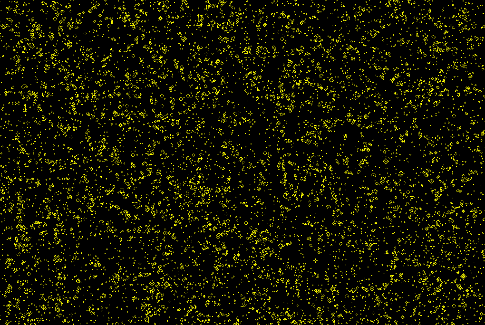
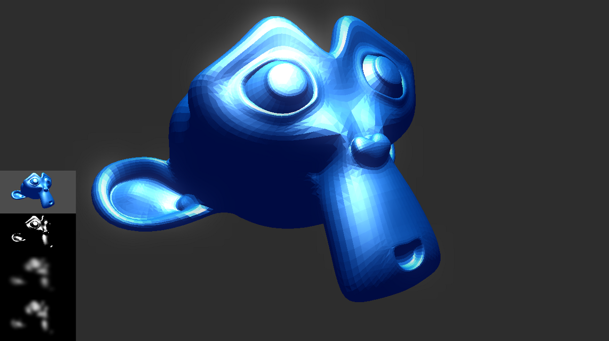
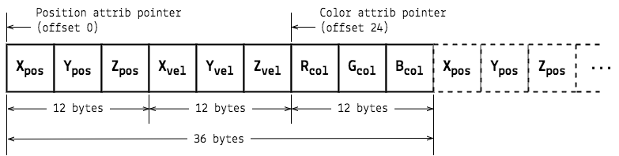

# Workshop report: Hi-perf Clojurescript with WebGL, asm.js and Emscripten

The majority of Clojurescript application development and community discussions
seems to be focused on improving standard UI implementation patterns and the
general workflow of how we can build web applications better, easier and faster.
In this respect it’s been truly amazing to observe how much has been achieved in
so short time (especially over the past 2 years) and I think by now
Clojurescript and the tooling enabled by it, really does offer an outstanding,
_simple_ and largely joyful web development experience. Since the language is
mainly targeting the browser environment, it’s maybe also about time to become
an ever more attractive choice for building apps utilizing the full feature set
of what the modern browser environment offers and here I’m thinking mainly about
applications going beyond those usually built with Clojurescript thus far. When
it comes to working with features like WebGL, WebAudio, WebRTC, WebWorkers,
building data and graphics intensive, visualization related or generally highly
interactive and media rich web applications, games etc., Clojurescript tooling /
library support and feasibility suddenly have been still questionable and it’s
something myself (and others) have been actively working on to fix over the past
few years. The primary approach to work with these features then has been via
existing Javascript libraries, often requiring large amounts of interop code and
having to deal with issues that don’t fit that nicely with the Clojurescript
modus operandi.

Most applications related to graphics involve a large amount of heavy data
processing and transformations in the browser, much more so than in the typical,
more or less form-driven web app scenario, however glitzy it might look & feel.
Performance matters a great deal in this context, since we too have a hard time
limit for this processing to keep the UI and/or animation fluid and responsive
at preferably 60fps. So for this workshop I chose to look more below the surface
of Clojurescript, analyze problem areas, examine possible optimization
strategies and above all introduce people to a number of modern web technologies
(WebGL, WebRTC, WebWorkers, Emscripten), techniques & tools offering possible
routes to use the language in a sound and elegant way to work with these
features.

## Slow life vs Fast life

For the first exercise we looked at the classic [Game of
Life](https://en.wikipedia.org/wiki/Conway%27s_Game_of_Life) (GOL) simulation
and undertook a series of six optimization steps to speed it up by a factor of
650, compared to the original and most idiomatic implementation. The GOL is
great context for exploring a variety of language constructs and patterns, from
data structures, iteration, sequence processing and JS interop required to
visualize the simulation state. Its evaluation process is a 3x3 kernel based
matrix convolution and therefore much of the approaches here also apply to other
related use cases (e.g. adjacency matrices (graphs), image processing, machine
learning etc.)



Workshop exercise #1: Six implementations of Conway’s Game of Life — from naive
(but idiomatic & slow) to optimized Clojurescript using typed arrays and direct
pixel manipulations (10,840 ms / frame vs 16.5 ms / frame = ~650x faster for a
1024x1024 grid). [Live demo](https://demo.thi.ng/ws-ldn-8/gol/)

When it comes to optimization, there are generally two prevailing camps:
Optimize Early and Optimize Late, with the latter being the by far larger group,
and both having good arguments for their case. The main arguments used by the
Optimize Late crowd are that optimized code is harder to read, harder to
maintain, less flexible, often contains bugs and above all that it’s often only
10% of a code base which drastically impact performance. On the other hand, the
Optimize Early crowd argues that the slow 10% in reality never exist in
isolation, are scattered around, hard to find and hence optimizing them usually
is limited to piecewise micro-optimizations and therefore requires a large
amount of refactoring and re-testing, all of which can be avoided by simply
being more aware of performance critical sections during the design and
implementation. For them, it’s a matter of better understanding language
constructs, algorithms and how the machine actually operates and therefore write
more efficient (rather than just functional/working) code in the first place.
System response times are/should be part of the design spec and been given time
budgets, as e.g. is often done in game development and embedded software with
hard real time limitations. We can’t argue that this is a bad thing, can we?
(Just for the record, I’m trying not to be ignorant of either way and
unconsciously aim for an happy compromise between these polar extremes)

With this in mind, as part of this first exercise we looked at:

## Awareness & understanding overheads of idiomatic language patterns

The textbook approach to encoding a 2D data grid in Clojure/script is using a
nested vector, which then can easily be processed using `map` / `reduce` to
produce the next generation in the simulation. Accessing individual grid cells
is also straightforward using
`([get-in](https://clojure.github.io/clojure/clojure.core-api.html#clojure.core/get-in)
grid [x y])`. However, in the GOL simulation we need to access 9 cells (1 cell

-   8 neighbors) in order to compute the new state of each cell. So in a 1024 x
    1024 grid this use of `get-in` will result in the creation of 9,437,184
    temporary Clojurescript vector objects (the vectors for the lookup
    coordinates) per frame, exercising a huge pressure on the garbage collector.
    In addition, since `get-in` can take lookup paths of any length and works
    polymorphically using protocol methods, each invocation also incurs a call
    to `reduce`, resulting in even more temp objects, an iteration loop and a
    load of protocol dispatch functions for its internal use of
    `get` — altogether a lot of (way too much!) work for a simple 2D index
    lookup.

In some situations (only if the lookup path is static, as in our case), we could
write a macro version of `get-in`, expanding the lookup calls at compile time
and thereby removing at least the overhead of a vector allocation and the use of
`reduce` at runtime:

```clj
;; get-in.clj

(defmacro get-in*
  "Macro version of clojure.core/get-in without not-found fallback"
  [root path]
  (loop [root root, path path]
    (if path
      (recur `(get ~root ~(first path)) (next path))
      root)))

(macroexpand-1 '(get-in* [[1 2 3] [3 4 [5 6 7 8]]] [1 2 3]))
;; (clojure.core/get (clojure.core/get (clojure.core/get [[1 2 3] [3 4 [5 6 7 8]]] 1) 2) 3)

(get-in* [[1 2 3] [3 4 [5 6 7 8]]] [1 2 3])
;; 8
```

Benchmarking this example with
[criterium](https://github.com/hugoduncan/criterium) under Clojure (which has
somewhat different/faster protocol dispatch than in Clojurescript), the macro
version results in 43.61ns vs 205.18ns for the default `get-in` (~5x faster).

Often these things are relegated as micro-optimizations and in some ways they
are, but considering that core functions like `get-in` are heavily used
throughout most Clojurescript applications, being more aware of the inherent
costs is useful and can help us looking into alternative solutions when needed.

Btw. One of the intermediate steps taken to speed up our simulation was using
[`transduce`](https://clojure.github.io/clojure/clojure.core-api.html#clojure.core/transduce)
instead of `map` & `reduce` to compute the number of alive neighbor cells,
however this ended up actually being ~15–20% slower in this case. We have not
looked into the reasons for this (yet)…

## Persistent vs mutable datastructures

The more obvious improvement to speed up the simulation was using a flat 1D
vector to encode the grid and calculate cell indices for the 2D coordinates,
much like in a pixel buffer. This not just gives us better cache locality, but
instead of `get-in` we could now just use `nth`, gain a ~6x speed up and
somewhat simpler code.

The final step (leaving out some other stages) of this exercise was an
introduction to JS [Typed
Arrays](https://developer.mozilla.org/en-US/docs/Web/JavaScript/Typed_arrays),
creating typed views over byte buffers and updating the canvas not via its 2D
drawing API, but making use of direct pixel manipulations via the canvas
context’s
[ImageData](https://developer.mozilla.org/en-US/docs/Web/API/ImageData). Since
all our data (both simulation grid and pixels) are stored in typed arrays, we
switched to only use `loop` instead of `map` / `reduce` (thereby removing
millions of internal function calls) and altogether gained a ~650x speedup
compared to the original.

A live version of the exercise is here:
[https://demo.thi.ng/ws-ldn-8/gol/](https://demo.thi.ng/ws-ldn-8/gol/) (Please be
aware that the UI for the “naive” mode and largest grid size will completely
freeze for ~10 seconds)

Some of the other things we talked about:

-   avoid keywords or collections as functions (use `get` instead)
-   use named functions instead of closures for `map`/`reduce` fns
-   protocol function dispatch overhead
-   `loop` vs `doseq`
-   `deftype` vs. `defrecord` (code size, memory efficiency, protocols)
-   controlled use of _set!_ and _volatile!_ to achieve mutability

## WebGL

To anyone interested in directly utilizing the GPU in the browser, WebGL is a
huge & fascinating topic, but it can also be very daunting for newcomers to
graphics programming, since efficient use of it requires a multitude of
prerequisite knowledge and terminology about 2D/3D geometry, linear algebra,
spatial thinking in multiple spaces (coordinate systems), low-level data
organization, the OpenGL state machine (with 100’s of options), GPU processing
pipelines, knowledge of the GLSL shading language, color theory etc. Not all of
it has to do with actual coding and it’s often the theory moments when A-level
maths knowledge comes back knocking on our door — it’s a lot to take in,
especially in a 3-day workshop, but we tried to cover most of the core topics
(and altogether probably spent most of the time on that) and we put theory to
practical use with the help of various [thi.ng/geom](https://thi.ng/geom)
examples. Later on we walked through an early prototype for a WebGL game written
in Clojurescript, going into more advanced topics, incl. creating mesh
geometries from scratch and creating a path-following camera etc.


Live demo of the game “prototype” (just a POC really thus far):
[https://demo.thi.ng/sjo/](https://demo.thi.ng/sjo/) — Move mouse to move
horizontally in the tunnel, press/hold down to accelerate (also works with
touch) — The entire tunnel is generated using the [Cinquefoil
Knot](https://en.wikipedia.org/wiki/Cinquefoil_knot) formula and
[Parallel-Transport
frames](https://github.com/thi-ng/geom/blob/develop/examples/ptf/demos.org) to
create the polygon segments. Btw. Sjö = Seven in Islandic

[thi.ng/geom](https://thi.ng/geom) is the most mature of the thi.ng projects and
has had basic WebGL support for over 2 years, however only recently I’ve managed
to invest more time in extending and updating its API to provide an unified
solution for both desktop OpenGL & WebGL in the browser. Some of the latest
additions include:

-   [Indexed and flattened 3D mesh types for
    OpenGL/WebGL](https://github.com/thi-ng/geom/blob/develop/src/gl/glmesh.org)
    with support for face normals, vertex normals, color & texture coordinate
    (soon arbitrary) attributes
-   [Completely customizable vertex attribute generation
    mechanism](https://github.com/thi-ng/geom/blob/develop/src/types/attribs.org)
    when converting platonic types to meshes
-   Set of pre-defined texture coordinate generators for boxes, spheres,
    tubes/cylinders, discs, polygons
-   [Declarative FBO shader processing
    pipeline](https://github.com/thi-ng/geom/blob/develop/src/gl/fx.org)
-   [2-point
    camera](https://github.com/thi-ng/geom/blob/develop/src/gl/camera.org),
    [arcball
    controller](https://github.com/thi-ng/geom/blob/develop/src/gl/arcball.org)
-   [JOGL window & event handling
    setup](https://github.com/thi-ng/geom/blob/develop/src/gl/jogl.org) (for
    desktop apps)
-   Geometry & texture I/O

The thi.ng/geom library takes a semi-declarative approach to working with
OpenGL/WebGL in that it’s extensively using Clojure maps to define various
geometry and shader specifications, which are then compiled into the required
data buffers & GLSL programs. This approach helps to make data manipulations
easier and avoids (for most common use cases) the direct use of WebGL function
calls in user code. Where possible, to make shader re-use easier between OpenGL
3.x/4.x & WebGL (which have some syntax differences), shader specs specify their
global variables (attributes, uniforms, varyings) as Clojure maps which are then
translated into the correct GLSL syntax using automatic code
generation/injection before compilation. In general the library does offer a
number of helpers & abstractions over the WebGL internals, but at no point is it
hiding the underlying layer, giving advanced users full control over the GL
state machine.


Texture mapping & color blend equation example



Render-to-texture and multi-pass FX processing to create classic Bloom effect
for bright image areas


Obligatory globe demo, explaining how different geometries require different
types of texture mapping

## Using WebGL with Reagent / React.js

Since a WebGL app usually wants to update its visualization as often as
possible, it doesn’t directly map to the worldview of React. For this purpose,
I’ve been defining a little reusable canvas component for Reagent and most of
the later workshop examples made use of it:

```clj
;; canvas.cljs

(ns canvas
  (:require
    [thi.ng.geom.gl.webgl.animator :as anim]
    [reagent.core :as reagent]))

(defn canvas-component
  [props]
  (reagent/create-class
   {:component-did-mount
    (fn [this]
      (reagent/set-state this {:active true})
      ((:init props) this)
      (anim/animate ((:loop props) this)))
    :component-will-unmount
    (fn [this]
      (reagent/set-state this {:active false}))
    :reagent-render
    (fn [_]
      [:canvas
       (merge
        {:width (.-innerWidth js/window)
         :height (.-innerHeight js/window)}
        props)])}))
```

## Managing GLSL shader dependencies

Code re-use is one of the big issues with GLSL (on any platform) and for a long
time this has been largely solved via a copy & paste culture. To address this in
Clojurescript from early on, we can use the
[thi.ng/shadergraph](https://thi.ng/shadergraph) library, which provides us with:

-   a transitive dependency resolution mechanism for GLSL code (based on the
    normal Clojure namespace mechanism and Stuart Sierra’s dependency library)
-   a growing library of pure, commonly used GLSL functions (lighting, color
    conversion, matrix math, rotations, effects etc.). Shader snippets can be
    defined via Clojure strings or loaded from separate source files (as part of
    the Clojurescript compilation process).
-   a basic compile-time shader minifier
-   Clojure meta data extraction of the defined GLSL functions (incl. arg lists
    and return type for improved REPL use and in preparation of future tooling)

Many of the workshop examples utilize various functions provided by this library
and helped us getting results faster.

## WebRTC & video FX processing

Since some of the participants were interested in using video for their own
projects, I prepared a small example combining a WebRTC camera stream with
Shadertoy-like WebGL image processing using a bunch of effect options.

[https://github.com/thi-ng/ws-ldn-8/tree/master/day3/ex06](https://github.com/thi-ng/ws-ldn-8/tree/master/day3/ex06)


Yours truly testing out a cheesy twirl video effect — Online demo unavailable
due to current lack of SSL, which is required for WebRTC.

## Web workers

Since 2013 Clojurescript has been blessed with the
[core.async](https://github.com/clojure/core.async) library, providing us (among
many super useful
[CSP](https://en.wikipedia.org/wiki/Communicating_sequential_processes)
abstractions) with the illusion of concurrent processes in the inherently
single-threaded environment of the JS VM. However, the currently only way to
obtain _real_ extra compute resources of a multi-core CPU in JavaScript is to
use WebWorkers and their use is one of the not-so-widely talked about topics in
the Clojurescript community. For one, they’re not the same as multi-threading in
Clojure, and furthermore, their use throws several spanners in the works, both
in terms of Clojurescript (+Figwheel) workflow, but also due to their inherent
limitation of running in an isolated environment from the main application.

WebWorker code needs to be loaded from a separate source file and can only
communicate with the main process via message passing. By default, the data
passed to the other process is copied, but some types (e.g. ArrayBuffers) can
also be transferred and when doing so the sender process loses ownership/access.
For large (binary) data this can be very useful though (e.g. any use case which
allows for typed arrays) and is potentially magnitudes faster than using a copy.
The most likely scenario for this transfer feature is a ping-pong like
processing setup of the same data object between main process and worker, each
claiming temporary ownership rights before sending it back to the other party.
[Rust](https://rust-lang.org) users might feel right at home here :)

In terms of code organization, Clojurescript’s (well, actually Google Closure
compiler’s) modular compilation at least allows us to keep the worker parts in
the same code base without incurring another copy of compiled Clojurescript. The
bad news are, that modular compilation is currently not supported when using the
build profile “:optimizations :none”, as is usually the case during development.
One way to workaround this is by trying to isolate the development of the worker
in time (do it first), compile it and then use Figwheel (or similar) for working
on the main app.

Our little example project can be found here:

[https://github.com/thi-ng/ws-ldn-8/tree/master/day3/ex06](https://github.com/thi-ng/ws-ldn-8/tree/master/day3/ex06)

## asm.js & Emscripten

Even though [thi.ng](https://thi.ng/) started out as (and largely still is) a
Clojure & Clojurescript-centric collection of projects, over the past year I’ve
been slowly expanding its scope to become more polyglot, so far mainly in the
form of some still unreleased C projects (not counting previous OpenCL related
thi.ngs). And whilst the combination of
[Clojure](https://clojure.org)/[Clojurescript](https://github.com/clojure/clojurescript)

-   C seems a bit weird at first, I’m fully convinced (and have proof!) there are
    many use cases for which I believe this combination is golden, giving us the
    best of both worlds: one of the currently best approaches and workflows to build
    the high-level aspects of an app and at the same time benefit from much better
    performance and more efficient memory usage for the parts where it matters most.
    This is especially true for Clojurescript, which is becoming ever more important
    for my line of work and in some ways makes it much easier to integrate foreign C
    modules than with its JVM-based parent.


Simple 3D particle system written in C, compiled to Javascript with Emscripten
and visualized / controlled via Clojurescript & WebGL. [Live
demo](https://demo.thi.ng/ws-ldn-8/)

One of the most interesting projects in this respect is
[Emscripten](https://emscripten.org), a LLVM-based transpiler for C and C++ to
[asm.js](http://asmjs.org) (and soon [WASM](https://webassembly.github.io/)).
The former (asm.js) is a highly optimizable subset of JavaScript. WASM
(WebAssembly) is a new sandboxed execution environment currently still being
designed as an open standard by a [W3C Community
Group](https://www.w3.org/community/webassembly/) that includes representatives
from all major browsers. Even though Emscripten’s current output isn’t really
native code, it allows us to write code in C, which for some use cases (e.g.
math heavy code, mutable data structures, WebGL, DSP etc.) is much easier to
write than in Clojurescript and in my own tests the resulting asm.js code almost
always performs noticeably faster than the Clojurescript version (even if the
latter is compiled w/ Closure compiler’s advanced optimizations). [With
WebAssembly on the
horizon](https://hacks.mozilla.org/2016/03/a-webassembly-milestone/), it’s maybe
a good time to invest some time into some “upskilling” (or down-skilling, as in
low-level)…

For the final exercise of the workshop we implemented a simple 3D particle
system in C, compiled it with Emscripten and learned how to integrate it into a
Clojurescript WebGL demo. This exercise tied up many of the things (and loose
ends) from the past days and too allowed me once more to demonstrate the
efficient use of typed arrays for visualization purposes.

```c
// particles.h

// particle system structs

typedef struct {
  float x,y,z;
} Vec3;

typedef struct {
  Vec3 pos; // 12 bytes
  Vec3 vel; // 12 bytes
  Vec3 col; // 12 bytes
} Particle;

typedef struct {
  Particle *particles;
  uint32_t numParticles;
  uint32_t maxParticles;
  Vec3 emitPos;
  Vec3 emitDir;
  Vec3 gravity;
  float speed;
  uint32_t age;
  uint32_t maxAge;
} ParticleSystem;
```

The above C structs are used for our particle system. The Emscripten runtime
emulates the C heap as a single, large JS ArrayBuffer with multiple views of
various word sizes (using typed arrays of uint8, uint16, uint32, float32 etc.).
Therefore a C pointer is simply an index into this array buffer and with a bit
of planning we can directly make use of this from the Clojurescript side to
avoid copying large amounts of data, something which would cause a huge overhead
and make the whole exercise of using C/asm.js pointless…

The diagram below shows the memory layout of the ParticleSystem’s “particles”
array. Each particle only takes up 36 bytes (much less than we could
idiomatically achieve in Clojurescript) and since that’s a multiple of 4, all
particles in this array are tightly packed and no alignment bytes are needed
(Floats always need to be stored at 4-byte boundaries).



On the Clojurescript side we’re using
[Reagent](https://reagent-project.github.io) to wrap React.js and the latest dev
snapshot (0.0.1158-SNAPSHOT) of [thi.ng/geom](https://thi.ng/geom) to handle all
WebGL aspects.

Thanks to Emscripten’s [interop
API](https://kripken.github.io/emscripten-site/docs/api_reference/preamble.js.html),
communication between the compiled C module and CLJS is pretty trivial, even
though we’re limited to only passing/receiving primitive LLVM data types. In the
case of our example this is absolutely fine though, since in CLJS we’re only
interested in a) initializing the particle system, b) updating it and c)
obtaining a pointer to the array of particles. The following code shows how to
[wrap](https://kripken.github.io/emscripten-site/docs/api_reference/preamble.js.html?highlight=closure#cwrap)
and
[call](https://kripken.github.io/emscripten-site/docs/api_reference/preamble.js.html?highlight=closure#ccall)
compiled C functions from Clojurescript:

Updating and rendering the particle system with WebGL is similarly trivial.
After each update of the system, we also must update the buffer data for WebGL
and for this we simply reference the memory in the C heap array. Our shader only
requires the particle position and color attributes, both of which are part of
the same chunk of memory and stored in an interleaved manner. When setting up
the WebGL buffers, we only need to supply the correct stride length (36 bytes,
see above diagram) and for the color attribute we too need to adjust the data
offset of 24 bytes (equivalent of 6 floats into the array).

The full source code for this example is here:
[https://github.com/thi-ng/ws-ldn-8/tree/master/day3/ex07](https://github.com/thi-ng/ws-ldn-8/tree/master/day3/ex07)

## Outlook & Near future

If you’re interested in learning more about any of these technologies, please
visit the [workshop.thi.ng](http://workshop.thi.ng/) website for upcoming
training sessions or sign up to the [thi.ng
newsletter](https://tinyletter.com/thi-ng).

**I’m about to announce the next bunch of workshop dates for June in the next 2
days. Apart from teaching, I’m also currently available for freelance
consulting. Please get in touch and let’s talk, no agents though! Thanks.**
