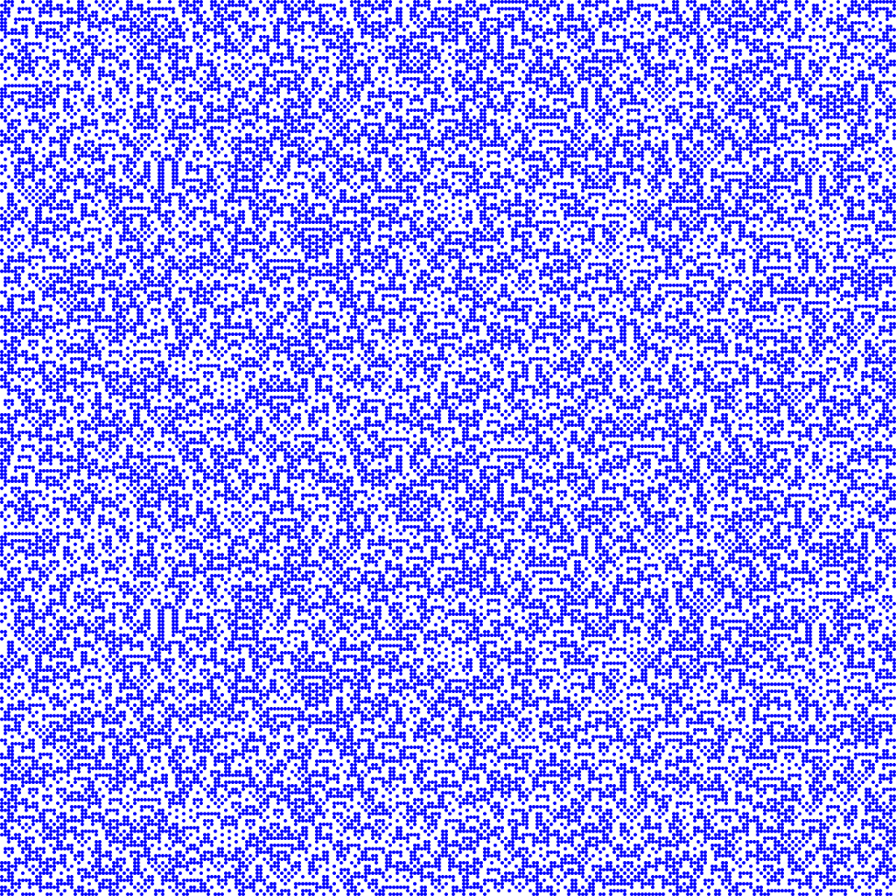

# Workshop report: Generative design with Clojure

2-day introduction to fundamental generative design techniques

Without wanting to sound generalizing, my impression sometimes is that for some
coders, generative design is often still relegated as only lightweight
application (and skills) of programming to create fancy imagery. In the
traditional designer’s camp, generative design is often still looked upon either
as a weird & wonderful magic tool to quickly spew out endless variations of
specific aesthetics (e.g. the ever popular randomized, “organic”/biological
routes many clients so often like to ask for) or is simply used as an automation
tool without ever fully wanting to embrace or deeply engage with the underlying
nature of the approach — that of building a complete design system from scratch,
with all that entails, incl. developing sensibilities and taking responsibility
over any aspect and detail of that system. The emergence & popularity of open
source creative computing frameworks has helped to shift understandings for the
better, but in some ways also slowly raised a copy & paste culture to simply
achieve certain clichéd generative design aesthetics faster / cheaper — merely
using a form of sampling or association by cultural/aesthetic proximity, but at
the same time avoid a deeper conceptual engagement with the true possibilities
offered.

For many years, to myself, generative design has been providing an ever varied
and expanding work context to learn about topics, which in the end any
cross-disciplinary designer and/or programmer should care about: System thinking
(& System _questioning_), tool making, UI/UX, process research, abstraction,
transposing & layering concepts and processes from one domain to another,
iterative development & refinement, determine ways to parameterize approaches
and exercise both systematic & serendipitous exploration of existing processes
(i.e. mapping & hacking), learning to make and judge creative decisions as
systemic trade offs etc. In terms of programming it often too requires one to
learn about and master many different, often not-so-mainstream language
features, data structures, algorithms and embrace the idea of constant
refactoring — sometimes to actually implement a certain idea in the first place,
other times to allow for more configuration options and hence greater expressive
potential (incl. to enable output in different formats/media) or to make a
generation process just run faster (and thereby sometimes making it realistic to
achieve). The latter can quickly become important, since much of the work in
this field often times requires fairly large numbers of inputs, actors,
iterations and long simulation times etc.

Over the two days of this sold-out workshop I wanted to introduce people to
several fundamental patterns, tools & techniques useful for this kind of work
and at the same time show how to implement these idiomatically with Clojure
(though we typically also talked about other languages in contrast).

Traces of a star polygon rotating around a point with a constantly modulated
radius (using sine waves).

The first examples dealt with the basic approach of replacing thinking in terms
of shapes/objects/nouns with thinking in terms of processes/functions/verbs.
This is not just required by the more or less functional nature of Clojure, but
also a fundamental approach for the generally bottom-up nature of generative
design. Therefore, I believe Clojure is actually a superb fit for this field.

A circle is a shape, but it becomes so much more useful and malleable if
understood as the process of a point rotating around another. This immediately
leads to questions like: What is rotation? What is space? How to define it, how
to work with it and how to map from one space to another (e.g.
[polar](https://en.wikipedia.org/wiki/Polar_coordinate_system) vs.
[cartesian](https://en.wikipedia.org/wiki/Cartesian_coordinate_system)). When is
it better to solve a problem in one or the other, how do the same ideas exist in
other domains (e.g. color spaces). It also leads us to question how this all can
be controlled and manipulated, through the introduction of parameters and other
processes to control their values over time. What happens if we rotate a set of
points instead of a single point around the center, what happens if we connect
these points? How can existing process metrics be used to form new relationships
and drive other parts of the design? E.g. What happens if we make the radius
itself a function of the rotation angle?

Whereas Clojure already offers an [interactive
workflow](http://clojure.org/about/dynamic) out of the box, working on visual
generative systems, we also want to naturally visualize the results, straight
from the REPL and as a way of unit testing, using our eye to judge the
correctness and aesthetic potential of the system. All examples in this workshop
are largely using vanilla Clojure, though we also extensively used the
[thi.ng/geom](http://thi.ng/geom), [thi.ng/math](http://thi.ng/math) &
[thi.ng/color](http://thi.ng/color) libraries to help us with [vector
algebra](https://github.com/thi-ng/geom/blob/develop/src/core/vector.org), [SVG
generation](https://github.com/thi-ng/geom/blob/develop/src/svg/core.org),
[geometry data types](https://github.com/thi-ng/geom/tree/develop/src/types) &
[export](https://github.com/thi-ng/geom/blob/develop/src/mesh/io.org) and to
simplify working with color (in multiple color spaces & formats).

## Polygons, polymorphism & graphs

We talked about various fundamental geometry data types, abstractions and
polymorphic operations provided by [thi.ng/geom](http://thi.ng/geom). These
types could be considered classes (in the OOP sense), but they too can act as
configurable point, line and shape generators and provide dozens of other useful
operations: analysis of dimensions, bounds, area, volume, intersections with
other types, conversions to other types, point classifications, spatial
transforms, interior & boundary sampling, extrusions, subdivisions,
tessellations etc. Many types also provide a kind of graph access, e.g. to
extract the vertices, edges, cycles (i.e. mesh faces), find vertex valence,
split/join edges etc. Much like many of the functions in _clojure.core_, all of
the 50+ operations defined in the _thi.ng.geom.core_ namespace are
[protocols](http://clojure.org/reference/protocols) and implemented to varying
extents by the currently 20+ shape types, thus keeping the main API surface area
small and easy to learn.

As a variation of these first examples, we put some of the above operations to
use and learned how to create polygons from a circle, first by sampling the
circle with a given resolution (e.g. resolution = 6 produces a hexagon) and then
continued re-sampling the edges of the resulting polygon perimeter at a fixed
distance to produce a sequence of uniformly spaced points.

https://gist.github.com/postspectacular/14aa9f6e5bd1c56965cc3509a27ff933

A simple transformation like that can yield a quite major change in the
resulting output of an otherwise unchanged process (this one inspired by my
childhood hobby of taking hundreds of long exposure photos of a torch hanging in
a dark room, though here we’re not using [Lissajous
curves](https://en.wikipedia.org/wiki/Lissajous_curve)).

Variation of the same process shown in the first image, but this time only using
vertices obtained by sampling the perimeter of the polygon at a uniform
distance.

## Iterative systems

Many generative processes are iterative by nature, i.e. in math speak:

`f(x+1) = f(f(x))`

In Clojure this can be elegantly achieved by using
[_iterate_](http://clojure.github.io/clojure/clojure.core-api.html#clojure.core/iterate),
[_reduce_](http://clojure.github.io/clojure/clojure.core-api.html#clojure.core/reduce)
or
[_loop_](http://clojure.github.io/clojure/clojure.core-api.html#clojure.core/loop).

Strange Attractors are some of the simplest iterative systems. We chose the
famous [Peter de Jong attractor](http://paulbourke.net/fractals/peterdejong/)
and visualized it first using SVG, then as bitmap graphics and introduced color,
by mapping spatial coordinates to points in RGB space.

https://gist.github.com/postspectacular/13ece130bcc31c303064d387d4d6b54d

The de Jong Strange Attractor (3 million iterations). XY coordinates used as
interpolation factors for color blending.

## Noise

Ever since their first use in the original
[Tron](http://www.imdb.com/title/tt0084827/) movie, [Ken
Perlin](http://mrl.nyu.edu/~perlin/)’s noise formulas have become a staple for
many procedural design tasks (e.g. texture / terrain generation, volumetric
clouds, flow fields). In many design situations, procedural noise is more
desirable than pure randomness, since it preserves local smoothness and can be
easier controlled and shaped. Because the functions are pure and deterministic,
they describe a noise space (in any dimension) and can also be applied in a
manner similar to additive sound synthesis, combining the results of harmonics
in different octaves to form more complex signals. Adding secondary processes to
distort input coordinates (e.g. turbulence) and/or filter outputs (e.g. [biquad
filters](http://www.earlevel.com/main/2003/02/28/biquads/)), we can create a
large variety of visual characteristics.

The direct representation of 2D noise values as colors is just one way of many.
In the bigger picture, procedural noise is a highly flexible & powerful driver
to control any other scalar design parameters.

2D gradient noise w/ turbulence (also noise)

A regular grid of 100k lines (320 x 320). Each line’s rotation and color is
controlled by the underlying 2D noise field. Color gradient created with
[http://dev.thi.ng/gradients/](http://dev.thi.ng/gradients/)

3D noise visualized as [voxel iso surface
mesh](https://github.com/thi-ng/geom/blob/develop/examples/voxel/demos.org#example-3d-gradient-noise)
and draft-rendered with [Luxrender](http://luxrender.net) (via
[http://thi.ng/luxor](http://thi.ng/luxor))

## Poisson disk sampling (Blue noise)

Apart from Perlin noise, there are many other types of procedural noise, each
with different characteristics: Simplex noise, Fractal noise, Gradient noise,
Pink noise, Brown noise, Blue noise etc. The latter also goes under the name
[Poisson disk
sampling](http://www.cs.virginia.edu/~gfx/pubs/antimony/antimony.pdf) and is
especially useful to generate random samples with locally adjustable uniform
distributions. The image below has been generated with this approach, using a
[quadtree](https://en.wikipedia.org/wiki/Quadtree) as acceleration structure and
one of the example programs bundled with the [c.thi.ng](http://c.thi.ng/)
library.

Image based Poisson disk sampling with brightness controlled local noise
densities (139k samples). See [c.thi.ng](http://c.thi.ng) for build & usage
instructions.

## Grid based simulations, Cellular Automata

With a similar mindset as used for the noise discussion, we briefly looked at
other means of grid based pattern generation — again not necessarily for direct
visualization, but as means to control other parameters or processes within a
larger system. These applications don’t even need to be visual in nature, e.g.
CAs are also highly useful for music generation, where the grid would define
notes over several octaves of a musical scale.

Cellular automata & reaction diffusion simulations are a fascinating topic and
can produce a vast amount of different outcomes, especially if reconfiguring
them from their textbook descriptions (e.g. by changing convolution kernel
sizes, increasing the number of possible cell states, playing with rules, making
them self-modifiable etc.). Like procedural noise, this class of generator can
also be applied in different dimensions and we looked at 1D-3D examples.

Classic 1D Wolfram automata (Rule #105), grid size 256x256, random seeding (50%)

Extended 1D CA with kernel size 3 and max. cell age of 64

3D visualization of the evolution of a 2D CA, created during toxiclibs workshop
@ SAC Städelschule, Frankfurt, 2013

## Agent systems

Whereas the examples so far all dealt with a single uniform process, we often
require a solution to be formed in a more indirect, or rather emergent, way. In
these situations, the idea of using autonomous
[agents](https://en.wikipedia.org/wiki/Agent-based_model), entities with
behavior(s) and knowledge of some design constraints, is a powerful approach to
create & shape possible, and often more complex, outcomes.

[Dipole - Wikipedia, the free encyclopedia](https://en.wikipedia.org/wiki/Dipole)

Inspired by a project commission I worked on in 2009, the [onedotzero festival
identity](https://www.flickr.com/photos/toxi/albums/72157620899002878), we
implemented a simple agent simulation to visualize field lines in an environment
populated with randomly charged di-poles. At first, a number of agents is
created for each positively charged pole and these are then evaluated until all
agents have either reached a negative pole or have left the simulation space. At
each time step, an agent will travel in the weighted direction of all di-poles,
implicitly taking into account that neighboring same-charged poles exercise a
repellent force on the agent. Also, at each time step we record an agent’s
current position and charge potential, information which is then used to
visualize the field line curves and their colors.

Field line visualization of 80 randomly placed & charged di-poles. Each line
represents the trace of a single agent, each one spawned at one of the positive
charged poles and being attracted/repelled by other poles in the system.

## Design grammars, recursion, L-Systems & basic interpreters

Keeping the idea of an agent, controlled by other constraints in the design
space, we introduced the concept of design grammars and rule based systems. The
possibly best known candidate in that field are
[L-Systems](https://en.wikipedia.org/wiki/L-system), named after Aristid
Lindemayer, who developed the idea in the late 1960s to describe natural growth
patterns.

An L-System consists of a number of symbols, each associated with an arbitrary
length replacement for itself (incl. the option of extinction). Given such an
rule set and an initial sequence of symbols (the so called “axiom”), each symbol
is iteratively rewritten, often forming vastly longer and more complex sequences
after even just a few iterations. Some symbols can have a fixed meaning and are
used as commands, similar to controlling a
[turtle](https://en.wikipedia.org/wiki/Turtle_graphics) in the [LOGO
language](https://en.wikipedia.org/wiki/Logo_%28programming_language%29): e.g.
move forward, turn left/right, branch. These commands can be used to visualize
the system, but are more or less optional (again, I’m taking a bigger picture
view here, since L-Systems also can be trivially used for non-visual
applications).

The code below implements a simple, yet easily extensible L-System
[interpreter](https://en.wikipedia.org/wiki/Interpreter_%28computing%29), based
on Clojure’s [multimethod](http://clojure.org/reference/multimethods) mechanism
(without even a single conditional expression, unlike implementations in most
other languages). At the end we define a sample rule set for the [Dragon
curve](https://en.wikipedia.org/wiki/Dragon_curve) fractal (pictured further
below). The agent and interpreter supports nesting by implementing a “call
stack” to store & restore previous agent states, whilst always collecting any
sub-paths generated by a branch back into the main path when popping (unwinding)
the stack. We also talked about how this is similar to the way
[S-expressions](https://en.wikipedia.org/wiki/S-expression) are executed and the
current setup & syntax could be easily changed to turn it into a
[Lisp](https://en.wikipedia.org/wiki/Lisp_%28programming_language%29)
interpreter, even with macro-expansion.

https://gist.github.com/postspectacular/47d62cc0386452fe3f9f0465c1fb1b73

The images below demonstrate different L-Systems generated with the above
interpreter. My favourite one is the rhomboidal [Penrose
tiling](https://en.wikipedia.org/wiki/Penrose_tiling) ([rules from
here](https://es.wikipedia.org/wiki/Teselaci%C3%B3n_de_Penrose#Dibujando_la_teselaci.C3.B3n_de_Penrose_P3)),
but I’m equally fascinated by the succinctness of the Dragon curve rule set.

Collection of L-Systems, clockwise from top left: Pentagon gasket, Penrose
tiling, Dragon curve, Fractal tree. Color hue represents position in iteration
sequence.

## Update: L-System Twitter bot

After the workshop, I expanded the L-System example and combined it with my
existing Twitter bot skeleton project. The repo for this is here:

[thi-ng/thingybot](https://github.com/thi-ng/thingybot)

There’s also [@thingybot](http://twitter.com/thingybot), where you can find some
more outputs (and the bot is sporadically online).

https://twitter.com/thingybot/status/747696221817544704

## Outlook

Two days are barely sufficient to even scratch the surface of an entire
discipline and design philosophy. There are many, many more topics we could &
should have talked about and experimented with, but I hope the topics we did
cover at least provided some important insights into how this field can be
approached with the elegance of the Clojure language and I hope they too
provided more stimulus to continue building up the (still) small community of
fellow Clojurians interested in this field.

**If you’re interested in taking part in similar hands-on training workshops in
the future, please** [**sign up to the
newsletter**](https://tinyletter.com/thi-ng/) **or visit**
[**workshop.thi.ng**](http://workshop.thi.ng) **for announcements.**

Till next time.
