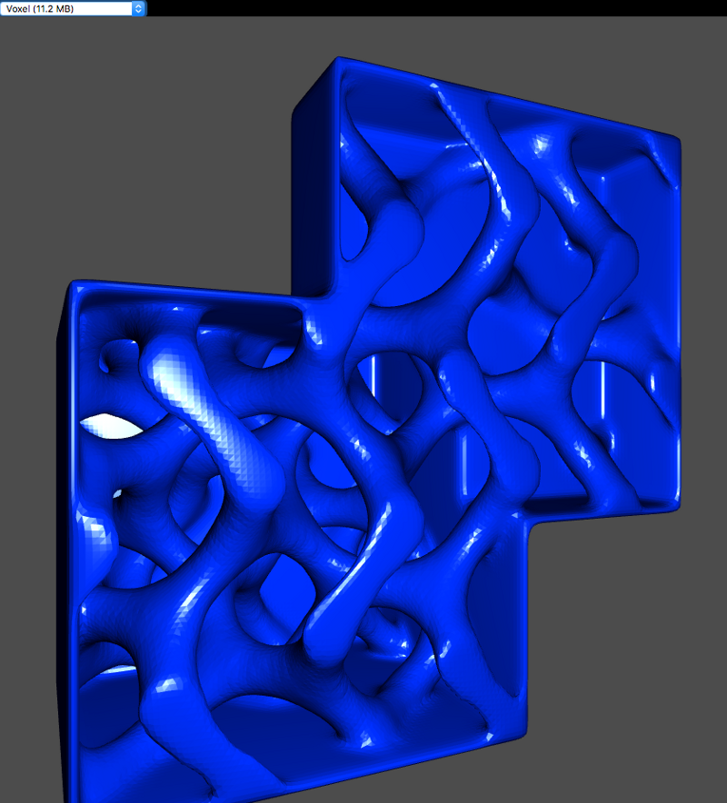

# ClojureScript, WebWorkers & WebGL

[ClojureScript](https://github.com/clojure/clojurescript) users have had the
great fortune of gaining access to
[CSP-type](https://en.wikipedia.org/wiki/Communicating_sequential_processes)
concurrency ever since the announcement of the
[core.async](https://github.com/clojure/core.async) library a few years ago. And
whereas core.async with its channel based philosophy gives us many powerful and
deeply transformative abstractions to better structure our code, in many cases
it’s often essentially just been used to provide the _illusion_ of concurrent
processes in the inherently single threaded environment of the JavaScript VM.
This illusion is Good Enough™ and incredibly believable for a large number of
lightweight use cases (though overzealous use can have quite an impact on file
size!), but if we need to use computationally expensive processes without
risking to freeze the browser and destroying the user experience,
[WebWorkers](https://developer.mozilla.org/en-US/docs/Web/API/Web_Workers_API/Using_web_workers)
provide the currently only way out, and have of course their own downsides.

The isolated scope of WebWorkers is one of the more practical downsides, i.e. a
WebWorker lives in its own sandbox, needs to be loaded from a separate source
file, cannot access the DOM and cannot directly share any data with the main
application. The latter can only be achieved via message passing, which in many
cases can incur quite an overhead due to needing to clone data (see exceptions
below). Of course I realize & appreciate the importance of the various security
considerations which caused these constraints, but they do quickly add up to
have a dramatic impact on an app’s architecture and the overall development
workflow, maybe especially so for ClojureScript.

ClojureScript uses a dual stage compilation strategy, relying on [Google’s
Closure compiler](https://developers.google.com/closure/compiler/) to produce
the final, optimized JS output. For production builds this usually generates a
single JS file, and thanks to dead code elimination, this is only containing the
actually used parts of the entire application, incl. those of the CLJS runtime
itself, as well as any other libraries used (if configured correctly). In
addition, the Google Closure compiler has been supporting modular compilation
for a long while now, allowing users to split outputs into separate modules and
ClojureScript gained access to that feature sometime last year. This means, we
can indicate to the compiler which namespaces should end up in which (of the
multiple) output files, as well as specify module dependencies. Via its so
called “cross module method motion”, the compiler then potentially even further
re-arranges functions over the various outputs, e.g. if it can prove that a
function is only used by a single module. This is truly splendid and generally
works like a charm — unless one wants to use Workers and have them be part of a
common code base.

There’re many reasons, both technical and from a UX perspective, why splitting
up large code bases for web deployment is an important step to take: We can
reduce the initial download size, enable code sharing between modules etc.
WebWorkers too can have a positive effect on the overall user experience,
generally enabling higher performance due to offering true concurrency (not just
an illusion) and avoiding (or at least reducing) stalling UIs and the resulting
high blood pressure. But…

Even though ClojureScript & Closure compiler include all the necessary
ingredients to enable this modular magic, neither tool can be made aware of the
fact that certain namespaces of the common code base are intended to run in a
separate scope (i.e. as worker), but still want to make use of other modules and
the compiler(s) will therefore produce breaking code when utilizing the full,
“advanced” optimization strategy/configuration.

In our [ClojureScript workshop last week](http://workshop.thi.ng/#WS-LDN-11), we
developed a small example discussing some of these pitfalls and I’ve spent some
more time afterwards to actually also make it work for production builds.



[Live demo](http://demo.thi.ng/ws-ldn-11/). Binary [STL
mesh](https://en.wikipedia.org/wiki/STL_%28file_format%29) loading via
WebWorker. The above mesh was generated with the voxel module of
[thi.ng/geom](http://thi.ng/geom). The mesh contains ~240k triangles (filesize
11.2MB) and takes 6–8secs to parse. Without workers this would cause an
unacceptable UI freeze for the same period…

The example project is a simple STL mesh viewer, using
[thi.ng/geom](http://thi.ng/geom)’s [mesh
I/O](https://github.com/thi-ng/geom/blob/develop/src/mesh/io.org) and
[WebGL](https://github.com/thi-ng/geom/tree/develop/src/gl) modules, as well as
[Reagent](http://reagent-project.github.io/) (just to test with a few more
dependencies). [Live demo here](http://demo.thi.ng/ws-ldn-11/).

## Project configuration

```clj
;; project.clj

(defproject stlmeshviewer "0.1.0-SNAPSHOT"
  :dependencies [[org.clojure/clojure "1.8.0"]
                 [org.clojure/clojurescript "1.8.51"]
                 [thi.ng/geom "0.0.1178-SNAPSHOT"]
                 [reagent "0.5.1"]]
  :plugins      [[lein-cljsbuild "1.1.3" :exclusions [[org.clojure/clojure]]]]
  :clean-targets ^{:protect false} ["resources/public/js" "target"]
  :cljsbuild
  {:builds
   [{:source-paths ["src"]
     :id           "min"
     :compiler
     {:optimizations :advanced
      :output-to     "resources/public/js/dummy.js"
      :modules       {:cljs-base  {:output-to "resources/public/js/base.js"}
                      :app        {:output-to "resources/public/js/app.js"
                                   :entries   #{"meshviewer.core"}}
                      :meshworker {:output-to  "resources/public/js/meshworker.js"
                                   :entries    #{"meshworker"}}}}}]})
```

## Worker implementation

The worker code is pretty minimal and only responsible for loading, parsing and
analyzing the loaded mesh. As mentioned previously, any kind of data can be
passed to/from a worker, but usually incurs a deep copy to be created, in order
to warrant non-leaking references. Thankfully, there are exceptions and these
are especially useful for WebGL-based use cases (or any other use case where
binary data is natural & suitable, e.g. asm.js too). In short, data ownership
can be literally transferred (instead of copied) to the other party by
specifying a list of object references as optional argument to
[_postMessage_](https://developer.mozilla.org/en-US/docs/Web/API/Worker/postMessage)— here
“object” meaning
[ArrayBuffers](https://developer.mozilla.org/en-US/docs/Web/JavaScript/Reference/Global_Objects/ArrayBuffer).
(In case you’re wondering why this is especially suitable for WebGL, it’s
because geometry data and other attributes must be defined as typed arrays,
hence a perfect match…)

**Very important:** Since our worker is written in ClojureScript, it needs to
import the file _base.js_ (the module containing CLJS etc.). This is done via
[importScripts](https://developer.mozilla.org/en-US/docs/Web/API/WorkerGlobalScope/importScripts).
Also note, Workers cannot use the global _window_ object and should use _self_
instead…

```clj
;; meshworker.cljs

;; base.js contains all of CLJS & thi.ng
(.importScripts js/self "base.js")

(ns meshworker
  (:require-macros
   [cljs-log.core :refer [debug info warn]])
  (:require
   [thi.ng.math.core :as m]
   [thi.ng.geom.core :as g]
   [thi.ng.geom.matrix :as mat]
   [thi.ng.geom.mesh.io :as mio]
   [thi.ng.geom.gl.glmesh :as glm]
   [thi.ng.strf.core :as f]))

(defn load-binary
  [uri onload onerror]
  (let [xhr (js/XMLHttpRequest.)]
    (.open xhr "GET" uri true)
    (set! (.-responseType xhr) "arraybuffer")
    (set! (.-onload xhr)
          (fn [e]
            (if-let [buf (.-response xhr)]
              (onload buf)
              (when onerror (onerror xhr e)))))
    (.send xhr)))

(defn build-mesh
  [buf]
  (let [t0       (f/timestamp)
        mesh     (mio/read-stl
                  (mio/wrapped-input-stream buf)
                  #(glm/gl-mesh % #{:fnorm}))
        bounds   (g/bounds mesh)
        tx       (-> mat/M44
                     (g/scale (/ 1.0 (-> bounds :size :y)))
                     (g/translate (m/- (g/centroid bounds))))
        vertices (-> mesh .-vertices .-buffer)
        fnormals (-> mesh .-fnormals .-buffer)
        num      (.-id mesh)]
    (debug (- (f/timestamp) t0) "ms," num "triangles")
    (.postMessage
     js/self
     ;; message payload
     #js [vertices fnormals num tx]
     ;; this is the list of buffers to transfer w/o copy
     #js [vertices fnormals])))

(defn load-mesh
  [msg]
  (load-binary
   (.-data msg)
   build-mesh
   #(warn "error loading mesh: " (.-data msg))))

(set! (.-onmessage js/self) load-mesh)
```

## Main app

The main app namespace provides various Reagent UI components (incl. a re-usable
canvas animation component), the WebGL initialization & update loop, app state
handling, initializes the worker and processes messages. The _receive-mesh!_
function is the receiver of mesh data sent from the worker and prepares the mesh
for WebGL (the worker itself has no access to it).

```clj
;; main.cljs

(ns meshviewer.core
  (:require-macros
   [reagent.ratom :refer [reaction]])
  (:require
   [thi.ng.math.core :as m :refer [PI HALF_PI TWO_PI]]
   [thi.ng.color.core :as col]
   [thi.ng.geom.core :as g]
   [thi.ng.geom.vector :as v]
   [thi.ng.geom.matrix :as mat]
   [thi.ng.geom.gl.core :as gl]
   [thi.ng.geom.gl.webgl.constants :as glc]
   [thi.ng.geom.gl.webgl.animator :as anim]
   [thi.ng.geom.gl.shaders :as sh]
   [thi.ng.geom.gl.glmesh :as glm]
   [thi.ng.geom.gl.shaders.phong :as phong]
   [reagent.core :as reagent]))

(defonce app (reagent/atom {}))

(def meshes
  [["../assets/suzanne.stl" "Blender Suzanne (788 KB)"]
   ["../assets/deadpool.stl" "Deadpool (2 MB)"]
   ["../assets/voxel.stl" "Voxel (11.2 MB)"]])

(defn trigger-mesh-change!
  [uri]
  (swap! app assoc :selected-mesh uri)
  (.postMessage (:worker @app) uri))

(defn receive-mesh!
  [msg]
  (let [[vertices fnormals id tx] (.-data msg)
        num   (* id 9)
        mesh  (thi.ng.geom.gl.glmesh.GLMesh.
               (js/Float32Array. vertices 0 num)
               (js/Float32Array. fnormals 0 num)
               nil nil nil id
               #{:fnorm})
        model (-> mesh
                  (gl/as-gl-buffer-spec {})
                  (assoc :shader   (:shader @app)
                         :uniforms (assoc (:uniforms @app) :model tx))
                  (gl/make-buffers-in-spec (:gl @app) glc/static-draw))]
    (swap! app assoc
           :mesh  mesh
           :model model)))

(defn init-gl
  [this]
  (let [gl       (gl/gl-context (reagent/dom-node this))
        vport    (gl/get-viewport-rect gl)
        shader   (sh/make-shader-from-spec gl phong/shader-spec)
        uniforms {:model         mat/M44
                  :proj          (mat/perspective 60 vport 0.1 10)
                  :view          (mat/look-at (v/vec3 0 0 1.25) (v/vec3) v/V3Y)
                  :lightPos      (v/vec3 0.1 0 1)
                  :ambientCol    0x000011
                  :diffuseCol    0x0033ff
                  :specularCol   0xffffff
                  :shininess     100
                  :wrap          0
                  :useBlinnPhong true}]
    (swap! app assoc
           :gl       gl
           :viewport vport
           :shader   shader
           :uniforms uniforms)))

(defn update-gl
  [this]
  (fn [t frame]
    (let [{:keys [gl viewport model model-tx]} @app]
      (when model
        (doto gl
          (gl/set-viewport viewport)
          (gl/clear-color-and-depth-buffer (col/rgba 0.3 0.3 0.3) 1)
          (gl/draw-with-shader
           (update-in model [:uniforms :model] #(m/* (g/rotate-y mat/M44 t) %))))))
    (:active (reagent/state this))))

(defn gl-component
  [props]
  (reagent/create-class
   {:component-did-mount
    (fn [this]
      (reagent/set-state this {:active true})
      ((:init props) this)
      (anim/animate ((:loop props) this)))
    :component-will-unmount
    (fn [this]
      (reagent/set-state this {:active false}))
    :reagent-render
    (fn [_]
      [:canvas
       (merge
        {:width (.-innerWidth js/window)
         :height (.-innerHeight js/window)}
        props)])}))

(defn mesh-selecta
  []
  (let [sel (reaction (:selected-mesh @app))]
    (fn []
      [:select
       {:default-value @sel
        :on-change     #(trigger-mesh-change! (-> % .-target .-value))}
       [:option "Choose:"]
       (for [[val label] meshes] [:option {:key val :value val} label])])))

(defn app-component
  []
  [:div
   [:div [mesh-selecta]]
   [gl-component {:init init-gl :loop update-gl}]])

(defn main
  []
  (let [worker (js/Worker. "js/meshworker.js")]
    (set! (.-onmessage worker) receive-mesh!)
    (swap! app assoc :worker worker)
    (reagent/render-component
     [app-component]
     (.getElementById js/document "app"))))

(main)
```

## Compilation & post-processing

Since the advanced optimizations in the Closure compiler generally completely
change the order, naming and presence of things, they will cause havoc in the
generated _meshworker.js_ file. Even though we placed the
[_importScripts_](https://developer.mozilla.org/en-US/docs/Web/API/WorkerGlobalScope/importScripts)
at the very beginning of the source file, the compiled version (due to x-module
motion) has a lot of other code injected/prepended (which is relying on code
defined in the _base.js_ file) and therefore is causing errors at runtime. After
some experimentation I figured out that this can be avoided by post-processing
the JS file and moving the _importScripts_ call to where it belongs: at the
beginning of the file. A simple nodejs script can automate this process:

```text
lein do clean, cljsbuild once min && node postprocess.js
```

```js
// postprocess.js

var fs = require("fs");
var path = "resources/public/js/meshworker.js";
var include = 'self.importScripts("base.js");';
src = include + fs.readFileSync(path, "utf8").replace(include, "");
fs.writeFileSync(path, src, "utf8");
```

The complete example repo can be found here and has been successfully tested in
Chrome (incl. on Android), Firefox, Safari.

[http://github.com/thi-ng/ws-ldn-11/day2/ex05b/](http://github.com/thi-ng/ws-ldn-11/day2/ex05b/)

## Future

WebWorkers are an exciting technology and I think deserve more attention by the
larger ClojureScript community. Part of ClojureScript’s rationale was to
simplify the development of larger web applications. Support of modular
compilation is part of that story and WebWorkers are too.

Last but not least,
[SharedArrayBuffers](https://developer.mozilla.org/en-US/docs/Web/JavaScript/Reference/Global_Objects/SharedArrayBuffer)
in combination with [atomic
operations](https://developer.mozilla.org/en-US/docs/Web/JavaScript/Reference/Global_Objects/Atomics)
(both currently only available in Firefox Nightly) will hopefully soon offer
improved flexibility when it comes to better harnessing the resources of
contemporary multicore hardware in the browser. It be great to slowly start
thinking (in a
[lazyweb](http://www.openp2p.com/pub/a/p2p/2003/01/07/lazyweb.html) way) if /
how ClojureScript could make (better) use of these things.
