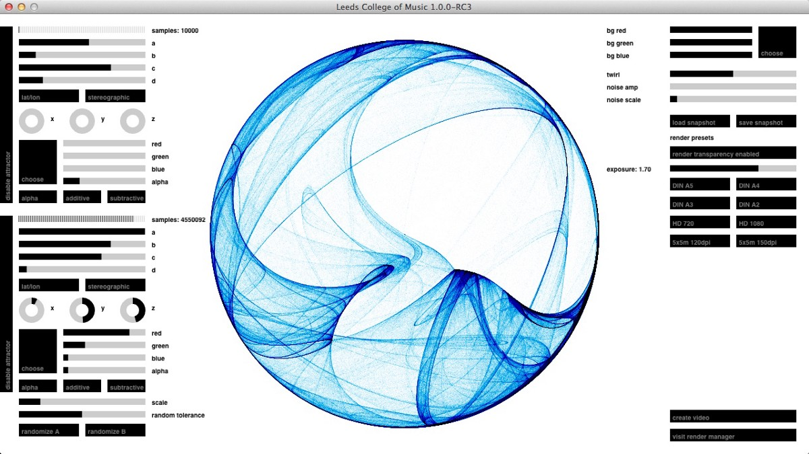
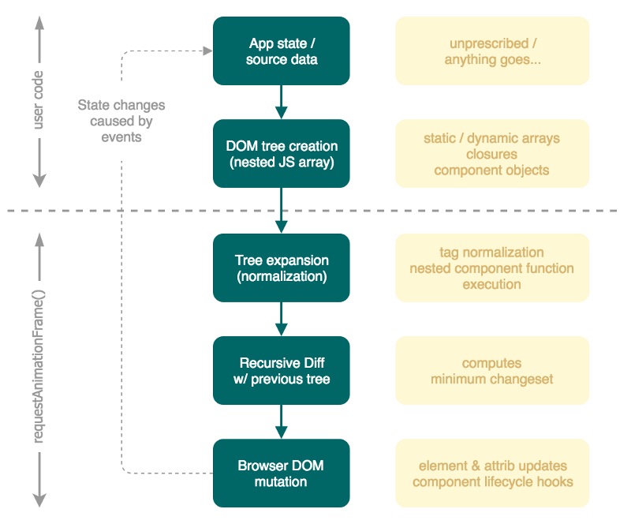

# How to UI in 2018

A purely functional approach to UI composition with ES6/TypeScript

---

**Update 2019: Take a deeper look at this and related projects in this blog
series: [Of umbrellas, transducers, reactive streams &
mushrooms](../2019/20190304-of-umbrellas-transducers-reactive-streams-pt1.md)**

---

The ease of turning nouns into verbs is an almost unmatched feature of the
English language and it’s a central tenet of what follows: The idea of turning
the composition and continuous (re)creation of a user interface into a verb, an
action, a process, a function.

Among UI & UX enthusiasts there never seems to be a short supply of “next
generation frameworks”, promising more efficiency, simplicity and happiness in
all your component and templating needs, so please don’t be surprised to read
about yet another one of those. Please also don’t be too quick with that browser
back button of yours — you might regret it later… :)

Speaking of templating (at least how it’s done 95% of the time): It’s actually
the first point I’d like to address and seriously question why the vast majority
of designers & developers still thinks this is a Great Idea™. Frameworks like
React, Angular, Vue etc. have taken over our little world by storm and as much
as I applaud the many innovations they have brought to the table, and as much as
they differ internally, they all embrace HTML in the most literal way.

At first glance this is of course completely natural. HTML **is** the only way
to make a browser show us what we want to build and I still have no quarrel with
that after 23 years working with it. However, being a markup language, it
doesn’t really play that nice (nor was it ever meant to) with the other standard
ingredient used to build modern UI’s — JavaScript. So the (obvious) solution the
big players all have decided on, was to conjure up new file formats, allowing
frontend developers to sprinkle snippets of HTML-ish looking markup all over
their source files and then in turn require an impressive array of tooling,
engineering, documentation, education, project specific component libraries,
editor support projects, parsers, compilers, source map generators, scaffolding
helpers, each with endless dependencies and totaling millions of man-years of
effort. And that all to magically transform this frankensteinish marriage of
reactified, angularized, vue-ed, marked-up JavaScript back into… JavaScript. And
all that because we seemingly cannot give up on using HTML to define our UIs.
And all that because our framework uses a slightly different approach than the
“other” and hence requires a similar duplication of effort. And all that because
even though JavaScript is the most popular and widely used programming language
of the past 10 years, we still can’t bring ourselves to give up on the overall
still same old idea of PHP-era templating engines and fail to see our UIs for
what they really are:

### In CS speak: Derived views of pure data

Seriously, this is nothing new and it’s the essence of the MV\* design pattern
flavors almost all modern UI frameworks are based upon. I do believe however
that somewhere along the “V”(iew) parts of these patterns we collectively took
the wrong turn (more like missed it in our excitement of a brighter future) and
forgot about **data being just data**, meaning in a [Turing-complete]
(https://en.wikipedia.org/wiki/Turing_completeness)language like JavaScript, it
should be easily possible to create those derived views without having to resort
to HTML magic injection pills. Not just that, but also maybe do so much more
elegantly and powerfully, merely by using the host language to its full extent.
Also remember, none of the mentioned frameworks actually cares about HTML as a
runtime format. Each one manipulates the browser DOM via JavaScript commands,
commands which were pre-compiled from their HTML-ish template snippets.
Therefore the presence of HTML syntax almost purely exists for authoring & code
generation purposes and is there for a perceived convenience and shallow
transition curves from previous approaches. MVC was about the separation of
concerns. Gang of Four. Enterprise patterns for Dummies. Separation of concerns
in software design shouldn’t necessarily mean separation of technologies, as is
the case for us now. What if we give HTML the same treatment or role as was
proposed for JavaScript a while back:

### HTML is (just) an UI assembly language

JavaScript has come a long way to become what it is today and many of the more
recent additions to the language have (ad)dressed its largest open wound and
reduced it to a mere, occasional sore spot, i.e. working with data. And this is
true both in terms of data structures & data flow. ES6 spread operator,
iterators, generators, maps, sets, template literals — for the purposes of this
article only some of them are relevant (hint: it’s **not** template literals!)
and I’ve often wondered why the following approach has not become more common.
But first some more prior art:



Brand identity generator for Leeds College of Music (2012–2013), built in
Clojure, OpenGL & OpenCL. The entire UI is constructed from a single, deeply
nested Clojure hashmap, completely describing/constraining various config
options, layout, value constraints, events fired etc.

The above example for Leeds College of Music was no web application and by no
means is special in an historical sense, but it was the first time I’d built an
UI entirely based on pure data, using only a single, nested hashmap to express
both the configuration and current states of every single component. Instead of
DOM elements, these UI components were assembled by a single recursive
transformation function which called other functions for each tree branch to
produce various OpenGL VBOs. Instead of CSS, shaders were used to do the layout
and theming. However, the idea is the same for web apps:

### In Math speak: ui = f(s)

> Your user interface is the result of repeatedly applying a transforming
> function `f` over the continuously changing internal state `s` of your app.

The core idea of all component frameworks is to abstract away the literal use of
the actual UI generating instructions (e.g. HTML markup or OpenGL calls), to
allow us expressing our UIs in terms of parcels of **function**ality. As pointed
out earlier, the common approach thus far has been to hide these snippets of
“lowlevel” HTML in special source files, wrapped in some way during
pre-processing. But what if we completely bypass HTML and can express our:

### UI components using only vanilla JavaScript?

The functional approach to UI composition is exactly what React&co. actually
already do internally, however we’re still stuck with expressing the markup for
our components in a format which is essentially a blackbox for JS and forces us
to jump through all these various hoops. My two main learnings from the 7 years
spent with Clojure / ClojureScript thus far have been:

1.  The conscious recognition that in software circles “simplicity” is widely
    just interpreted and actively celebrated as primarily serving convenience
    and existing habits. It’s systemic, but not pervasive. E.g. Rich Hickey’s
    calm clarity of thought and ability to take a step back to reconsider
    prevailing design choices has led many others in and outside the Clojure
    community to question the status quo of the more mainstream language camps
    and we have seen several key innovations from the Clojure community quickly
    spill over and becoming transplanted in other languages.
2.  Clojure being a dialect of Lisp, a language with often no clearcut
    separation between data & code, a language where even source code is
    literally encoded and processed as recursive data structures itself, I’ve
    learned to value S-expressions (in all their forms) as both the ultimate and
    most simple approach to encode tree based data, e.g. not just UI
    descriptions.

Some argue JavaScript & HTML too belong to the Lisp family tree (albeit more
like far removed cousins), but it’s undeniable that both conceptually borrow in
part from Lisp’s [S-expressions](https://en.wikipedia.org/wiki/S-expression).
Since in JS we can only create arrays or objects in this literal way, let’s
restrict ourselves to only using these two syntactic forms and play the game of
“S-expressions” to build an UI:

```text
js:   ["div", "hello world"]
html: <div>hello world</div>

js:   ["div#foo.warning.blink", "howdy!"]
html: <div id="foo" class="warning blink">howdy!</div>

js:   ["div", {id: "foo", class: "warning blink"}, "howdy!"]
html: <div id="foo" class="warning blink">howdy!</div>
```

According to a tweet by my friend [Jack
Rusher](https://twitter.com/jackrusher/status/960186878426337283) (thanks for
the correction!), it was Phil Wadler at Edinburgh University who [pioneered this
approach in
Lisp](http://homepages.inf.ed.ac.uk/wadler/papers/next700/next700.pdf) back in
1999, but my first encounter was James Reeves’
[hiccup](https://github.com/weavejester/hiccup) (2009) Clojure library, which
later also influenced the way how React components can be defined in
[Reagent](http://reagent-project.github.io/) (and others). I’m deeply, deeply
grateful to both projects, since they have helped me to completely change my
view on how to build UIs.

```text
[“tag”, {attribs}?, body, [“tag”, {attribs}?...] ...]
```

In this convention vanilla JS arrays define elements/components. The first value
is used as the element tag (with some support for [Emmet](https://emmet.io/))
and an optional JS object as the second value is used to define arbitrary
attributes. Anything after is considered the body/children of the element.

The beauty of this approach is not just its true simplicity and minimal character:

1.  Far more important is that we now have expressed the component in native
    language constructs and have obtained the ability to generate, transform and
    generally handle these components with the full arsenal our language has to
    offer.
2.  Since the component is plain data it can be transformed into any shape, not
    just for browser purposes. Writing serializers/transformers for this simple
    convention is trivial.

Wrap these beauties as functions and we can quickly build up a standard library
of named, reusable and **composable** component functions to build complex UIs.
During authoring this provides us with autocompletion, default params, doc
strings and (in TypeScript/Flow) with the ability to strongly type our entire
user interface. Win-win!

```js
/**
 * @param href link target
 * @param body link body
 */
const link = (href, body) => ["a", { href }, body];
/**
 * @param src image URL
 * @param alt (optional)
 */
const img = (src, alt = "no desc") => ["img", { src, alt }];
link("https://thi.ng/hdom", "hdom");
link("https://thi.ng/hdom", img("foo.png"));
```

If we need to transform sequences of values, we can use the standard language
features and use closures and functional composition to produce customizable
behaviors:

```js
const li = (body) => ["li", body];
const list =
    (type) =>
    (items, tx = li) =>
        [type, ...items.map(tx)];
// create different list types
const ol = list("ol");
const ul = list("ul");
ol(["alice", "bob", "charlie"]);
// [ 'ul', [ 'li', 'alice' ], [ 'li', 'bob' ], [ 'li', 'charlie' ] ]
// use custom list item function
ul(["alice.jpg", "bob.png", "charlie.gif"], (src) => li(img(src)));
// [ 'ul',
//   [ 'li', [ 'img', {src: "alice.jpg"} ] ],
//   [ 'li', [ 'img', {src: "bob.png"} ] ],
//   [ 'li', [ 'img', {src: "charlie.gif"} ] ] ]
```

So far our components are just static, but let’s add some local state (not
implying this is something one should do!) by using closures.

[You can see the result here](https://demo.thi.ng/umbrella/hdom-basics/).

```js
// static component w/ param
const greeter = (name) => ["h1.title", "hello ", name];
// component w/ local state
// also note how this function returns another one
// more on this later...
const counter = () => {
    let i = 0;
    return () => ["button", { onclick: () => i++ }, "clicks: " + i];
};
// root component is just a static array
const app = ["div#app", greeter("world"), counter(), counter()];
```

You might have wondered how the above code can have possibly produced an actual
working HTML version. Here’s your answer…

### Introducing [thi.ng/hdom](https://github.com/thi-ng/umbrella/tree/develop/packages/hdom)

Obviously something is missing between the construction of our DOM as nested
arrays and getting something shown on screen. To save another 1000 words from
this article, here’s a diagram:



The [thi.ng/hdom](https://github.com/thi-ng/umbrella/tree/develop/packages/hdom)
library is handling the 3 major processing steps below the fold. It’s no
surprise that this looks very similar to React. Once started hdom usually runs
an update loop at (usually) 60fps, which in turn is recursively executing our
root component array or function and then only updates the real DOM when & where
it’s absolutely needed. Any functions embedded in a component array will be
called as part of the tree normalization step and their result used a component.
The `counter` from the previous example is a demonstration of this ‘lazy
execution'. Alternatively one can define component objects with life cycle
methods (i.e. `init()`, `render()`, `release()`) to run component local
setup/teardown tasks.

However, this library isn’t meant to be comparable to React, since it has a more
narrow scope and too is much more lightweight. The user provided array **is**
the virtual DOM. There’s no virtual event system. There’s currently only a
subset of component lifecycle methods (and in my experience thus far they’re
needed only occasionally).

A brief overview of benefits from the GitHub readme:

-   Use the full expressiveness of ES6/TypeScript to define, annotate & document
    components
-   Clean, functional component composition and reuse
-   Non-opinionated about app state handling and/or event flow
-   No pre-processing / pre-compilation steps
-   No string parsing / interpolation steps
-   Less verbose than HTML, resulting in smaller file sizes
-   Static components can be distributed as JSON (or [dynamically compose
    components, based on JSON
    data](https://github.com/thi-ng/umbrella/blob/develop/examples/json-components))
-   Supports SVG, arbitrary elements, attributes, events
-   CSS conversion from JS objects
-   Suitable for server side rendering (by passing the same data structure to
    thi.ng/hiccup’s `serialize()`)
-   Fairly fast (see benchmark example below)
-   **Only ~10KB minified**

Even though I started this project in early 2016, I’ve only recently found more
time over the holidays to get this ready for public consumption and am looking
for feedback and contributions from other interested, like-minded users aiming
to avoid the artificial complexity of currently more popular approaches.

To get started, there’re several small, digestible, commented examples in the
parent Umbrella mono-repo, some of which combine **hdom** with other related
libraries of the thi.ng collection, addressing:

-   app state ([thi.ng/atom](https://github.com/thi-ng/umbrella/tree/develop/packages/atom))
-   data transformation via transducers ([thi.ng/transducers](https://github.com/thi-ng/umbrella/tree/develop/packages/transducers))
-   reactive streams (via transducers) ([thi.ng/rstream](https://github.com/thi-ng/umbrella/tree/develop/packages/rstream), [thi.ng/rstream-log](https://github.com/thi-ng/umbrella/tree/develop/packages/rstream-log))

Examples:

-   [Todo list](https://demo.thi.ng/umbrella/todo-list/) with Undo/Redo feature ([source](https://github.com/thi-ng/umbrella/tree/develop/examples/todo-list))
-   [Component generation from JSON](https://demo.thi.ng/umbrella/json-components/) (w/ realtime editor/preview, [source](https://github.com/thi-ng/umbrella/tree/develop/examples/json-components))
-   [SVG particle system](https://demo.thi.ng/umbrella/svg-particles/) ([source](https://github.com/thi-ng/umbrella/tree/develop/examples/svg-particles))
-   [Stress test](https://demo.thi.ng/umbrella/hdom-benchmark/) ([source](https://github.com/thi-ng/umbrella/tree/develop/examples/hdom-benchmark))

Another brief note about the stress test: On a MBP 2016 with a configuration of
192 cells this still runs at ~58-60fps. In this configuration each cell triggers
4 DOM updates every single frame, so a grand total of 768 DOM mutations. It’s a
stress test for a reason, but if you’re getting poor performance please do keep
in mind that this is a highly unlikely thing to happen in a standard UI. Btw.
[Here’re some more FPS reports collected via
Twitter](https://twitter.com/toxi/status/959246871339454464).

Having said all this, I’ve been using this library for a large computational
design tool at work (40KLOC) for the past year, so have proof that it scales
well to IRL applications with complex UIs…

### Outlook

Since this is getting rather long, in a follow up post we will take a deeper
look at component functions, life cycle hooks, available state and event
handling options and learn how to obliterate large duplication of manual data &
component transformation work using re-usable transducers…

Again, if you’re interested in this project, please do get in touch!

Thanks!
