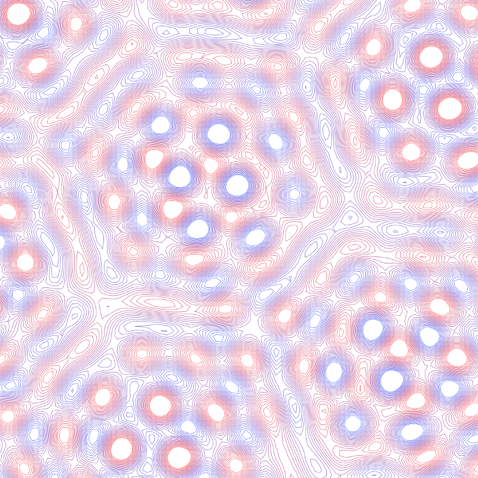

# Of umbrellas, transducers, reactive streams & mushrooms (Pt.1)

In which we start delving deeper into the land of
[thi.ng/umbrella](http://thi.ng/umbrella)…

This is the first chapter of an ongoing blog series, other parts available:

-   [Part 2](https://medium.com/@thi.ng/of-umbrellas-transducers-reactive-streams-mushrooms-pt-2-9c540beb0023) — HOFs, Transducers, Reducers, ES6 iterables
-   [Part 3](https://medium.com/@thi.ng/of-umbrellas-transducers-reactive-streams-mushrooms-pt-3-a1c4e621db9b) — Convolution, 1D/2D Cellular Automata
-   [Part 4](https://medium.com/@thi.ng/of-umbrellas-transducers-reactive-streams-mushrooms-pt-4-62d8e71e5603)— Disjoint Sets, Graph analysis, Signed Distance Fields

Once upon a time, in the cold February of the year 2018, this narrator sat by
his fireplace and [told of a small software
device](../2018/20180204-how-to-ui-in-2018.md) to conjure
so-called user interfaces within the glowing rectangles of people’s networked
screens, with nothing but the native data structures provided by any of the
recent incarnations of JavaScript. Though (arguably) poignant, that story more
or less ended in an anti-climax with an open ending, and this author didn’t make
it clear, it was nothing but a chapter in a much larger undertaking, one which
has been brewing & evolving for several years (since late 2015)…

This larger undertaking/labor of love is:

## [thi.ng/umbrella](http://thi.ng/umbrella)

…a mono-repository and proving ground for a set of mutually developed &
complementary projects, aimed at the general premise of building TypeScript/ES6
apps in a less frameworky, more minimal, simple, sane, and most importantly,
more data-oriented and functional way. In short: Less magic, less tooling, more
plain data, more data flow, more composition, more types (without becoming
fascist about them), shallow(er) / opt-in abstractions, and above all, more
flexibility and re-use. Currently counting in at 89 packages with, at first
sight, seemingly not too much in common (or so I’ve been told), a small random
sampling of topics covered, includes:

-   Data structures for various use cases (graphs, sets, trees, heaps, lists etc.)
-   Binary data manipulation, encoders/decoders
-   Functional programming
-   ES6 iterators & transducers (a primary topic)
-   Reactive dataflow streams & graphs
-   Immutable data / state containers & updates, time travel
-   Extensible value-based (not pointer-based) equality, diffing
-   Interceptor-based, composable event handling
-   2D geometry, color, gradients, visualization
-   Higher-order string formatting
-   Finite-state machines
-   Declarative SPA routing
-   Structured, multi-target data logging
-   HTML / SVG / XML / CSS / Markdown generation & parsing
-   Strided memory pooling/mapping/ allocation (WebGL/WASM interop)
-   nD vector & matrix operations (dense & sparse)
-   Oscillators/wave generators (not only for audio)
-   Seeded PRNGs w/ uniform API
-   Forth-like, point-free stack DSL
-   …and, of course, above-mentioned component based UI generation

In any application, this last topic (UI update) is just a piece of the bigger
picture, and in most cases not part of the “business logic”. Yet, the
architectural design choices of this UI layer can have a huge impact on the
rest. Unfortunately, the previous article from a year ago didn’t go into any
detail about possible workflows and real-world usage patterns supported and
enabled by [**thi.ng/hdom**](http://thi.ng/hdom) (the library discussed in that
article), especially the much more important aspects of state handling and
deriving UI components from other values (app state). This was partly because
these issues are outside the scope of hdom, but also was due to the already
lengthy nature of the post. Additionally, even after 3+ years of working with
some of these tools on an almost daily basis, I’m still regularly discovering,
adding and experimenting with new approaches.

Primarily for this last reason, i.e. experimentation with new approaches**,
thi.ng/umbrella** is more of a toolkit and explicitly **not a framework.**
Instead, it aims to support a wide variety of use cases with very disparate
architectural needs and approaches. It largely provides fundamental constructs
to enable a “pick & mix” approach for different aspects of app development. It’s
designed to avoid lock-in and most customization points only expect either raw,
JS native data or certain interfaces rather than specific implementations. Some
packages offer higher levels of abstraction or more context-specific
functionality as separate opt-in layers. It’s maybe also worth pointing out that
most packages in this project heavily rely on various ES6 syntax features and
are not explicitly considering legacy ES5 compatibility nor do they provide
polyfills of any form. However, all packages are distributed in these three
formats: ES6 modules (individual files) and bundled CommonJS & UMD, incl. type
declarations and source maps.

Several of these packages are partial, updated ports of some of my earlier
Clojure / ClojureScript (and Go) projects. Others are at least heavily
influenced by the Clojure approach to (plain) “Data First”. As I said many times
before, I’m heavily indebted to all that this language and community have taught
me, even though my focus now has shifted to other languages, better suited for
my endeavors…

Long tails everywhere — Package file sizes of all current thi.ng/umbrella projects

Since the publication of the previous article, there have been 2250+ new commits
(excluding merges), hundreds of test cases, dozens new packages, 40+ documented
example projects (totaling a few thousand lines & many showing how various
packages can be used in combination), plus dozens of smaller example snippets in
various long-form readme files and docstrings in the source code. So much for
the rough overview. There’s still _a lot_ more to do, particularly in terms of
documentation & testing, but the full scope of topics covered by the whole
project, by now makes it impossible for me to cover meaningfully in a single
article or two. Therefore, I will apply some dose of Divide & Conquer and aim to
publish more targeted, shorter posts, each dealing with some (IMHO) interesting
features the different packages have to offer and explain how these various
parts can be combined in the wild.

A small selection of example projects included in the repo:

Dataflow graph example — [Live demo](https://demo.thi.ng/umbrella/estuary/) / Source code (needs updating)

Pump & dump in action — Crypto-currency SVG live chart - [Live demo](https://demo.thi.ng/umbrella/crypto-chart/) / [Source code](https://github.com/thi-ng/umbrella/tree/master/examples/crypto-chart)

thi.ng/hdom benchmark — [Live demo](https://demo.thi.ng/umbrella/hdom-benchmark2/) / [Source code](https://github.com/thi-ng/umbrella/blob/master/examples/hdom-benchmark2)

[Incremental Voronoi / Delaunay](https://github.com/thi-ng/umbrella/tree/master/packages/geom-voronoi) via [Quad-edge data structure](https://github.com/thi-ng/umbrella/tree/master/packages/quad-edge) of 20k [Poisson-disk sampled](https://github.com/thi-ng/umbrella/tree/master/packages/poisson) points, accelerated using [kD-Tree spatial indexing](https://github.com/thi-ng/umbrella/tree/master/packages/geom-accel)

Transducer based [Figlet](https://en.wikipedia.org/wiki/FIGlet) style bitmap font transformer —[Live demo](https://demo.thi.ng/umbrella/bitmap-font/) / [Source code](https://github.com/thi-ng/umbrella/tree/master/examples/bitmap-font)

Recursive polygon tessellation & [thi.ng/hdom-canvas](http://thi.ng/hdom-canvas) visualization — [Live demo](https://demo.thi.ng/umbrella/geom-tessel/) / [Source code](https://github.com/thi-ng/umbrella/blob/master/examples/geom-tessel)

D0 & stochastic L-Systems made w/ [thi.ng/lsys](http://thi.ng/lsys)

Minimal Markdown parser / hiccup converter — [Live demo](https://demo.thi.ng/umbrella/markdown/) / [Source code](https://github.com/thi-ng/umbrella/blob/master/examples/markdown)

Sine-plasma effect w/ realtime multi-contour extraction — [Live demo](https://demo.thi.ng/umbrella/iso-plasma/) / [Source code](https://github.com/thi-ng/umbrella/tree/master/examples/iso-plasma)

hdom virtual scroller component with fuzzy search — [Live demo](https://demo.thi.ng/umbrella/hdom-vscroller/) / [Source code](https://github.com/thi-ng/umbrella/tree/master/examples/hdom-vscroller)

Worker based, interactive Mandelbrot explorer with cosine gradient colorization —[Live demo](https://demo.thi.ng/umbrella/mandelbrot/) / [Source code](https://github.com/thi-ng/umbrella/tree/master/examples/mandelbrot)

Interactive, additive wave synthesis SVG visualization —[Live demo](https://demo.thi.ng/umbrella/svg-waveform/) / [Source code](https://github.com/thi-ng/umbrella/tree/master/examples/svg-waveform)

In addition to these bundled examples, most packages have also been used in
several private production projects, some of which already for several years.

## Where to go from here…

Having been a game designer/coder in a previous life (15–30 years ago), I still
believe the discipline is fairly unique in terms of combining a multitude of
different skills and topics. So even though none of the projects discussed here
have anything directly to do with game development (i.e. thi.ng/umbrella is
definitely **not** a game engine), I will introduce, discuss and start weaving
together concepts & projects under the pretext of slowly building up a
semi-functional mini-game, using nothing but packages from the monorepo…

## Welcome to Shroomania!

Below is a teaser screenshot of what we will be building over the coming parts
of this article series…

Screenshot of the current state of Shroomania — Play it @
[demo.thi.ng/shroomania](https://demo.thi.ng/shroomania).

You can play the current prototype at:
[**demo.thi.ng/shroomania**](https://demo.thi.ng/shroomania)

Aim: Collect all edible mushrooms, avoid the toxic ones. FYI. There’s no
gratifying element waiting for you if you manage to collect them all…

Controls: WASD or cursor keys. Sorry, there’s no mobile version.

To set expectations, and before we start digging in, let’s briefly explain the
topics covered by this example project:

Cellular automata example used as starting point for the game — [Live
demo](https://demo.thi.ng/umbrella/cellular-automata/) / [Source
code](https://github.com/thi-ng/umbrella/tree/master/examples/cellular-automata)

1.  **Procedural generation**: Apart from the cute pixel art base tile set,
    obtained from
    [opengameart.org](https://opengameart.org/content/zelda-like-tilesets-and-sprites)
    (plus a few additions made by myself), all other aspects of the game world
    generation are 100% procedural, created with 2D Cellular Automata (CA) and
    signed distance fields (SDF). Btw. the entire game world is based on [one of
    the configuration
    presets](https://demo.thi.ng/umbrella/cellular-automata/#000001111000011111)
    of the above CA demo.
2.  **Graph analysis**: Since the game world is created via a semi-random
    process, not all results produce a good playable environment. We will cover
    some basic (undirected) graph theory, algorithms & data structures (e.g.
    [Disjoint Sets](https://en.wikipedia.org/wiki/Disjoint_sets)) to analyze the
    generated raw environment, verify playability and, if successful, extract
    more meaningful data for successive map generation steps.
3.  **Functional programming with transducers**: Almost all data processing
    steps in terms of terrain generation and game state handling are done via
    [transducers](http://thi.ng/transducers) (and compositions of such), one of
    my favorite (and IMHO one of the most powerful) functional programming
    concepts, able to maximize
    [DRY](https://en.wikipedia.org/wiki/Don%27t_repeat_yourself) in many usage
    scenarios. These (transducers) in turn heavily rely on ES6 iterables, which
    we will cover in some detail as well.
4.  **Reactive dataflow**: Zooming out slightly, the aforementioned transducers
    are all connected into a dataflow graph of reactive values making up the
    game state & processing logic. Each reactive value is essentially of a
    stream-based nature and we will use a number of
    [thi.ng/rstream](http://thi.ng/rstream) constructs and operators to connect
    them into a compute graph, with injected transducers doing the actual work
    (or stopping downstream traffic).
5.  **Declarative, data-driven, on-demand canvas drawing**: Excluding some minor
    pre-processing steps for the minimap overlay, where we use the “low-level”
    HTML canvas API, the main game render step only updates the UI when needed
    and uses [thi.ng/hdom](http:thi.ng/hdom) and
    [thi.ng/hdom-canvas](http://thi.ng/hdom-canvas) components (i.e. JS arrays &
    iterators).

> 

## Epilogue

There have been four versions (each between 2–5k words) of a follow-up post to
that previous article sitting in my drafts for much of 2018. However, since many
of these topics are touching quite dry CS stuff, my hope is that the new, more
concrete context of building a small game will help to better show usage
patterns and discuss some auxiliary topics at the same time. You know, one
stone, two flies and such…

Now go on and read:

-   [Part 2](https://medium.com/@thi.ng/of-umbrellas-transducers-reactive-streams-mushrooms-pt-2-9c540beb0023) — Transducers
-   [Part 3](https://medium.com/@thi.ng/of-umbrellas-transducers-reactive-streams-mushrooms-pt-3-a1c4e621db9b) — Cellular automata
-   [Part 4](https://medium.com/@thi.ng/of-umbrellas-transducers-reactive-streams-mushrooms-pt-4-62d8e71e5603)— Disjoint Sets, Graph analysis, Signed Distance Fields

Lastly, if you have any questions or feedback about any of the projects
mentioned, please do get in touch via
[Twitter](https://twitter.com/thing_umbrella), the [GH issue
tracker](https://github.com/thi-ng/umbrella/issues) and/or join our [Discord
channel](https://t.co/mbKeDzEC7e).

Until then, Happy hacking! :)
