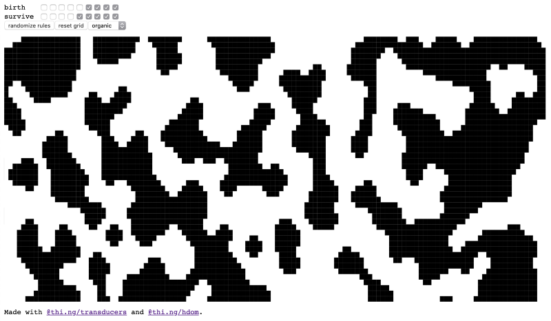

# Of umbrellas, transducers, reactive streams & mushrooms (Pt. 3)

1D & 2D convolutions, functional, branchless, cellular automata

This is part 3 of an ongoing series introducing & discussing projects of the
[thi.ng/umbrella](https://thi.ng/umbrella) monorepo. Other parts:

-   [Part 1](./20190304-of-umbrellas-transducers-reactive-streams-pt1.md) — Project & series overview
-   [Part 2](./20190307-of-umbrellas-transducers-reactive-streams-pt2.md) — HOFs, Transducers, Reducers, ES6 iterables
-   [Part 4](./20190314-of-umbrellas-transducers-reactive-streams-pt4.md) — Disjoint Sets, Graph analysis, Signed Distance Fields

Having covered some transducer basics and related functional programming
concepts in the previous post, we are now ready to apply some of that knowledge
to start creating the world for our game.

## A convoluted approach to Cellular Automata

Convolutions are an interesting group of mathematical operations with many
applications in audio & image processing (DSP, computer vision), machine
learning (CNNs), statistics, engineering etc. In general math terms, convolution
is the integral of the product of two functions `f(t)` and `g(t)`, with one of
them shifted in time. In other words, we compute a sliding, weighted-sum of
function `f(t)`, with `g(t)` being the weighting function (also called
_kernel_).


Images by Brian Amberg, Source: [Wikipedia](https://en.wikipedia.org/wiki/Convolution)

Theoretically, a convolution involves computing the integral over the infinite
interval -∞ .. +∞. However, for our purposes, we can restrict our two functions
to a finite domain and a discreet one to boot. In practice this means, rather
than having to compute the integrals, we can work with and express our functions
as fixed size arrays. And this itself has the following added benefits:

-   we can store arbitrary (numeric) data in our arrays without needing to
    repeatedly re-evaluate an actual, possibly complex or even unknown function
-   we can express a single convolution/integration step (i.e. of a single
    sliding window of function f(x)) as a [dot product of two
    vectors](https://en.wikipedia.org/wiki/Dot_product).

The dot product is simply the sum of the component-wise products of two vectors:

```js
const dot3 = (a, b) => a[0] * b[0] + a[1] * b[1] + a[2] * b[2];

// or more generally (for any vector length)
const dot = (a, b) => a.reduce((dp, a, i) => dp + a * b[i], 0);

dot([1, 2, 3], [10, 20, 30]);
// 140 = 1 * 10 + 2 * 20 + 3 * 30
```

> As an aside: The dot product is one of these magic little gems I find myself
> running into in all sorts of domains, and not just in geometry related fields.
> Indirectly, on a fundamental level, most of NN-based machine learning is a
> long, nested sequence of dot products (via matrix multiplications)… Hence also
> the advantage of using GPUs for ML, which are hardware optimized for this
> computation.

Let's start with a simple 1D convolution process, built via
[transducers](https://thi.ng/transducers). First, we need to define some (random)
test data:

```js
// signal
const signal = [1, 2, 2, 2, 8, 10, 0, 0, 5, 4];

// convolution coeffs / weights
const kernel = [0.25, 0.5, 0.25];
```

The next thing we require is a sliding window of all `signal` values. This
sliding window should always be the same size as `kernel` — in order to compute
the dot product, both vectors must be the same size. If you paid attention in
the previous article, we've already introduced the `partition` transducer for
that precise effect, i.e. segmenting a linear input sequence into overlapping or
non-overlapping chunks of a given size.

```js
import * as tx from "@thi.ng/transducers";

// use iterator version for brevity
// make partitions same size as `kernel`
// use a step size of 1 to create sliding window effect
[...tx.partition(kernel.length, 1, false, signal)];

// [ [ 1, 2, 2 ],
//   [ 2, 2, 2 ],
//   [ 2, 2, 8 ],
//   [ 2, 8, 10 ],
//   [ 8, 10, 0 ],
//   [ 10, 0, 0 ],
//   [ 0, 0, 5 ],
//   [ 0, 5, 4 ] ]
```

This is _almost_ perfect, but not yet good enough! We're only getting 8 result
windows for our 10 input values. In general, with a partition size `k` and a
step size of 1, `partition` will always produce `n — k + 1` outputs for `n`
inputs. In order to process the very first and last value of `signal`, we also
need this tuple `[0, 1, 2]` at the front and `[5, 4, 0]` at the end. The sliding
window should always have the current value to be processed at the center index.
One way to achieve this is via dynamically padding the input with some zeroes on
either end, using the `concat` iterator:

```js
[...tx.concat([0], [1, 2, 3], [0])]
// [ 0, 1, 2, 3, 0 ]

[...tx.partition(3, 1, false, tx.concat([0], signal, [0]))]
// [ [ 0, 1, 2 ],  <- new
//   [ 1, 2, 2 ],
//   [ 2, 2, 2 ],
//   [ 2, 2, 8 ],
//   [ 2, 8, 10 ],
//   [ 8, 10, 0 ],
//   [ 10, 0, 0 ],
//   [ 0, 0, 5 ],
//   [ 0, 5, 4 ],
//   [ 5, 4, 0 ] ] <- new
```

Another alternative would be to configure the input `signal` in such way that we
could consider both ends of the array not separate, but joined. That is, to
consider the `signal` array as a piece of tape and then join the ends, forming a
loop/ring. We will later use this approach in two dimensions to create a
seamless, tiled terrain (and topologically speaking, a torus).


Torus interconnect in 2D — Source: [Wikipedia](https://en.wikipedia.org/wiki/Torus_interconnect)

In our current 1D case, the iterator which can help us with this is called `wrap`:

```js
// prepend & append 1 value on either side
[...tx.wrap([1, 2, 3, 4, 5], 1)];

// [ 5, 1, 2, 3, 4, 5, 1 ]
```

Now it's only a small step to compute a full convolution: We do this by
composing the `partition` transform with another `map` operation to compute the
dot product of the sliding window with the kernel. We also add optional support
for the wrap-around behavior:

```js
const convolve1d = (signal, kernel, wrap = false) => {
    const kw = kernel.length >> 1;
    return tx.transduce(
        tx.comp(
            tx.partition(kernel.length, 1),
            tx.map((window) => dot(window, kernel))
        ),
        tx.push(),
        wrap
            ? tx.wrap(signal, kw)
            : tx.concat(tx.repeat(0, kw), signal, tx.repeat(0, kw))
    );
};

convolve1d(signal, kernel);
// [ 1, 1.75, 2, 3.5, 7, 7, 2.5, 1.25, 3.5, 3.25 ]

// with wrap-around
convolve1d(signal, kernel, true);
// [ 2, 1.75, 2, 3.5, 7, 7, 2.5, 1.25, 3.5, 3.5 ]
```

Some notes/observations:

-   The size of the `kernel` should always be odd and usually ≥ 3. To avoid
    having to explicitly round off `kw`, we use bit shifting for the same
    effect.
-   For a kernel size `k`, when wrap-around is enabled, only the first and last
    `floor(k/2)` values will be different compared to the non-wrap-around
    version. However, this is only true for a single convolution step. If the
    result is repeatedly convolved again, eventually all values will be
    impacted.
-   For the non-wrap-around version, we're using the `repeat` generator to
    produce the right number of zeroes, e.g. `[...repeat(0, 3)]` => `[0, 0, 0]`


Iterative convolution of our original 10 test values / signal (blue) with kernel
[¼, ½, ¼] , convolved results shown in reds — essentially a very basic [low-pass
filter](https://en.wikipedia.org/wiki/Low-pass_filter).

## Iterative convolution

As the last step in preparation for our main topic, cellular automata, we will
have to consider the task of convolving our input multiple times. Since our
existing `convolve1d` function is stateless and pure, it will always produce the
exact same result, if given the same inputs.

[thi.ng/transducers](https://thi.ng/transducers) provides several options for
creating an iterative process (will only briefly discuss a couple).

### iterate()

Classic, infinite, iterative induction, feedback:** _f(t+1) = f(f(t))_**.
Because `iterate` creates an infinite sequence/generator, be sure to limit it
via a suitable operator, like `take`:

```js
[
    ...tx.take(
        4,
        tx.iterate((x) => convolve1d(x, kernel), signal)
    ),
];
// [ [ 1, 2, 2, 2, 8, 10, 0, 0, 5, 4 ],
//   [ 1, 1.75, 2, 3.5, 7, 7, 2.5, 1.25, 3.5, 3.25 ],
//   [ 0.9375, 1.625, 2.3125, 4, 6.125, 5.875, 3.3125, ... ],
//   [ 0.875, 1.625, 2.5625, 4.109375, 5.53125, 5.296875, ... ] ]

// reduce w/ `last()` if you're only interested in final result
tx.transduce(
    tx.take(4),
    tx.last(),
    tx.iterate((x) => convolve1d(x, kernel), signal)
);
// [ 0.875, 1.625, 2.5625, 4.109375, 5.53125, 5.296875, ... ]
```

### scan()

This is a higher-order, _stateful_ transducer, wrapping an inner reducer. It's a
[generalization of the Prefix Sum
operator](https://en.wikipedia.org/wiki/Prefix_sum#Scan_higher_order_function).
Since this is all quite a mouthful, let's see it in action. Also recall
`reductions` from the previous article…

```js
// actual "prefix sum" using `scan` w/ inner `add` reducer
// then using `str` reducer to join outer results
tx.transduce(tx.scan(tx.add()), tx.str(" -> "), tx.repeat(1, 4));
// "1 -> 2 -> 3 -> 4"

// ...or let's compose 2 scans
tx.transduce(
    tx.comp(tx.scan(tx.count(100)), tx.scan(tx.pushCopy())),
    tx.push(),
    tx.repeat(0, 4)
);
// [ [101], [101, 102], [101, 102, 103], [101, 102, 103, 104] ]
```

> Stateful here means that the results produced by `scan` are dependent on
> previous inputs (kind of the whole point of this operator, since it's wrapping
> a reducer). There're several other stateful transducers, e.g. `dedupe`,
> `distinct`, `partition`, `throttle` etc. However, none of them are using
> global state and their internal stateful nature is more or less an
> implementation detail.

To put `scan` to use for our convolution, we need to define our own custom
reducer (which, if you remember from the previous article, is just a [3-element
array of
functions](https://github.com/thi-ng/umbrella/tree/develop/packages/transducers#reducer)).
This currently seems way more effort than using `iterate`, but `scan` being a
transducer instead of a generator means it's more flexible in terms of
supporting different data flow scenarios (as we will see v. soon).

```js
tx.transduce(
    tx.scan([
        () => signal, // init
        (acc) => acc, // completion
        (acc, _) => convolve1d(acc, kernel), // reduction
    ]),
    tx.push(), // collect all iterations in array
    tx.range(4) // compute 4 iterations
);

// [ [ 1, 1.75, 2, 3.5, 7, 7, 2.5, 1.25, 3.5, 3.25 ],
//   [ 0.9375, 1.625, 2.3125, 4, 6.125, 5.875, ... ],
//   [ 0.875, 1.625, 2.5625, 4.109375, 5.53125, ... ],
//   [ 0.84375, 1.671875, 2.71484375, 4.078125, ... ] ]
```


1D cellular automata, Wolfram Rule 105 — Source: [c.thi.ng](http://c.thi.ng)

## Wolfram automata

If you've been wondering what all this so far had _anything_ to do with
[Cellular Automata] (https://en.wikipedia.org/wiki/Cellular_automaton)(CA),
wonder no more! Discovered in 1940 by Stanislaw Ulam & John Von Neumann, CAs are
deterministic, rule-based systems, which are evolved from one generation to the
next via… convolution. We will start with the simplest case, 1D automata, but
the concept can be applied in any dimension, though computational costs grow
exponentially.

A cellular automaton consists of three pieces of data:

1.  An array holding the cell state of the current generation. This is
    straightforward, especially for 1D automata. For our project, we are only
    dealing with cells with 2 states: dead or alive (`0` or `1`). This also is
    the most common case but by no means the only option. In other words, a
    "generation" in CA terms is the discrete function to be convolved, just as
    we've seen earlier, albeit with a more limited set of values.
2.  A convolution kernel (another array), defining the size and shape of each
    cell's neighborhood. In terms of convolution, these are the weights of
    neighboring cells: a weight of `1` includes that neighbor, a `0` ignores it.
    For 1D CAs the kernel usually includes one or more cells on either side. For
    2D and higher, the neighborhood usually defines a ring (or cross) of cells
    around an empty center. We will get back to that later.
3.  An encoding of birth & survival rules for a cell. These rules define the
    overall behavior, lifespan, and complexity of the resulting automata. In
    [John Conway's Game of
    Life](https://en.wikipedia.org/wiki/Conway%27s_Game_of_Life), the most
    famous CA of all (and still an active area of research, even after decades),
    there're only two rules: 1) A currently dead cells becomes alive if it has
    exactly 3 alive neighbors, 2) A live cell remains alive if it has 2 or 3
    alive neighbors, else it dies.> In general, only cells selected by the
    kernel have an impact on the next state of the cell being processed. The
    beauty of CAs is that very simple behaviors on the local level of a few
    individual cells can lead to highly complex global behaviors of the entire
    simulated CA universe.> Another thing to keep in mind (if you're of a
    philosophical nature): The entire evolution of the CA is completely defined
    by the state of the first generation and the rules… This is
    [Predeterminism](https://en.wikipedia.org/wiki/Predeterminism) in action.

After lots of experimental research throughout the 1950-70s (Barricelli, Wiener,
Hedlund, Conway etc.), only in the early 80s, [Stephen
Wolfram](https://en.wikipedia.org/wiki/Stephen_Wolfram) was the first to
systematically explore and document properties and behaviors of cellular
automata, primarily the binary-state, 1D versions. He later summarized this work
in the 1200 page tome [A New Kind of Science](https://www.wolframscience.com/).


Visualizations of a selection of the possible 256 rules of Wolfram automata

In the classic configuration, there're 256 possible Wolfram automata. The
"classic" refers to a kernel size of 3 cells (with equal weight) and therefore
selecting the current cell plus a neighbor cell on either side. With this
configuration, there're 8 (2³) possible outcomes for each cell, depending on the
current pattern selected by the kernel. Here're the state transitions for [Rule
110](https://en.wikipedia.org/wiki/Rule_110), considered a [universal,
elementary
automaton](https://en.wikipedia.org/wiki/Elementary_cellular_automaton):


The first row shows all 8 possible cell states for a given kernel and the 2nd
row a rule specific outcome for each state. If you're familiar with binary
notation, you should recognize the bit pattern in the last row represents 110
(decimal):

110 = 64 + 32 + 8 + 4 + 2

110 = 0\*128 + 1\*64 + 1\*32 + 0\*16 + 1\*8 + 1\*4 + 1\*2 + 0\*1

## Into the land of bits

Let's use a function from the
[thi.ng/transducers-binary](https://thi.ng/transducers-binary) package to
convert a number into its bit sequence:

```js
import { bits } from "@thi.ng/transducers-binary";

// expand each input number into 8 bits
[...bits(8, [110])];

// [ 0, 1, 1, 0, 1, 1, 1, 0 ] -> same as in above table
```

By default `bits` will produce a bit sequence starting with the
[most-significant
bit](https://en.wikipedia.org/wiki/Bit_numbering#Most_significant_bit) of each
input value, but we can also invert the order by starting with the least
significant bit:

```js
const rule = [...bits(8, false, [110])];
// [ 0, 1, 1, 1, 0, 1, 1, 0 ]
```

This is more useful for our purposes since we will use the resulting bit array
as a [lookup table](https://en.wikipedia.org/wiki/Lookup_table) to apply the
rule behavior to each cell in a **_completely branchless_ **manner. You'll find
most other CA tutorials employ all sorts of conditional constructs to determine
the new state of a cell. Here, we'll have none of that and instead solve this
task via some binary trickery, not just in the current 1D case, but also later
in 2D. Another huge benefit of that approach is that our CA is now completely
data-driven and no code changes have to be performed if we're changing the
rule(s).

With `rule` encoded as an array in LSB order, we can now change our kernel
weights to include position info (relative to the kernel) of each cell. Since
we're in the binary domain, we assign each kernel value a different power of 2:

```js
// left cell = 1
// center cell = 2
// right cell = 4

const kernel = [1, 2, 4];
```

Now the "trick" is that if we compute the dot product of this kernel with a cell
pattern from the current CA generation, the resulting number can be directly
used as an index into our rule-specific lookup table to decide a cell's fate in
the next generation. In other words, calculating `dot([1,2,4], bitpattern)`
provides us with the decimal/numeric version of the given bit pattern, which is
then used to obtain a 0 or 1 from the `rule`.

```js
dot(kernel, [0, 1, 1]);
// 6

rule[6];
// 1

rule[dot(kernel, [1, 1, 1])]; // 0
```

Compare the results with the above rule table to verify…

> The same can be done to convert an array of digits in other number bases /
> radixes, here using digits in natural ordering:
>
> Decimal: `dot([100, 10, 1], [5,1,2])` => `512`
>
> Hexadecimal: `dot([256, 16, 1], [7, 15, 14])` =>
> `0x7fe`

## Textmode forever!

And with that we just need to combine all these (and earlier) parts to produce a
completely functional, branchless 1D Wolfram automata, visualized in textmode:

```js
import { comp, map, scan, step } from "@thi.ng/transducers";
import { bits, randomBits } from "@thi.ng/transducers-binary";

const kernel = [1, 2, 4];
const rule = [...bits(8, false, [22])];

// randomized first generation
const seed = [...randomBits(0.25, 32)];

// rename convolve1d -> evolve1d
// add rule application
const evolve1d = (signal, kernel, rule, wrap = false) => {
    const kw = kernel.length >> 1;
    return tx.transduce(
        tx.comp(
            tx.partition(kernel.length, 1),
            tx.map((window) => dot(window, kernel)),
            // !!!NEW!!! rule lookup / application
            tx.map((x) => rule[x])
        ),
        tx.push(),
        wrap
            ? tx.wrap(signal, kw)
            : tx.concat(tx.repeat(0, kw), signal, tx.repeat(0, kw))
    );
};

// stepwise update
// computes next generation & formats it
const update = tx.step(
    tx.comp(
        tx.scan([
            () => seed,
            (acc) => acc,
            (acc, _) => evolve1d(acc, kernel, rule),
        ]),
        tx.map((gen) => gen.map((x) => " #"[x]).join(""))
    )
);

update();
// '         ##   # #    ##       #  #              '
update();
// '        #  # ## ##  #  #     ######             '
update();
// '       #####      #######   #      #            '
update();
// '      #     #    #       # ###    ###           '
update();
// '     ###   ###  ###     ##    #  #   #          '
update();
// '    #   # #   ##   #   #  #  ###### ###         '
update();
// '   ### ## ## #  # ### #######          #        '
update();
// '  #          ####            #        ###       '
```

Adding a few bits of UI to this and allowing users to switch between two
different kernel sizes, one can play with this for the next few hours:


Extended browser version of the CLI example below — [Live demo](https://demo.thi.ng/umbrella/wolfram/) / [Source code](https://github.com/thi-ng/umbrella/tree/develop/examples/wolfram)

> Note: when selecting a kernel width of 5 in the above demo, the number of
> possible rules grows from 256 to 4 billion (32 bit numbers)! You might get
> lucky finding some new interesting rule / pattern by typing in large random
> numbers. If you do, please share the Rule ID in the comments.

Since the browser demo utilizes several other aspects (non-CA related) which we
will only start covering in follow up articles, I've extracted the key parts of
that example as non-interactive command line version. The full code is shown
below. This is meant to be run in an ANSI compatible terminal, via `node`. You
can cancel the script via Control+C.

**Note**: The demo uses convolution related functions from the
[thi.ng/transducers](https://thi.ng/transducers) package, instead of the
functions created earlier in this article. Please see the package docs for
further reference and (minor) differences:

-   [`buildKernel1d()`](https://docs.thi.ng/umbrella/transducers/modules/_xform_convolve_.html#buildkernel1d)
-   [`convolve1d()`](https://docs.thi.ng/umbrella/transducers/modules/_xform_convolve_.html#convolve2d)
-   [`lookup1d()`](https://docs.thi.ng/umbrella/transducers/modules/_func_lookup_.html#lookup1d)

```js
const tx = require("@thi.ng/transducers");
const txb = require("@thi.ng/transducers-binary");

// ANSI clear screen esc seq
const CLEAR = "\x1b[2J\x1b[;H";

// CA dimensions
const WIDTH = 72;
const HEIGHT = 24;

// Wolfram rule ID
const RULE = 22;

// seed w/ 25% probability
const seed = () => [...txb.randomBits(0.25, WIDTH)];

// separate rule ID into bits
const parseRule = (id) => [...txb.bits(8, false, [id])];

// single evolution step
const evolve = (kernel, rule) => (src) =>
    tx.transduce(
        tx.comp(
            // convolve curr generation w/ kernel
            tx.convolve1d({
                src,
                kernel,
                width: src.length,
                wrap: true,
            }),
            // apply rule
            tx.map(tx.lookup1d(rule))
        ),
        tx.push(),
        tx.range(src.length)
    );

// CA update as dynamically built transducer, wrapped in
// `tx.step()` for stepwise execution via setInterval (below)
const update = tx.step(
    tx.comp(
        // evolve current generation
        tx.scan(
            tx.reducer(
                seed,
                evolve(tx.buildKernel1d([1, 2, 4], 3), parseRule(RULE))
            )
        ),
        // transform new gen into ASCII art
        tx.map((gen) => gen.map((x) => (x ? "#" : " ")).join("")),
        // form sliding window of max `HEIGHT` last results
        tx.slidingWindow(HEIGHT),
        // join all lines into single string, prefix w/ clear screen cmd
        tx.map((win) => CLEAR + win.join("\n")),
        // print
        tx.trace()
    )
);

// kick off
setInterval(update, 16);
```

## From 1D to 2D

Whilst 1D automata can produce an impressive array of complex patterns, none of
them are really suitable for building a game world, at least not a playable one.
So let's try our luck by increasing the number of dimensions and do so with very
little effort. Good foundations count!

As mentioned earlier, a 2D convolution kernel usually defines/selects a ring of
cells around an empty center cell — at least for CA purposes. In the general
case, the weights can be (and often are) any numeric value. [Von Neumann's
original CA kernel
neighborhood](https://en.wikipedia.org/wiki/Von_Neumann_neighborhood) is still
one of the most commonly used, however, the larger [Moore
neighborhood](https://en.wikipedia.org/wiki/Moore_neighborhood) is probably
_the_ most popular choice and also used by the Game of Life:


Moore vs Von Neumann neighborhoods / kernels. The red cells are used to collect
cell states to determine the next state of the blue cell in the center.

Instead of updating our existing 1D convolution function for 2D, we will
continue to use the existing functionality of the **thi.ng/transducers**
package, as shown in the above example code.

First, we're building a 2D kernel of a Moore neighborhood, a 9 element array
(3x3) of 1's, with the center cell a zero:

```js
// 3x3 Moore neighborhood
const moore = [1, 1, 1, 1, 0, 1, 1, 1, 1];

// weights and XY offsets of each neighbor cell
const kernel = tx.buildKernel2d(moore, 3, 3);

// [ [ 1, [ -1, -1 ] ],
//   [ 1, [ 0, -1 ] ],
//   [ 1, [ 1, -1 ] ],
//   [ 1, [ -1, 0 ] ],
//   [ 0, [ 0, 0 ] ],
//   [ 1, [ 1, 0 ] ],
//   [ 1, [ -1, 1 ] ],
//   [ 1, [ 0, 1 ] ],
//   [ 1, [ 1, 1 ] ] ]
```

Next up are the rules of the game: For the Game of Life (GoL), a new cell is
born if it has 3 alive neighbors and remains alive if 2 or 3 alive neighbors.
Like before, these rules can be encoded as a lookup table, this time with 18
values: The first 9 for currently dead cells, the other 9 for those alive:

```js
const rules = [
    // next states for currently dead cells
    0, 0, 0, 1, 0, 0, 0, 0, 0,
    // for alive cells
    0, 0, 1, 1, 0, 0, 0, 0, 0,
];
```

Also as before, this table can be expressed as a single 18-bit number:

```js
// Game of Life = 6152
[...txb.bits(18, false, [6152])];

// [
//   0, 0, 0, 1, 0, 0, 0, 0, 0,
//   0, 0, 1, 1, 0, 0, 0, 0, 0
// ]
```

Our evolution function becomes:

```js
const evolve2d = (src, kernel, rules, width, height, wrap) =>
    transduce(
        comp(
            // sum up neighbors
            tx.convolve2d({ src, width, height, kernel, wrap }),
            // lookup & apply rules
            tx.mapIndexed((i, n) => rules[n + src[i] * 9])
        ),
        tx.push(),
        tx.range2d(width, height)
    );
```

A short explanation of the `rules[n + src[i] * 9]` expression: Since both our
kernel and cell-matrix only contains zeroes or ones, the convolution result for
each cell is the number of alive neighbors. To determine the right rule, we also
need to take into account if the cell was currently dead or alive. The `src[i] *
9` part takes care of this. The `n` argument is the number of alive neighbors.

The [cellular automata
example](https://github.com/thi-ng/umbrella/tree/develop/examples/cellular-automata)
in the **thi.ng/umbrella** repo implements the approach described here. By
switching our rules to the configuration shown below, we can create cave /
tunnel-like stable structures instead of the constantly changing patterns
produced by GoL. In the next article, we will use this as the basis for
extracting areas walkable/reachable by the player and to extract a terrain
elevation map from the generated 1-bit image, using signed distance fields.



2D CA example shown with the config used to create the terrain for our
game — [Live demo](https://demo.thi.ng/umbrella/cellular-automata/) / [Source
code](https://github.com/thi-ng/umbrella/tree/develop/examples/cellular-automata)

## The end

And there we are! You've reached the end of an, I hope, informative part 3 of
this series.

As always, if you've got any questions or feedback, please do get in touch via
[Twitter](https://twitter.com/thing_umbrella), the [GitHub issue
tracker](https://github.com/thi-ng/umbrella/issues/), join our
[Discord](https://discord.gg/JhYcmBw) or discuss on [Hacker
News](https://news.ycombinator.com/item?id=19355112).

Other parts:

-   [Part 1](./20190304-of-umbrellas-transducers-reactive-streams-pt1.md) — Project & series overview
-   [Part 2](./20190307-of-umbrellas-transducers-reactive-streams-pt2.md) — HOFs, Transducers, Reducers, ES6 iterables
-   [Part 4](./20190314-of-umbrellas-transducers-reactive-streams-pt4.md) — Disjoint Sets, Graph analysis, Signed Distance Fields

PS. To prove textmode can still be hip, here're a few more demoscene productions
for your viewing pleasure:

https://www.youtube.com/watch?v=t76kr2lKC2k

https://www.youtube.com/watch?v=Kjknm6wKsrU
