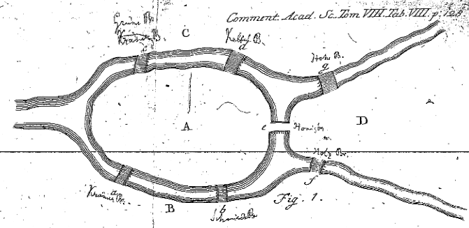

# Of umbrellas, transducers, reactive streams & mushrooms (Pt. 4)

Disjoint Sets, Graph analysis & Signed Distance Fields

This is part 4 of an ongoing series introducing & discussing projects of the
[thi.ng/umbrella](https://thi.ng/umbrella) monorepo, whilst building a
minigame on the side. Other parts available:

-   [Part 1](./20190304-of-umbrellas-transducers-reactive-streams-pt1.md) — Project & series overview
-   [Part 2](./20190307-of-umbrellas-transducers-reactive-streams-pt2.md) — HOFs, Transducers, Reducers, ES6 iterables
-   [Part 3](./20190310-of-umbrellas-transducers-reactive-streams-pt3.md) — Convolution, 1D/2D Cellular Automata

We finished the last part with expanding our 1D cellular automata generator to
two dimensions, and in this part, we will slightly refactor this and perform
several post-processing steps to extract an actually usable and playable terrain
from the raw CA generated pattern/grid.

## A rough guide to Shroomania

The diagram below provides a high-level overview of the processing steps
required to get from our raw CA output to the version later shown to the player:


Terrain generation steps for Shroomania (from left-to-right): 1) Binary CA image, 2) SDF elevation
map, 3) SDF + labeled regions, 4) In-game visualization

We will deal with the last stage in the next installment. As a very first step,
though, we need to take care of the fact that evolving the CA from an initially
randomized seed generation will require several generations (iterations) to give
the system time to develop structures and converge into a more or less stable
state. Remember, the global pattern produced by a CA is the result of repeated
local interactions between neighboring cells only. [You can see this convergence
in action
here](https://demo.thi.ng/umbrella/cellular-automata/#000001111000011111) — click
“reset grid” to observe that behavior again…

> Not all CA rule sets produce convergent behavior, but ours does. Also, as an
> aside and addendum to the previous article, similar local/global pattern
> emergence happens in so called reaction-diffusion processes. There, instead of
> using discrete states as used for CAs, each cell stores rational numbers, but
> is similarly evolved via convolution. E.g. the by now famous [Gray-Scott
> model](https://en.wikipedia.org/wiki/Gray-Scott_model) can produce a vast
> number of stable and unstable pattern formations and uses two interacting
> density buffers (plus another two for storing diffusion strengths), convolved
> via a 3x3 Laplacian kernel (Von Neumann shaped neighborhood). [See here for
> more details](http://toxiclibs.org/2010/02/simutils-grayscott/).

Below is the entire CA generation code for
[**_Shroomania_**](https://demo.thi.ng/shroomania/)_,_ largely based on what
we’ve created in the previous article, but with some important additions:

```ts
import { IRandom } from "@thi.ng/random";
import {
    buildKernel2d,
    comp,
    convolve2d,
    ConvolutionKernel2D,
    last,
    map,
    mapIndexed,
    matchFirst,
    multiplexObj,
    push,
    range,
    range2d,
    reduce,
    reducer,
    trace,
    transduce,
} from "@thi.ng/transducers";
import { randomBits } from "@thi.ng/transducers-binary";

interface CAOpts {
    width: number;
    height: number;
    rnd?: IRandom;
    seedProb?: number;
    iter?: number;
}

const rules = [0, 0, 0, 0, 0, 1, 1, 1, 1, 0, 0, 0, 0, 1, 1, 1, 1, 1];

const kernel = buildKernel2d([1, 1, 1, 1, 0, 1, 1, 1, 1], 3, 3);

const randomizeGrid = (
    width: number,
    height: number,
    rnd?: IRandom,
    prob = 0.5
) => [...randomBits(prob, width * height, rnd)];

const convolve = (
    src: number[],
    kernel: ConvolutionKernel2D,
    rules: number[],
    width: number,
    height: number,
    rstride = kernel.length,
    wrap = true
) =>
    transduce(
        comp(
            convolve2d({ src, width, height, kernel, wrap }),
            mapIndexed((i, x) => rules[x + src[i] * rstride])
        ),
        push(),
        range2d(width, height)
    );

const computeCA = ({ width, height, rnd, seedProb, iter }: CAOpts) =>
    reduce(
        reducer(
            () => randomizeGrid(width, height, rnd, seedProb),
            (acc) => convolve(acc, kernel, rules, width, height)
        ),
        range(iter || 20)
    );
```

To create a new CA game map, we only need to call `computeCA`, which then
produces the initial seed generation via `randomizeGrid` and evolves it for a
given number of iterations, then returns an array of ones and zeroes.

```ts
computeCA({ width: 32, height: 32 });
```

All parts of the game relying on randomness (incl. the initial CA generation)
support an optional (possibly seedable)
[PRNG](https://en.wikipedia.org/wiki/Pseudorandom_number_generator) via the
`IRandom` interface, defined in the [thi.ng/random](https://thi.ng/random)
package alongside several seedable implementations. If not specified, these
function will revert to a wrapper of the standard (non-seedable)
`Math.random()`, called
`[SYSTEM](https://github.com/thi-ng/umbrella/blob/develop/packages/random/src/system.ts)`.
However, using a seedable generator will ensure deterministic behavior and later
allows us to encode any game map with just a single number (the seed).

```ts
import { Smush32 } from "@thi.ng/random";

// this will always generate the exact same result
computeCA({
    width: 32,
    height: 32,
    iter: 20,
    rnd: new Smush32(0xce77babe),
}).filter((x) => x).length;

// 379 (aka number of live cells after 20 iterations)
```

## You reap what you sow

The probability of live cells in the initial CA seed generation has a major
impact on the overall outcome, and in the case of our game, on the overall
playability and complexity of the game map. Through experimentation I found an
initial live cell chance between 47–53% produces a great balance and variety
between large, open spaces and/or narrow, winding passages. Once we get to the
actual game mechanics in a later part, we could use this probability to slowly
increase the difficulty of each successive game level…


Comparison of outcomes of different live cell probabilities in the seed
generation. White areas are deemed walkable (in principle), but might not be
reachable/connected.

## Into the forest of Disjoint Sets

As stated in earlier parts, and unless we’re using a seeded PRNG with a verified
outcome, we cannot assume that the result of `computeCA` constitutes an actually
playable map/game level. For example, the 55% version in the above image,
technically could be used, but it only consists of many small, isolated pockets,
not exactly a great setup! Therefore, we will have to perform some analysis of
the raw CA array and define some arbitrary rules to determine overall
playability, such as:

> **A map is considered playable if it contains at least one continuous white
> region (zeroes), covering at least 33% of the entire map.**

If the analysis fails, we will have to execute `computeCA` again until it works
(or we give up). The next question then is how to transform a 1D array of zeroes
and ones (which actually encode a 2D image), to a) figure out the number of
individual, isolated regions and b) measure their overall size/area?

Luckily for us, there’s a single data structure we can use to get answers to
both of these questions: A [Disjoint
Set](https://en.wikipedia.org/wiki/Disjoint-set_data_structure) tracks a set of
elements, partitioned into non-overlapping (i.e. disjoint) subsets. This data
structure has many great benefits in that it provides the following operations
in near constant time:

-   adding new elements / sets
-   merging existing sets
-   querying whether two elements are in the same set

Internally, a Disjoint Set manages a set of trees (hence is a _forest_), each
representing a subset of elements. The
[thi.ng/adjacency](https://thi.ng/adjacency) package provides a `DisjointSet`
class for us to work with:

```ts
import { DisjointSet } from "@thi.ng/adjacency";

// create set of 10 items
const set = new DisjointSet(10);
```


The initial state of the above Disjoint Set

At this point our `set` contains 10 subsets/partitions, i.e. each element
initially is its own set. Let’s merge some of these:

```ts
// combine subsets
set.union(1, 5);
set.union(2, 7);
set.union(6, 9);

// query if connected
set.unified(5, 1);
// true

set.unified(1, 2);
// false

// get canonical ID for an element
// (i.e. its parent, if any)
set.canonical(9);
// 6
set.canonical(6);
// 6

// retrieve all subsets
set.subsets();
// Map {
//   6 => [ 9, 6 ],
//   8 => [ 8 ],
//   2 => [ 7, 2 ],
//   1 => [ 5, 1 ],
//   4 => [ 4 ],
//   3 => [ 3 ],
//   0 => [ 0 ] }
```


State after above the `union()` operations. The IDs shown in the top row are
considered the canonical roots of the new subsets. Roots can change if a subset
is merged with another.

As shown, the DS now has 3 subsets with 2 elements, just as we declared, but
let’s continue:

```ts
set.union(6, 2);
set.union(9, 5);

set.subsets();
// Map {
//   6 => [ 9, 7, 6, 5, 2, 1 ],
//   8 => [ 8 ],
//   4 => [ 4 ],
//   3 => [ 3 ],
//   0 => [ 0 ],
// }
```


This diagram only shows the logical tree structure after these new merges. In
practice, Disjoint Set implementations usually apply a form of [path
compression](https://en.wikipedia.org/wiki/Disjoint-set_data_structure#Path_compression)
to avoid intermediate tree levels.

Now all 3 larger subsets have been merged into a single one… Again, small local
interactions (via `union()`) cause drastic global structural change.

If you want to find out more about Union-Find and the Disjoint Set data
structure, I refer you to Robert Sedgewick’s & Kevin Wayne’s [amazing lecture
notes](https://algs4.cs.princeton.edu/lectures/15UnionFind-2x2.pdf) of their
Princeton [Algorithms course](https://algs4.cs.princeton.edu), which contain
lots of implementation details and diagrams.

Before we make use of this for our CA map analysis tasks at hand, we first need
to take another brief excursion…

## Into the land of Graphs



Leonhard Euler’s sketch of the 7 Königsberg bridges. Source: [Euler
archive](http://eulerarchive.maa.org/)

This 18th-century sketch by the [King of
Mathematics](https://www.therichest.com/rich-list/most-influential/greatest-mathematicians/)
about the [Königsberg
Bridges](https://en.wikipedia.org/wiki/Seven_Bridges_of_K%C3%B6nigsberg) problem
constitutes the beginning of the fields now known as [Graph
Theory](https://en.wikipedia.org/wiki/Graph_theory) and
[Topology](https://en.wikipedia.org/wiki/Topology).

A graph consists of a set of _vertices_ (also called _nodes_), connected by
_edges_. These connections can be either
[_directed_](https://en.wikipedia.org/wiki/Directed_graph) or
[_undirected_](https://en.wikipedia.org/wiki/Graph_%28discrete_mathematics%29#Undirected_graph),
weighted and/or unweighted. For example, in the above map, the four land masses
are the vertices, connected by 7 bridges, acting as undirected edges (though in
the Königsberg problem, these could be considered directed, since each bridge is
only allowed to be crossed once, however, it’s not stated in which
direction — in fact, the problem has no solution).


A 1D cell array interpreted as 2D image and as a graph. Array indices are used
as vertex IDs. For our analysis, we’re only interested in the white vertices and
must also take care of the horizontal/vertical wrap-around, when looking for
qualifying neighbors. **Due to this toroidal topology, all white cells actually
form a single continuous region**…

If we consider our CA array / 2D image as an undirected graph, we could
interpret each array index/cell/pixel as a vertex, with up to four edges to its
top, left, right and bottom neighbors. However, we will need to apply the
following restrictions:

1.  We only care about 0-cells, which we declared to be our walkable areas. 1’s
    in the CA array are considered unreachable / obstacles. Since we’re going to
    use transducers for processing, we can just plug in a `filter` at the start
    of the transformation pipeline to ignore all 1's.
2.  Related to the previous point: For each of these cells only edges to other
    0-cell neighbors are created. Any 1-neighbors are ignored.
3.  Since our CA array was evolved as a topological torus (see the previous
    article), we need to apply special treatment for cells in the first & last
    row/column, i.e. at the edges and corners of the image. For example, cells
    at column 0 might have edges to cells on the rightmost column of the image
    and vice versa (and same for top/bottom rows)

For our purposes, we don’t actually need a proper graph data structure itself,
but it still helps to think about the problem from a graph perspective. In code
form this all can be expressed as:

```ts
import { wrap } from "@thi.ng/math";
import {
    comp,
    filter,
    iterator,
    map,
    mapcat,
    range,
} from "@thi.ng/transducers";

// returns the toroidal array index for given x,y coords and grid size
// uses `wrap` from math package to perform wrap-around
const index = (x: number, y: number, width: number, height: number) =>
    wrap(y, 0, height) * width + wrap(x, 0, width);

// coord offsets of potential neighbors
const VON_NEUMANN = [
    [-1, 0],
    [0, -1],
    [1, 0],
    [0, 1],
];

// returns an iterator of a cell's edges to neighbors with value 0
const neighbors = (src: number[], width: number, height: number, i: number) => {
    const x = i % width;
    const y = (i / width) | 0;
    return iterator<number[], Edge>(
        comp(
            filter(([kx, ky]) => !src[index(x + kx, y + ky, width, height)]),
            map((k) => [i, index(x + k[0], y + k[1], width, height)])
        ),
        VON_NEUMANN
    );
};

// returns an iterator of all edges from/to 0-cells in the given grid
const walkableEdges = (src: number[], width: number, height: number) =>
    iterator<number, Edge>(
        comp(
            filter((i) => src[i] === 0),
            mapcat((i) => neighbors(src, width, height, i))
        ),
        range(src.length)
    );
```

If we now encode the 5x5 grid shown in the above diagram and call
`walkableEdges`, we should get the following output. Note that this function
returns an iterator, producing each qualifying edge on demand…

```ts
// test grid
// prettier-ignore
grid = [
    1, 1, 1, 0, 0,
    1, 1, 0, 0, 0,
    0, 1, 1, 1, 0,
    0, 1, 0, 0 ,0,
    0, 0, 1, 0, 0
];

[...walkableEdges(grid, 5, 5)];
// truncated for brevity
// there should be xxx results in total
// each edge will be here twice (w/ flipped directions)
// the disjoint set will take care of deduping
// [ [ 3, 23 ], [ 3, 4 ], [ 3, 8 ], [ 4, 3 ], [ 4, 24 ],
//   [ 4, 9 ], [ 7, 8 ], [ 8, 7 ], [ 8, 3 ], [ 8, 9 ],
//   [ 9, 8 ], [ 9, 4 ], [ 9, 14 ], [ 10, 14 ], [ 10, 15 ],
//   [ 14, 9 ], [ 14, 10 ], [ 14, 19 ], [ 15, 19 ], [ 15, 10 ],
//   [ 15, 20 ], [ 17, 18 ], [ 18, 17 ], [ 18, 19 ], [ 18, 23 ],
//   ...
//  ]
```

Before we can continue, at this point, the only remaining thing left to do is
extracting all connected components/regions (using `DisjointSet`) from these
edges. The `walkableComponents` function takes care of this:

```ts
type Edge = [number, number];

// returns reducer performing union-find operation
// reduction result is a DisjointSet instance
const unify = (width: number, height: number) =>
    reducer<DisjointSet, Edge>(
        () => new DisjointSet(width * height),
        (acc, e) => (acc.union(e[0], e[1]), acc)
    );

// takes iterable of edges and returns array of connected components
// sorted by size (in descending order)
const walkableComponents = (
    edges: Iterable<Edge>,
    width: number,
    height: number
) =>
    [...reduce(unify(width, height), edges).subsets().values()].sort(
        (a, b) => b.length - a.length
    );
```

Still using our small 5x5 test grid and putting everything so far together, we
should get:

```ts
const edges = walkableEdges(grid, 5, 5);
// Object [Generator] {}

const regions = walkableComponents(edges, 5, 5);
// [ [ 24, 23, 21, 20, 19, 18, 17, 15, 14, 10, 9, 8, 7, 4, 3 ],
//   [ 22 ],
//   [ 16 ],
//   [ 13 ],
//   [ 12 ],
//   [ 11 ],
//   [ 6 ],
//   [ 5 ],
//   [ 2 ],
//   [ 1 ],
//   [ 0 ] ]
```

The first and largest subset returned contains the IDs of all white cells. The
subsets with single items are all the black ones. Of course, for our game, we
need to generate a much larger grid (e.g. 128 x 128), which will result in a
number of larger subsets at the beginning of the returned array. However, for
our map qualification/playability test, we’re really only interested in the very
first (and therefore largest) set. Our check simply is:

```ts
if (regions[0].length >= grid.length / 3) {
    // yay!
}
```

Finally, in case of a test failure, we need to regenerate the CA with a new,
random state and repeat these analysis steps until we’re successful. We also
want to avoid going into a potentially infinite loop, and hence, will need to
put a cap on the maximum number of trials. All this can be done via a single,
composed transducer pipeline (surprised? not! :)

```ts
interface GenerationOpts extends CAOpts {
    thresh: number;
    maxTrials?: number;
}

const generateWalkable = (opts: GenerationOpts) =>
    transduce<number, any, any>(
        comp(
            trace("generation #"),
            map(() => computeCA(opts)),
            multiplexObj({
                raw: map(identity),
                comps: map((raw) =>
                    walkableComponents(
                        walkableEdges(raw, opts.width, opts.height),
                        opts.width,
                        opts.height
                    )
                ),
            }),
            matchFirst(
                ({ raw, comps }) => comps[0].length / raw.length >= opts.thresh
            )
        ),
        last(),
        range(opts.maxTrials || 20)
    );
```

The `generateWalkable` function uses several transducers we haven’t previously
mentioned:

-   [matchFirst](https://docs.thi.ng/umbrella/transducers/modules/_xform_match_first_.html) — waits
    for first qualifying value, then terminates pipeline
-   [multiplexObj](https://docs.thi.ng/umbrella/transducers/modules/_xform_multiplex_obj_.html) — forked
    transducer application
-   [last](https://github.com/thi-ng/umbrella/blob/develop/packages/transducers/src/rfn/last.ts) — reducer
    which merely keeps the last value received
-   [trace](https://github.com/thi-ng/umbrella/blob/develop/packages/transducers/src/xform/trace.ts) — side-effect
    transducer, printing incoming values to the console

The output of this function is an object with the `raw` CA array and the
connected components/regions (`comps`), both values will be needed for the
following steps of the game initialization.

```ts
generateWalkable({
    width: 32,
    height: 32,
    thresh: 1 / 3,
    maxTrials: 20,
});

// generation # 0
// generation # 1
// generation # 2
// generation # 3
// {
//   raw: [1,0,0,0,0,0,0,0,0,0,1,1,1,1,1,0...],
//   comps: [
//     [1020,1019,1018,1017,1010,1009,...],
//     [395,394,368,367,366,365,364,363,362,361,337...],
//     [1023],
//     [1022],
//     [1021],
//     [1016],
//     ...
//   ]
// }
```

## From binary matrix to Signed Distance Field

The very last task for us to do in this article is the transformation from the
binary CA array to another array encoding a 2.5D terrain, in the form of an
elevation map. We will assign an elevation value to each cell, based on the
distance to the nearest cells with a different color/value, i.e. 0 = white, 1 =
black. For white cells, the search stops with the first black cell found and
vice versa. The meaning of “nearest” will be not entirely precise (though more
than sufficient) since we will restrict our searches to 45-degree angles. In
other words, the search proceeds outwards from the current cell in 8 directions,
and as with our prior graph analysis, is taking into account the toroidal nature
of our map (i.e. wrap-around on grid edges). There are more precise ways of
computing that, but unnecessary for our specific use case.

Preferably, the elevation map retains the same kind of information as our
original CA array. To achieve this we are using the sign of the computed
elevations to discriminate between the walkable regions (negative) and
inaccessible parts of the map (positive). This kind of map is also called a
discrete [Signed Distance
Field](https://en.wikipedia.org/wiki/Signed_distance_function) and finds
applications in many domains, including 3D graphics, [volumetric
modeling](https://www.tokeru.com/cgwiki/index.php?title=HoudiniVolumes#SDF),
visualization, GPU font rendering etc.


The raw CA image on the left, transformed into a Signed Distance Field elevation
map on the right. Each cell stores the distance to the closest differently
colored cell. In a larger map with generally bigger regions of each type, the
maximum distances will be larger, yet we will limit them for visualization and
optimization purposes…

The above SDF shows the computed distances for each cell. The field includes no
zeroes since each cell is at least 1 step away from the opposing terrain type.
To compute this field, we will use the following two functions:

```ts
import { partial } from "@thi.ng/compose";

// computes distance to nearest cell of different color (0/1)
const cellDist = (
    src: number[],
    width: number,
    height: number,
    [x, y]: ReadonlyVec
) => {
    const yy = y * width;
    const e = src[yy + x] ? 0 : 1;
    let d: number = 1;
    const maxd = Math.min(width, height);
    for (
        let l = x - 1, r = x + 1, t = y - 1, b = y + 1;
        d < maxd;
        d++, l--, b++, r++, t--
    ) {
        l = wrap(l, 0, width);
        r = wrap(r, 0, width);
        t = wrap(t, 0, height);
        b = wrap(b, 0, height);
        const yt = t * width;
        const yb = b * width;
        if (
            src[yy + r] === e ||
            src[yy + l] === e ||
            src[yt + r] === e ||
            src[yt + x] === e ||
            src[yt + l] === e ||
            src[yb + r] === e ||
            src[yb + x] === e ||
            src[yb + l] === e
        ) {
            break;
        }
    }
    return e ? -d : d;
};

// takes raw CA array and computes SDF
const computeElevation = (src: number[], width: number, height: number) =>
    transduce(
        map(partial(cellElevation, src, width, height)),
        push(),
        range2d(width, height)
    );
```

In the next article we will continue to combine these computed results further
and start working on visualizing them in the browser, using
[thi.ng/hdom](https://thi.ng/hdom) and
[thi.ng/hdom-canvas](https://thi.ng/hdom-canvas)… and even more transducers
(after all they’re one of the key topics of this series).

## Mo’ pictures, please!

In preparation for this next part, and to leave you with at least some visual
output from this installment’s exercises, here’s a small final example to
compute and export the SDF as SVG heatmap via NodeJS. The code utilizes all the
other functions created above but is omitted here for brevity. You can [download
the full example from
here](https://gist.github.com/postspectacular/cea5f570c492897c28c804c6345755e2).


SVG output produced by the above example, showing walkable areas in blues and
non-walkable regions in browns (with elevation/SDF labels). The walkable areas
are labeled with their respective region name. E.g. all “A” cells are part of
the same region. I find small tools like this very useful for debugging and
quick exploration without having to build a UI first...

One doesn’t need to stop here and might also like to extract contour lines from
the SDF and visualize them as SVG (or via canvas). I shall leave this exercise
to the reader, code examples can be found in the
[thi.ng/geom-isoline](https://github.com/thi-ng/umbrella/tree/develop/packages/geom-isoline)
readme.


Realtime contour line extraction via thi.ng/geom-isoline. [Live
demo](https://demo.thi.ng/umbrella/iso-plasma/) / [Source
code](https://github.com/thi-ng/umbrella/tree/develop/examples/iso-plasma)

This really is the end now of this longer than expected article! As always, if
you’ve got any questions or feedback, please do get in touch via
[Twitter](https://twitter.com/thing_umbrella), the [GitHub issue
tracker](https://github.com/thi-ng/umbrella/issues/), join our
[Discord](https://discord.gg/JhYcmBw) or discuss on Hacker News.
