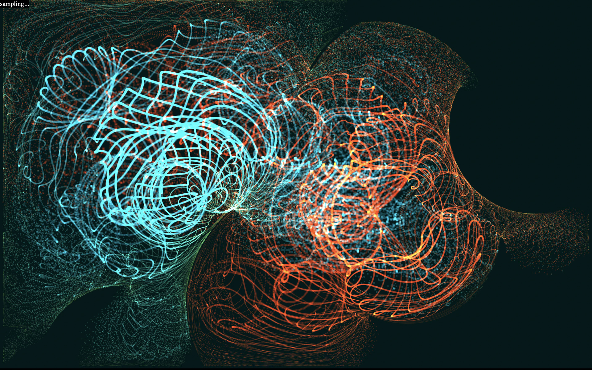
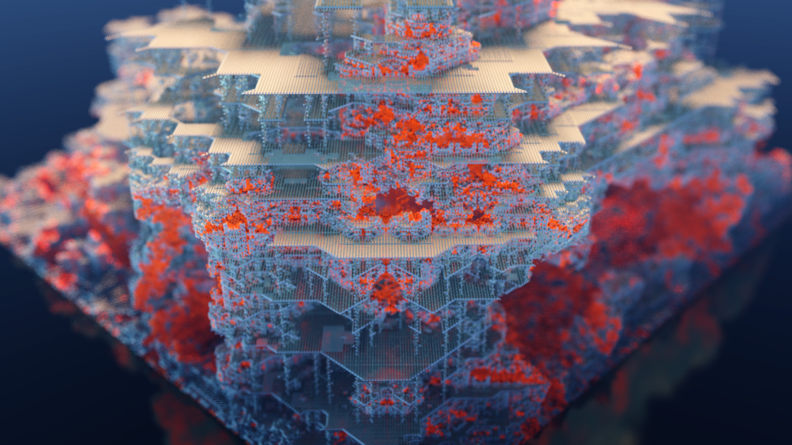
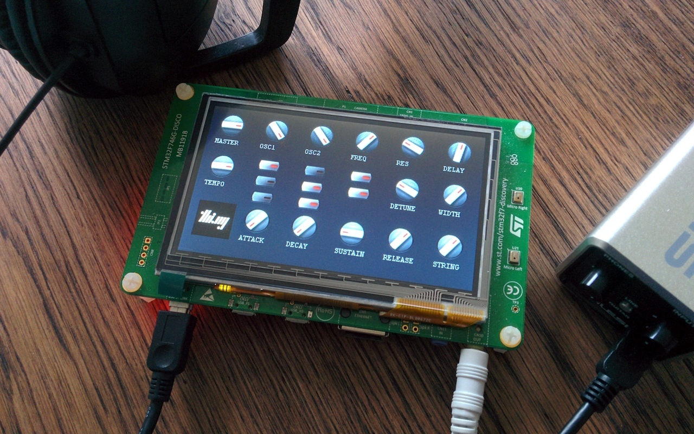

# Zig projects I'm working on...

I've been following Zig's unhaltable rise since early 2019 (incl. minor
sponsoring for 2 years), though due to lack of personal bandwidth, managed to
start using the language in earnest only end of last year. For the past 9 months
I've been looking for (and actively working on) ways to integrate the language
into my existing workflows, figuring out potential new architectures for my
projects and trying to learn new things with each project...

Some brief disclaimers:

1. My primary interests in Zig (for now) are browser-based use cases via
   WebAssembly, combining Zig with my plethora of ongoing TypeScript projects...
2. This post gives only a brief overview of one completed and some other
   currently still early work-in-progress (and planned) projects. Some of these
   are not open source yet, but likely will be in due course... In any way, I'm
   planning to do more detailed write-up's for some of them, but feedback (esp.
   about some maybe obvious mistakes/shortcomings) is much appreciated!

### Quasiflock

An animated, interactive generative art piece/sculpture, hybrid TypeScript
([thi.ng/umbrella](https://thi.ng/umbrella)) & Zig (compiled to WASM). This
project is a browser-based remake of a hair/strand flocking simulation which I
originally wrote in early 2006 as a sketch for what eventually became [Nokia's
global re-brand master texture](https://vimeo.com/17559579) (in the video from
~1:08, developed at Movingbrands), applied to all brand assets incl. product
packaging, print/TV ads etc.

The original sketch was written in [Processing](https://processing.org) (i.e.
Java/OpenGL). The 2021/22 rewrite uses Zig for all physics & animation parts to
compile the strands into a single mesh and to update it. The Zig module exposes
a simple API to connect with the main JS app and
[thi.ng/webgl](https://thi.ng/webgl) for zero-copy transfers to WebGL. Avoiding
any memory allocations (both in Zig and TypeScript), helps the piece run at a
stable, smooth-as-butter 60fps (max. framerate in current browsers), even on
mobile!

From a technical POV, my hope for this project was to get hands-on experience
with Zig's (truly amazing and easy to use!) cross-compilation features and to
see how easy or hard it'd be to integrate with my other TS tooling. Test
successful!

You can view 320 variations of the piece in this [fxhash
gallery](https://www.fxhash.xyz/generative/6671). Best experienced on desktop,
though!

### thi.ng/wasm-api

[thi.ng/wasm-api](https://thi.ng/wasm-api) is a generic, modular, extensible API
bridge, glue code and bindings code generator for hybrid JS/TypeScript &
WebAssembly projects.

This package provides the following:

1. A small, generic and modular `WasmBridge` class as interop basis and much
   reduced boilerplate for hybrid JS/WebAssembly applications
2. A minimal core API for memory allocation (can be disabled), debug output,
   string/pointer/typedarray accessors for 8/16/32/64 bit (u)ints and 32/64 bit
   floats. In the future we aim to also supply support modules for DOM
   manipulation, WebGL, WebGPU, WebAudio etc.
3. Include files for C11/C++ and Zig, defining WASM imports of the JS core API
   defined by this package
4. Extensible shared datatype code generators for (currently) Zig & TypeScript.
   The latter also generates fully type checked memory-mapped (zero-copy)
   accessors of WASM-side data. In general, all languages with a WebAssembly
   target are supported, however currently only bindings for these few langs are
   included.
5. CLI frontend/utility to invoke the code generator(s)

The package readme has a lot more info & examples (even though I'm still writing
docs for the latest codegen aspects & updates). There will be a new release in
the next few days, followed by a dedicated blog post in the next couple of
weeks...

### S-TRACE

Currently also still an active work-in-progress, S-TRACE is one of my upcoming
generative art projects: a constantly shape-shifting negative space is being
explored & visualized in different ways by 2D sphere tracing agents. The
architecture is very similar to the above Quasiflock, however all Zig (WASM) ⇄
TypeScript interop is now handled via the
[thi.ng/wasm-api](https://thi.ng/wasm-api) bridge & code generators (which I'm
developing in parallel and in a feedback loop with this piece...)

This piece uses up to a million vertices for its animated visualizations and
again thanks to Zig & WebGL2 instancing this runs @ 60fps without jittering the
same on an iPhone 11 as on a MacBook Air M1...

(If you're interested, you can follow updates to the project on Twitter via this
[dedicated timeline](https://twitter.com/toxi/timelines/1519315312524550145).)

### zig.thi.ng

[zig.thi.ng](http://zig.thi.ng) is a **very** early-stage repo where I'm
starting to collect various Zig libraries & exercises I've been working on, e.g.

-   SIMD-based generic vector type & operations (incl. type & size specific extras)
-   Generic nD-Array base implementation

At the time of writing there's not much else to see just yet (plus I'm having to
apply newer updates from some of those other projects mentioned here), but I'm
hoping to develop it as a similar kind of monorepo as my predominantly
TypeScript-based [thi.ng/umbrella](https://thi.ng/umbrella)...

### Voxel renderer

This is a low priority slow burning Zig porting effort of an OpenCL &
[Clojure](https://clojure.org)-based [voxel renderer from
2013](https://thi.ng/raymarchcl). Again, my main interest here is learning more
language features, in this case incl. writing the above mentioned
`@Vector`-backed generic vector algebra lib and trying out various `comptime`
patterns. Whilst working on this project I also came across [some weird SIMD
issues in Google Chrome](https://twitter.com/toxi/status/1510693121604173830).
Seemingly, these have automagically resolved themselves in the meantime...

### Zig on STM32

I'm also very keen exploring more of the
[microzig](https://github.com/ZigEmbeddedGroup/microzig) tooling to get back
into the world of STM32 & similar, revamping some of my C projects...

-   [thi.ng/synstack](https://thi.ng/synstack) - Forth VM and DSL for DSP & softsynth construction
-   [thi.ng/ct-gui](https://thi.ng/ct-gui) - Small GUI library for embedded devices
-   [ARM / STM32F7 DIY synth workshop](https://thi.ng/ws-ldn-12)

https://youtube.com/watch?v=3lL-ZxyrHiE

Ps. FWIW I will also be sharing more about at least some of these projects in my
talk at Software You Can Love...
