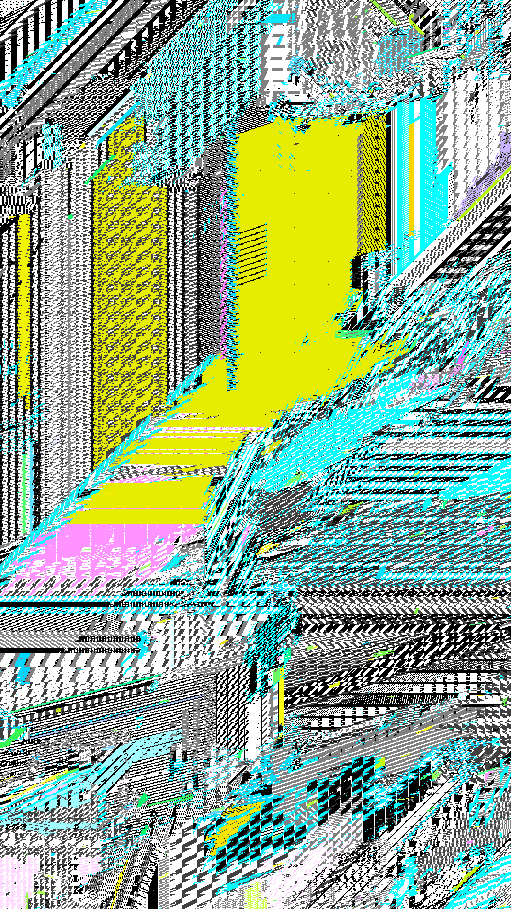
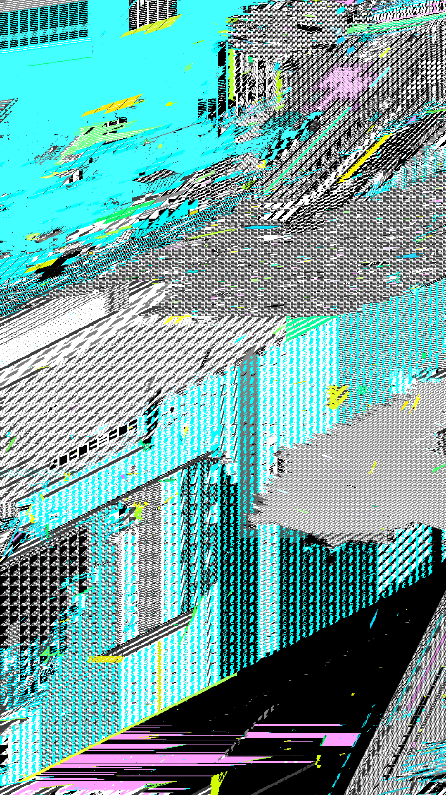
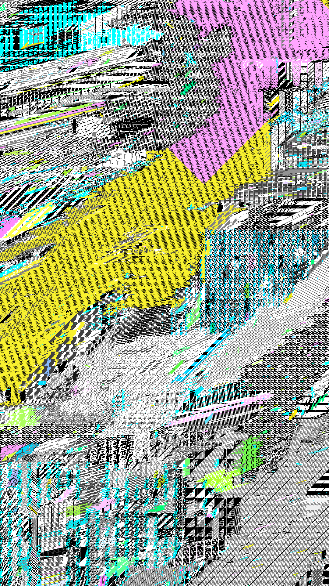
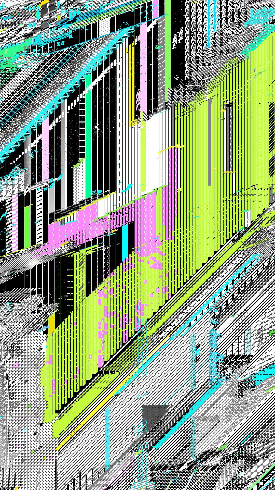
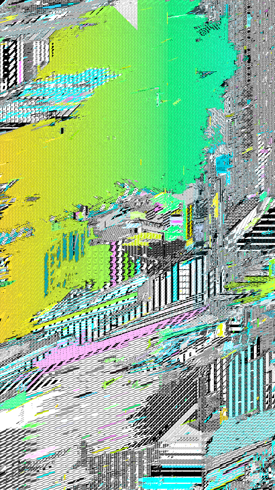

# De/Frag on show at ZKM Karlsruhe

Super pleased to announce that a custom version of
[De/Frag](https://art.thi.ng/defrag) (2021) will be on display at ZKM Karlsruhe
as part of their new milestone show "The Story That Never Ends" from next
Saturday, April 5 until September 20. The exhibition features approx. 100 works
from their collection of 12,000 works of the past 70 years. It's a true honor to
be part of it!

https://zkm.de/de/2025/04/the-story-that-never-ends

Unlike the original release, which was constrained to only 640x640 pixels, this
new custom version runs at 1080x1920 resolution on a large 75" screen, and will
continuously evolve over the course of the next 5½ months, i.e. for the entire
duration of the exhibition.

De/Frag is a homage and exploration of the classic flood fill algorithm,
combined with semi-randomly generated bit/fill patterns, multiple iteration &
sorting strategies, creating an endlessly changing tapestry of complex pixel
textures and tectonics, whilst revealing the inner workings of the intentionally
slowed down core algorithm. It also is an exercise in algorithmic purity,
attempting to devise a minimalist generative system producing maximalist
variation (relative to its setup).

The downscaled 30 second time lapse shows snapshots of a 20 minute time window,
with one frame taken every 5 seconds... In reality, all transitions are
continuous and mesmerizing to watch unfold in unexpected way (something the time
lapse cannot do justice).

# Ambiguous intstructions

For anyone interested: Here's an ambiguous set of instructions (in the spirit of
Sol leWitt or https://conditionaldesign.org) for (re)creating a simplified
version of the infinitely evolving De/Frag piece (see beginning of this thread).

Preparations:

0. You may use any suitable medium.
1. Create a pixel-based canvas of arbitrary dimensions.
2. Create a palette of random choice of 4 colors, plus black and white.

Repeated steps:

3. Choose two random colors from the palette, giving black or white priority.
4. Using the chosen colors, create a random pixel pattern in one of four sizes
   (e.g. using percentages of the longest side of the canvas as pattern size,
   e.g. 1%, 2%, 5%, 10%, or 4x4, 8x8, 16x16 pixels...)
5. Choose a random pixel position on the canvas and a random color tolerance.
6. Perform the flood fill algorithm[1] from the chosen start position, selecting
   all connected pixels within the chosen tolerance.
7. Apply the new pattern (created in step 4) to the pixels selected in step 6,
   in an order and speed of your choosing.
8. Repeat from step 3

[1] The Flood Fill algorithm is described here:
https://en.wikipedia.org/wiki/Flood_fill

