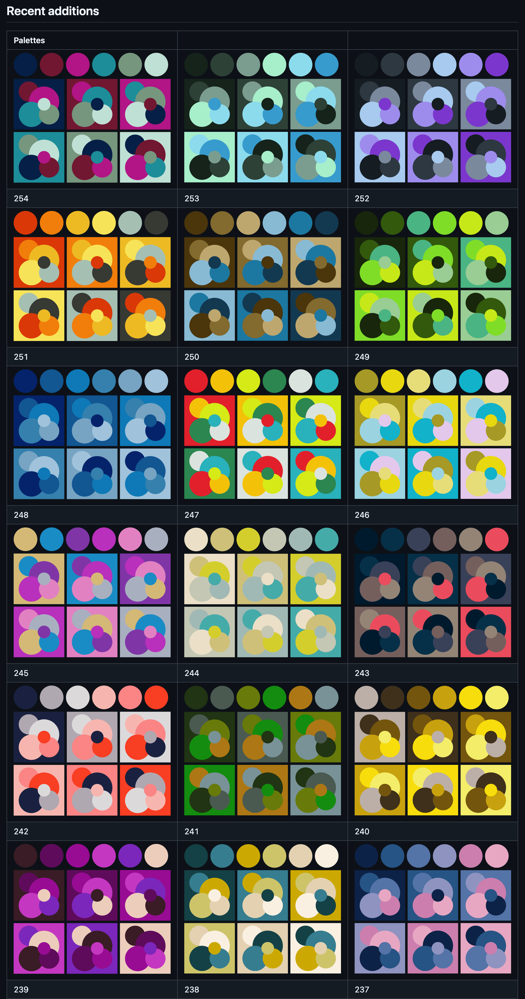
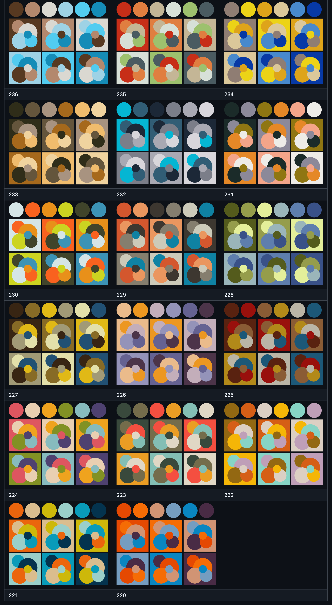

# thi.ng/color-palettes updates

#ReleaseSaturday — Just added 35 new color palettes (255 in total now) to
[thi.ng/color-palettes](https://thi.ng/color-palettes). All of these are based
on images and their dominant colors have been extracted via this tool below and
then partially hand edited. The SVG swatches were generated via a custom tool
(included in the project repo).

The package provides accessors for obtaining themes as CSS hex colors, ARGB
ints, sRGB or LCH tuples. Themes can also be programmatically selected/filtered
by a number of composable criteria (examples in the readme)...

https://demo.thi.ng/umbrella/dominant-colors/

#ThingUmbrella #Color #OpenSource #TypeScript #JavaScript #SVG

